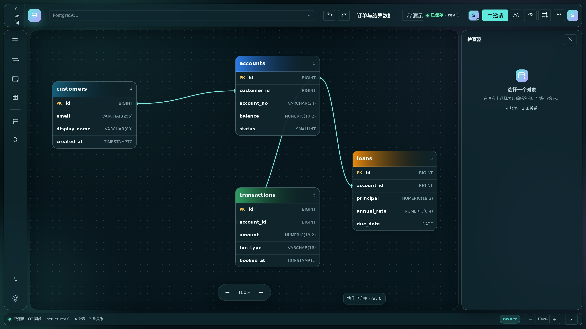

<div align="center">
    <h1>coldrawdb</h1>
    <p><b>自托管、浏览器端的数据库 ER 图设计工具</b><br>产品灵感源自 drawDB 与 PDManer，代码为纯 Rust 自研</p>
    
</div>

## 简介

coldrawdb 是一个纯 Rust 实现的数据库实体关系（DBER）编辑器：前端以 WASM + Leptos 在浏览器中自绘 Canvas 画布，后端以 actix-web + SQLite 提供图表持久化、SQL/DBML 导入导出、多引擎 DDL 生成，并逐步扩展用户鉴权、实时协作与 AI 客户端（MCP）接入能力。

核心特性：

- **可视化 ER 编辑器**：表 / 字段 / 关系 / 索引 / 枚举 / 自定义类型 / 区域 / 备注 / 待办，9 类对象自由拖拽连线
- **多引擎 SQL 与 DBML**：7 种引擎的 DDL 生成与导入（MySQL / PostgreSQL / SQLite 等），JSON 全量导入导出
- **修订号乐观锁**：图表保存携带 `expected_revision`，并发冲突返回 409，不静默覆盖
- **协作与鉴权（V2，后端已就绪）**：注册 / 登录 / Token 续期（JWT + Argon2）、协作房间与邀请、WebSocket OT 实时协作
- **MCP 服务（S06，实现中）**：本地 stdio adapter，让 Claude / Codex / Cursor / OpenCode 直接管理图表
- **数据字典（S07）**：代码映射字典 CRUD、字段绑定、Markdown 导出
- **暗色模式**：`--cdb-*` 设计 token 体系驱动的 Light / Dark 全局主题

## 技术栈

> 前端为纯 Rust（WASM）实现，全仓库无 React / Node 前端构建链。

| 层 | 技术 |
|---|---|
| 前端 | **Rust + Leptos 0.5（CSR）+ WASM**，`frontend-rs/` crate，4 个逻辑模块：data_access / core / panels / render |
| 前端构建 | `trunk`（WASM bundler） |
| 渲染 | HTML5 `<canvas>` 自绘 + 贝塞尔连线，Leptos signals 细粒度响应式 |
| 设计系统 | `--cdb-*` 设计 token（13 类约 100 个）+ SVG 图标库 + 8 类核心组件 + 动效 token |
| 代码视图 | Monaco Editor + DBML 语法 |
| 后端 | **Rust + actix-web 4 + tokio**，`backend/` crate，默认 `127.0.0.1:3000` |
| 持久化 | SQLite（WAL 模式）+ SeaORM 0.12，8 个幂等迁移（`backend/migrations/`） |
| 鉴权 | JWT（`jsonwebtoken`）+ Argon2 密码散列 + refresh token |
| 协作 | actix-web-actors WebSocket + OT（Operation Transform） |
| MCP | `mcp-server/` 独立 crate，stdio transport，仅调用 diagram HTTP API |
| 部署 | 多阶段 Dockerfile（静态服务 + SPA 回源）+ docker-compose（nginx:80 反代 + 每日 SQLite 备份侧车） |
| 测试 | `cargo test`（UT/ST）+ `wasm-pack test --chrome` + Playwright E2E |
| CI | GitHub Actions：`build.yml`（cargo build + trunk build）与 `docker.yml`（镜像构建） |

架构详情见 [`docs/phase4/architecture.mmd`](docs/phase4/architecture.mmd) 与 [架构概览](logos/resources/prd/3-technical-plan/1-architecture/core-01-architecture-overview.md)。

## 快速开始

### 前置要求

- Rust stable（建议经 [rustup](https://rustup.rs/) 安装）
- `trunk`：`cargo install --locked trunk`
- `wasm32-unknown-unknown` target（`rustup target add wasm32-unknown-unknown`）
- 可选：`wasm-pack`（前端集成测试）、Playwright + Chromium（E2E）

无需 Node.js / npm。

### 方式一：一键启动脚本

```bash
./scripts/start-local.sh   # 启动后端 + 前端（可用 COLDRAWDB_BACKEND_PORT / COLDRAWDB_FRONTEND_PORT 改端口）
./scripts/stop-local.sh    # 停止
```

日志写入 `logs/`。

### 方式二：手动启动

**1) 启动后端**（Rust + SQLite，默认 `127.0.0.1:3000`，配置见 `backend/config.toml`）：

```bash
cd backend
cargo run --release   # 性能测量必须使用 release 模式
```

首次启动会执行 `backend/init.sql` 基线建表，再按序执行 `backend/migrations/*.up.sql`（幂等，版本记录在 `schema_migrations` 表）。

健康检查（无 DB 依赖）：

```bash
curl http://127.0.0.1:3000/api/v1/diagrams/health
```

**2) 启动前端**（新终端）：

```bash
cd frontend-rs
trunk serve --port 8080   # 访问 http://localhost:8080
```

前后端联调说明：无代理层，前端经 `fetch` 直连 `127.0.0.1:3000`，CORS 由后端 `actix-cors` 管理（dev 全开）。数据流：`editor-data-access` → `editor-core`（1s debounce）→ `editor-panels` / `editor-render`。

**3) 接口快速验证**：

```bash
# 创建图表
curl -X POST http://127.0.0.1:3000/api/v1/diagrams \
  -H 'Content-Type: application/json' \
  -d '{"name":"demo","engine":"mysql"}'

# 查询 bridge 配置
curl http://127.0.0.1:3000/api/v1/bridge/config
```

### 构建

```bash
# 后端 release
cd backend && cargo build --release

# 前端 release（trunk 0.21.x 需显式关闭 wasm-opt，见 frontend-rs/Trunk.toml 注释）
cd frontend-rs && trunk build --release --no-wasm-opt
# 产物：frontend-rs/dist/
```

## Docker 部署

单容器：

```bash
docker build -t coldrawdb .
docker run -p 3000:3000 -v ./data:/data coldrawdb
```

staging 组合（推荐，含 nginx 反代与每日备份）：

```bash
docker compose up -d --build
```

- `nginx`（80 端口）反代至 `coldrawdb`（3000 端口），静态资源 + SPA 回源
- SQLite 数据落盘 `./data/`，日志落盘 `./logs/`
- `backup` 侧车每日打包 `./data/` 至 `./backups/`
- 健康检查：`GET /api/v1/diagrams/health`（30s 间隔，自动重启）

## API 概览

生产后端路由（`/api/v1` 前缀）：

| 分组 | 端点数 | 说明 |
|---|---|---|
| diagrams | 5 | 图表 CRUD + health（含 409 revision 冲突语义） |
| bridge | 5 | SQL / DBML / JSON 导入导出（7 引擎） |
| auth | 5 | register / login / refresh / logout / me |
| rooms | 11 | 房间 / 邀请 / 成员生命周期 |
| collab | 2 + 1 WS | collab head / ops REST + WebSocket OT 帧协议 |

另有遗留的 `/diagrams/*` 路由单列兼容。API 规格见 [`logos/resources/api/`](logos/resources/api/)（auth.yaml / rooms.yaml / collab.yaml / mcp-tools.yaml）。

## MCP 服务（AI 客户端接入）

`coldrawdb-mcp` 是本地 stdio adapter，支持 Claude、Codex、Cursor、OpenCode 四类客户端，MVP 提供 7 个工具：

- 读取：`list_diagrams` / `get_diagram` / `export_schema`
- 写入：`create_diagram` / `update_diagram`（携带 `expected_revision`，409 返回 `REVISION_CONFLICT`）/ `delete_diagram`（`destructiveHint` + 本地 confirm 双重约束）/ `import_schema`

```bash
./scripts/build-mcp.sh   # 产物：mcp-server/target/release/coldrawdb-mcp
```

必需环境变量 `COLDRAWDB_BASE_URL`；四客户端配置模板见 `mcp-server/examples/`。完整说明见 [`mcp-server/README.md`](mcp-server/README.md)。

## 项目状态

项目遵循 OpenLogos 方法论管理，场景状态（详见 [`logos/logos-project.yaml`](logos/logos-project.yaml)）：

| 场景 | 名称 | 状态 |
|---|---|---|
| S01 | 编辑并保存图表 | ✅ launched |
| S02 | 加载分享链接图表 | ✅ launched |
| S03 | 用户注册 / 登录 / Token 续期 | 🚧 后端已实现，前端接入中 |
| S04 | 创建/加入协作房间 | 🚧 后端已实现，前端接入中 |
| S05 | OT 实时协作 | 🚧 后端已实现，前端接入中 |
| S06 | AI 客户端通过 MCP 管理图表 | 🚧 实现中（MVP 7 工具，仅 stdio） |
| S07 | 管理数据字典并绑定字段 | 🚧 实现中 |

唯一现行 HTML 评审原型：`logos/resources/prd/2-product-design/2-page-design/core-01-editor-prototype.html`。

### 常用命令

```bash
openlogos status   # 查看项目阶段进度
openlogos next     # 查看下一步建议
openlogos change <slug>   # 创建变更提案（修改源码前必须）
```

## 文档索引

| 文档 | 说明 |
|---|---|
| [`docs/MILESTONE_V1_INITIAL.md`](docs/MILESTONE_V1_INITIAL.md) | V1 里程碑总览 |
| [`docs/phase0/` ~ `docs/phase4/`](docs/) | 各阶段过程文档与收官报告 |
| [`logos/logos-project.yaml`](logos/logos-project.yaml) | OpenLogos 资源索引（所有规格文档入口） |
| [`RUST_WEB_REFACTOR_PLAN.md`](RUST_WEB_REFACTOR_PLAN.md) | React → Rust Web 重构计划 |
| [`logos/resources/scenario/`](logos/resources/scenario/) | 端到端 API 编排测试定义 |
| [`scripts/`](scripts/) | 本地启动 / MCP 构建 / 验证测试脚本 |

## 致谢

coldrawdb 的产品形态与交互设计深受以下两个优秀开源项目启发：

- [drawDB](https://github.com/drawdb-io/drawdb) —— 浏览器端数据库实体关系（DBER）编辑器
- [PDManer 元数建模](https://gitee.com/robergroup/pdmaner) —— 跨平台关系数据库建模工具

coldrawdb 仅在**产品理念层面**借鉴二者；**全部代码均为纯 Rust 自研，未使用、未移植、未衍生上述任何项目的源代码**，与二者的代码库不存在派生关系。感谢两个项目的作者与社区带来的设计启发。

## 许可证

[MIT](LICENSE)
