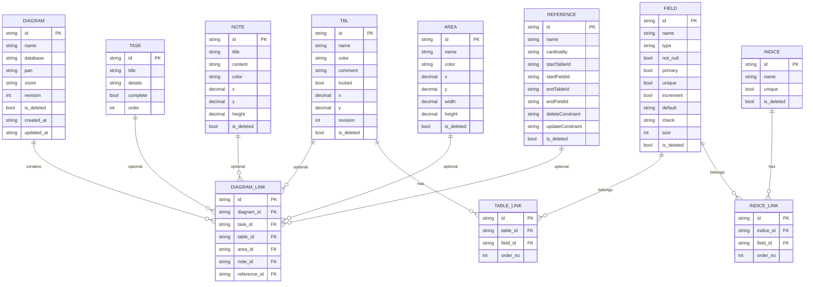

# drawDB Phase 0 - ERD（方案冻结草案）

> 当前分支仅保留 Legacy 接口，本文档描述之 schema 与 0001 迁移一致。

本文用于架构评审，覆盖当前后端实体与 Phase 1 预期落库结构。

## 1. 设计边界
- 仅覆盖 diagram 编辑主链路相关实体。
- 用户、权限、多租户等能力暂不纳入本轮 ERD。
- ID 统一使用字符串（当前后端已有雪花 ID 生成能力）。

## 2. 核心 ERD（Mermaid）

## 3. 与当前实现的冻结结论
1. `diagram_link` 字段统一命名为 `reference_id`（当前 `init.sql` 中为 `reference`，需在 migration 中修复）。
2. `table_link` 与 `indice_link` 建议新增 `order_no`，保证字段/索引列顺序可重建。
3. `diagram` 新增 `revision` 字段，作为保存冲突检测基线。
4. 为 `diagram_link(diagram_id)`、`table_link(table_id)`、`indice_link(indice_id)` 增加索引。

## 4. 评审结果（会议决策）
- 是否在 v1 即引入 `is_deleted` 软删除：**是**。
- `last_modified` 与 `updated_at` 是否合并为单字段：**是**（统一保留 `updated_at`）。
- 是否对 `reference.startFieldId/endFieldId` 增加强 FK：**否**（保持弱约束，优先保障导入容错）。
