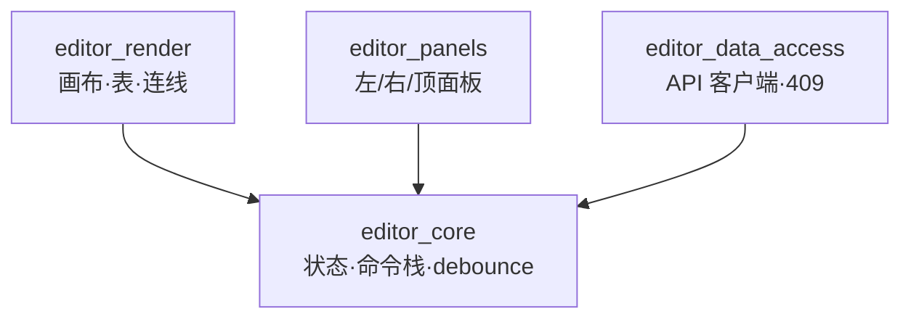

# Phase 4 — 模块映射文档 (Module → React Reference)

> Spec: `.omc/specs/deep-interview-phase4-rust-web-mvp.md`（PASSED, R14 「参考 React 但不强对位」）
> Plan: `.omc/plans/phase4-rust-web-mvp.md`（W1-3 段, AC-6 / AC-7）
> ADR: 同 plan §7（采用 1 crate + 4 modules 内部结构）

---

## 1. 概览

Phase 4 的 Rust Web 前端落地为 **1 个 crate + 4 个 modules** 的结构：

- **Crate**：`frontend-rs`（`/home/kyle/coldrawdb/frontend-rs/`，`[lib] crate-type = ["cdylib", "rlib"]`）
- **Modules**（4 个，`src/editor_*.rs`）：
  - `editor_core` — 状态 / 命令栈 / debounce 触发器
  - `editor_render` — 画布渲染（表 / 连线）
  - `editor_panels` — 左 / 右 / 顶面板 UI
  - `editor_data_access` — API 客户端 / 409 协议处理

**设计原则：参考 React 但不强对位**（spec R14）。4 modules 与 React 的 `src/{api,components,pages,context}/` 形成**松散映射**——有 React 对位时记下参考文件，无对位处显式标「**独立设计**」（spec Round 15 决议）。这避免为了对齐 React 而牺牲 Rust Web 的 idiomatic 写法。

依赖方向（`editor_core` 为底座）：

```
editor_render    ─┐
editor_panels    ─┼─→ editor_core
editor_data_access ┘
```

依赖方向在 `frontend-rs/src/editor_core.rs` 中**禁止反向 import**（CI 用 `frontend-rs/scripts/check_module_deps.sh` ast-grep + cargo-modules 双重 gate，见 R-3）。

---

## 2. 映射表

| Module | 职责 | React 能力参考 | 对位强度 | 备注 |
|--------|------|----------------|----------|------|
| **editor-data-access** | API 客户端（`GET / PUT / POST / DELETE /api/v1/diagrams/{id}`）+ 409 冲突协议处理 + debounce 1s 触发器入口 | `src/api/` | **弱** | 当前 `src/api/` 仅含 `email.js` / `gists.js`，**Phase 4 客户端仅实现 diagrams CRUD；email/gists 客户端不在 scope**（见 plan AC-20 / spec R10）。409 处理对应 `backend/src/diagrams_v1.rs:137-144` 的 `current_revision` 协议。 |
| **editor-panels** | 顶部工具栏（「建表」/「保存」）+ 左侧面板（表列表）+ 右侧面板（字段编辑 / 改类型 / 设关系）+ 409 弹窗 + error toast | `src/components/{EditorHeader,EditorSidePanel}/` | **中** | React 时代 panels 较为扁平；Rust Web 在 Leptos signals 驱动下可更细粒度更新（每个面板独立订阅 store）。`409 弹窗` 与 `error toast` 在 React 时代散落多处，Phase 4 在 `editor-panels` 内统一定义。 |
| **editor-render** | `<canvas>` 渲染（表 = 矩形 + 字段列表；连线 = 贝塞尔曲线）+ 拖拽 + 缩放 + 选中高亮 | `src/components/EditorCanvas/` + `src/pages/Editor.jsx` 渲染部分 | **强** | Editor.jsx 实际为 **11 个 ContextProvider 包裹** + `<WorkSpace />`（见第 3 节）；渲染实质由 `src/components/Workspace.jsx` + `EditorCanvas/` 完成，与 `editor-render` 对位紧密。 |
| **editor-core** | `EditorStore`（`tables` / `references` / `revision` / `dirty`）+ 命令模式 + undo/redo 底座 + 状态机 + 信号（signals） | `src/context/DiagramContext.jsx` 等 **13 个 Context 文件** | **强** | React 时代靠 13 个 Context 拆分状态；Rust Web 在 `editor-core` 内部用 signals / stores 统一，跨模块共享 DTO 类型（`Table` / `Field` / `Reference`）放 `editor_core::types`。 |

---

## 3. Editor.jsx 的 11 个 ContextProvider

`src/pages/Editor.jsx:1-40`（实际为 **11 个 ContextProvider** 嵌套 + `<WorkSpace />` 叶子节点）：

| # | Provider | 来源文件 | 职责（粗略） |
|---|----------|----------|---------------|
| 1 | `LayoutContextProvider` | `src/context/LayoutContext.jsx` | 整体布局（顶 / 左 / 右 / 中四象限） |
| 2 | `TransformContextProvider` | `src/context/TransformContext.jsx` | 画布 pan / zoom 坐标系 |
| 3 | `UndoRedoContextProvider` | `src/context/UndoRedoContext.jsx` | 撤销 / 重做栈 |
| 4 | `SelectContextProvider` | `src/context/SelectContext.jsx` | 选中态（表 / 字段） |
| 5 | `TasksContextProvider` | `src/context/TasksContext.jsx` | 异步任务（保存进度等） |
| 6 | `AreasContextProvider` | `src/context/AreasContext.jsx` | 画布区域批注 |
| 7 | `NotesContextProvider` | `src/context/NotesContext.jsx` | 节点备注 |
| 8 | `TypesContextProvider` | `src/context/TypesContext.jsx` | 字段类型枚举 |
| 9 | `EnumsContextProvider` | `src/context/EnumsContext.jsx` | 用户自定义枚举 |
| 10 | `TablesContextProvider`（实为 `DiagramContext` 的 alias） | `src/context/DiagramContext.jsx` | 表 / 字段 / 引用核心数据 |
| 11 | `SaveStateContextProvider` | `src/context/SaveStateContext.jsx` | 自动保存状态机（dirty / saving / saved / error） |

**13 个 Context 文件 = 11 个被 `Editor.jsx` 使用 + 2 个旁路**：

- `SettingsContext.jsx`（不在 Editor.jsx 嵌套中）— 由 `src/App.jsx:7, 12, 42-60` 引用，承载全局偏好（主题 / 语言 / 快捷键映射）。Phase 4 落地为 `editor-panels` 的 settings UI（settings 入口在顶部下拉菜单内），不进入 `editor-core`（避免与画布状态耦合）。
- `CanvasContext.jsx`（不在 Editor.jsx 嵌套中）— 由 `src/components/Thumbnail.jsx` 引用，承载缩略图渲染的轻量副本。Phase 4 落地为 `editor-render` 内部 `Thumbnail` 子模块，独立于 `editor-core`（缩略图不需要完整的 commands 栈）。

> **关键校正**（plan §5.1 verification grep 必须命中）：文档中显式含字样「**11 个 ContextProvider**」与「**13 个 Context 文件**」。Editor.jsx 实际为 11 个 Provider 嵌套；`src/context/` 目录共 13 个 .jsx 文件，多出来的 2 个由 Editor.jsx 之外的位置消费（App.jsx / Thumbnail.jsx）。

---

## 4. 独立设计（无 React 对位）

下列设计点在 React 前端**没有直接对应物**，是 Phase 4 的独立技术决策。

### 4.1 commands 撤销栈底座

`editor_core::commands` 枚举 + `EditorStore::apply(cmd: Command)` 模式：

- `Command::AddTable(Table) | AddField { table_id, Field } | AddReference(Reference) | ChangeType { field_id, new_type } | ...`
- 撤销栈底座存在但**不暴露 UI**（spec §Non-Goals：撤销 / 重做按钮不在 Phase 4 范围）
- 撤销栈为 Phase 5 零成本开启 UI 预留（详 plan §7 ADR §Follow-ups）

> **React 对位**：React 时代 `UndoRedoContext` 已实现撤销栈（`src/context/UndoRedoContext.jsx`），但其 undo/redo 是「直接改 state 后 push 历史」的反向模式；Phase 4 采用「命令先行、apply 改 state」的**前向命令模式**，更易扩展（与 Redux / Elm 架构同源）。两者是设计模式演进，**不是简单迁移**。

### 4.2 wasm-bindgen 适配层

`editor_core::wasm_bind` 模块提供 JS-interop 桥：

- `#[wasm_bindgen]` 标注的 `pub struct EditorStoreHandle`（对外暴露状态读写）
- `pub fn mount(target_id: &str) -> Result<(), JsValue>`（挂载到 `<div id="editor">`）
- 事件回调 `pub fn on_save_conflict(callback: js_sys::Function)`（409 协议回调）

> **React 对位**：React 团队无对应经验；这是 Rust Web 全栈团队的全新适配层。W1-2 选型后（Leptos 倾向），框架官方 runtime 库（`leptos_dom` / `gloo`）已封装大部分适配工作，本层主要处理与 `editor-data-access` 的 fetch API 桥接。

### 4.3 409 协议处理

后端 `backend/src/diagrams_v1.rs:137-144` `PUT /api/v1/diagrams/{id}` 在 `revision` 不一致时返回：

```json
{ "error": "conflict", "current_revision": 42 }
```

前端处理流程（`editor_data_access::handle_409` → `editor_panels::conflict_dialog`）：

1. `editor_data_access` 解析响应，构造 `SaveError::Conflict { current_revision: i64 }`
2. `editor_core` 接收错误，挂起后续自动保存（`schedule_save` 暂停）
3. `editor_panels` 渲染 409 弹窗，**二选一**：
   - **强制覆盖**：调用 `PUT` 时携带本地 `revision`（强制服务端覆盖，需在 spec 范围内已确认；**详 plan W2-1 spec 后补**）
   - **重新加载**：调用 `GET /api/v1/diagrams/{id}` 拉取服务端最新 revision 覆盖本地 store

> **React 对位**：React 时代有 `SaveStateContext` 处理类似流程（`src/context/SaveStateContext.jsx`），但**没有强制覆盖分支**——用户只可选「重新加载」。Phase 4 引入「强制覆盖」是为 spec Round 8 决议（见 spec §Constraints §mvp-minimum-link），属 Phase 4 新增能力。

### 4.4 debounce 1s 触发器

`editor_core::schedule_save<F: FnOnce()>(...)` 用 `gloo-timers` 的 `Timeout` 实现 1s 静默触发：

- 任何 `Command::apply` 后调用 `schedule_save` 复位定时器
- 定时器到期执行 `editor_data_access::DiagramClient::save(id, expected_revision, body)`
- 失败（409 / 500 / 网络断开）按 AC-10 / AC-11 / AC-12 处理

> **React 对位**：React 时代 debounce 在 `SaveStateContext` 内部用 `useEffect` + `setTimeout`（手动清理）；Phase 4 用 `gloo-timers` 是 idiomatic WASM 写法，行为等价但**实现位置不同**（不在 `data_access` 而在 `core`——避免 `data_access` 隐式持有 store 引用造成循环）。

---

## 5. 客户端 Phase 4 不实现的端点

为避免 scope creep 与功能回归隐瞒，下列端点 / 客户端**Phase 4 不实现**（已申报 Phase 5）：

| 端点 / 客户端 | 当前文件 | Phase 4 状态 | 申报 |
|---------------|----------|--------------|------|
| **email 模板分享** | `src/api/email.js` | **不实现** | Phase 5（mvp-advanced-features 评估） |
| **GitHub Gist 同步** | `src/api/gists.js` | **不实现** | Phase 5（mvp-advanced-features 评估） |
| **`POST /api/v1/diagrams/import` 客户端** | （无 React 客户端，仅服务端 endpoint） | **不实现** | Phase 5 或保留 export 替代（服务端 endpoint 在 `backend/src/diagrams_v1.rs:168-228` 保留） |

**功能回归影响**（写入 `docs/phase4/CHANGELOG-react-removal.md` 公告）：

- 用户**无法**从编辑器发送 diagram 到 email（React 时代可用）
- 用户**无法**一键同步 diagram 到 GitHub Gist（React 时代可用）
- 用户**无法**通过编辑器界面导入 server-side JSON（React 时代该功能本就无 UI，仅服务端 endpoint 存在，故不构成回归；保留服务端 endpoint 以便 Phase 5 客户端或 CLI 工具复用）

---

## 6. 模块依赖图（与 architecture.mmd 一致）



**约束**：

- 4 节点 + 3 条单向箭头
- 箭头方向 `→ editor_core` 表达「依赖」（render / panels / data-access 全部 `use editor_core`）
- `editor_core` **无任何出向箭头**（底座）
- 无环（spec §module-architecture 显式约束）

完整 Mermaid source 见 `docs/phase4/architecture.mmd`；CI 在 W4-3 强制 `npx -p @mermaid-js/mermaid-cli mmdc -i docs/phase4/architecture.mmd -o docs/phase4/architecture.svg` 渲染（详 plan AC-7）。

---

## 7. 模块与 React 文件对位汇总（grep 自查清单）

便于 Architect 评审时用 grep 自查：

```bash
# editor-data-access → src/api/
grep -RE "src/api/" /home/kyle/coldrawdb/docs/phase4/module-mapping.md

# editor-panels → src/components/{EditorHeader,EditorSidePanel}
grep -RE "EditorHeader|EditorSidePanel" /home/kyle/coldrawdb/docs/phase4/module-mapping.md

# editor-render → src/components/EditorCanvas/ + src/pages/Editor.jsx
grep -RE "EditorCanvas|src/pages/Editor.jsx" /home/kyle/coldrawdb/docs/phase4/module-mapping.md

# editor-core → src/context/DiagramContext.jsx 等 13 个 Context 文件
grep -RE "src/context/|Context\.jsx" /home/kyle/coldrawdb/docs/phase4/module-mapping.md
```

每行至少 1 个 hit 即可（详 plan §5.1 AC-6）。
