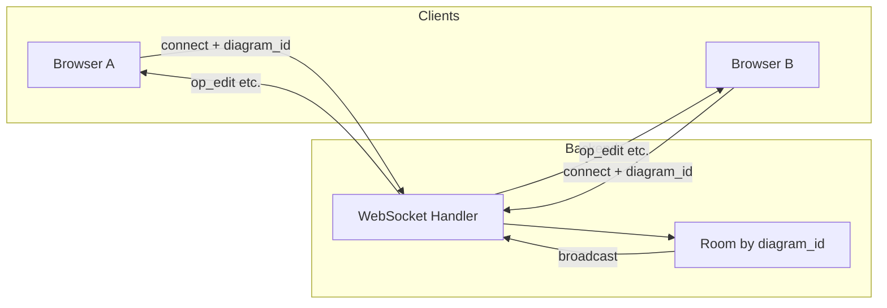
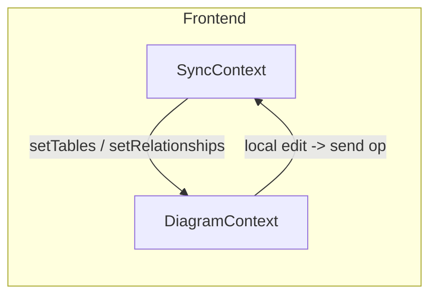

# 解决方案 01：多人协作与实时响应

## 1. 目标与范围

### 业务目标

- **同一 diagram 多端编辑**：多个用户/多个浏览器标签可同时打开同一张图表并编辑。
- **操作实时可见**：任一端的增删改（表、关系、笔记等）在数秒内同步到同文档的其他端。
- **冲突处理策略**：明确多端同时编辑时的合并或提示策略，避免数据错乱或静默覆盖。

### 范围

- **本期**：先支持「同链接/同文档」的实时同步（通过共享 diagram 的 URL 或 shareId 进入同一文档）。
- **可选后续**：在线用户列表、光标/选区展示、权限（只读/编辑）、历史与回放。

---

## 1.1 当前进度（与代码一致）

> 该小节用于描述**已落地能力**，避免文档与实现脱节。

### 已完成（一期：保存级实时 + 冲突提示）

- **WebSocket 端点已提供**：`GET /diagrams/ws/{diagram_id}`，按 `diagram_id` 建立 room 并广播消息。
- **revision 冲突已支持**：REST 更新（`POST /diagrams/update`）携带 expected `revision`，服务端校验不一致返回 **409 Conflict**，前端 Toast 提示并支持拉取最新快照刷新。
- **保存/自动保存触发同步**：保存成功后广播整份 diagram 快照到同 room 的其他客户端，其他端收到后应用快照更新状态。

### 仍是待办（下一阶段要解决的核心问题）

- 字段级冲突合并仍为 **LWW + 操作级同步**：即便已经支持 `field_update/field_remove/field_reorder` 的实时广播，不同用户同时编辑同一字段时仍可能出现“后写覆盖前写”的情况。
- 光标/在线体验仍较粗糙：已具备 `op_awareness/op_cursor` 协议与内存状态（`onlineClients/cursors`），但 UI 仅是粗粒度地标记他人正在查看的对象，缺少清晰的用户标识与选区展示。
- 历史版本/回放尚未落地：`diagram_history` 表结构与 `/diagrams/history` 接口仍在设计阶段，前端暂未提供时间轴/回放 UI。
- CRDT/OT 尚处于 PoC 设计阶段：目前仅在文档层规划在 notes 文本区域引入 Yjs/yrs 等方案，尚未在生产路径启用。

---

## 2. 前置条件

### 当前架构简述

- 数据流为 **REST 单请求-响应**：前端通过 Vite 代理调用后端 `/diagrams`、`/tables`、`/todos`、`/references`、`/templates`，无长连接。
- **已有 WebSocket**：已提供 `GET /diagrams/ws/{diagram_id}`，用于多人协作的实时消息广播。
- 前端状态在 React Context（如 `DiagramContext`）中，保存时调用 `diagramService.update` 等 REST API；同时在保存成功后通过 WS 广播快照，实现保存级同步。

### 依赖

- 需在后端新增 **WebSocket 服务端** 与前端建立长连接。
- 需定义 **文档/房间** 维度：以 `diagram_id` 为 room key，同一 diagram 的客户端加入同一 room，消息仅在 room 内广播。

---

## 3. 技术选型

### 服务端

- 在 Actix-web 上提供 WebSocket：
  - **方案 A**：`actix-web-actors` + `actix`，使用 Actor 管理连接与 room。
  - **方案 B**：`tokio-tungstenite` 等裸 WS，在 handler 内维护 `HashMap<diagram_id, Vec<WsSender>>` 做广播。
- 按 **diagram_id** 做 room/channel 管理：连接建立时根据 path 或 query 取得 `diagram_id`，握手时可选校验 diagram 是否存在（查 DB），再加入对应 room。

### 同步模型

- **方案 A（推荐用于强一致性）**：采用 **操作转换（OT）** 或 **CRDT**（如 Rust 侧无成熟库时可考虑前端使用 `yrs` 等，后端仅转发）。
- **方案 B（快速落地）**：**LWW（Last-Writer-Wins）** + revision 乐观锁；payload 中带 `revision`，服务端或客户端丢弃旧 revision 的更新，冲突时提示用户刷新或合并。

### 前端

- 在现有 `src/context/` 外增加 **SyncContext**（或 CollaborationContext）：
  - 根据当前打开的 `diagram_id` 建立 WebSocket 连接（如 `ws://host/diagrams/ws/{diagram_id}`）。
  - 订阅 WS 消息，解析后调用现有 Context 的 `setTables`、`setRelationships`、`setNotes` 等，或应用增量操作（若采用 OT/CRDT）。
  - 本地编辑时（如保存或关键操作后），将操作封装为协议消息发送到 WS，由服务端广播给同 room 其他客户端。

---

## 4. 分步实施（可落地步骤）

| 步骤 | 内容 |
|------|------|
| **Step 1** | 后端新增 WebSocket 端点，例如 `ws://host/diagrams/ws/{diagram_id}`；握手时校验 diagram 存在（可先不做鉴权）。 |
| **Step 2** | 服务端维护「diagram_id -> 连接集合」的 room，收到某连接的消息后，向同 room 内其他连接广播（消息格式建议 JSON：`{ "type": "...", "payload": { ... } }`）。 |
| **Step 3** | 定义最小消息协议：如 `op_edit`（表格/关系/笔记等变更）、`op_cursor`（可选）、`op_awareness`（可选）。 |
| **Step 4** | 前端根据当前打开的 diagram_id 建立 WS 连接，在 SyncContext 中接收并解析消息，调用现有 Context 的 setTables/setRelationships 等或应用增量操作。 |
| **Step 5** | 前端在本地编辑（如保存或关键操作）时，向 WS 发送 op，服务端广播给同 room 其他客户端。 |
| **Step 6** | （可选）冲突策略：若采用 LWW，在 payload 中带 revision，服务端或客户端丢弃旧 revision 的更新并提示用户。 |

---

## 4.1 下一阶段（推荐）：操作级实时响应（op_edit）

> 目标：把“保存级快照同步”升级为“操作级实时同步”，使任一端的编辑操作在 1–2 秒内出现在其他端（不依赖保存）。

### 当前落地情况简述

- 已实现：
  - `op_edit` 消息通道（后端仅转发，不写库）。
  - 前端在 **表 / 关系 / 笔记 / 区域 / 任务** 的增删改时发送 `op_edit`，其他端通过 `SyncContext.applyOp` 增量更新各 Context。
  - 自身发送的 op 会通过 `senderClientId` 被忽略，避免重复应用。
- 未实现（仍为后续工作）：
  - 字段级 CRDT/OT 合并（当前字段级仍为 LWW + 操作级同步）。
  - 更丰富的光标/选区展现（目前仅在本地选中表/笔记/区域时向其他客户端广播粗粒度 `op_cursor`，并在内存中维护 `cursors` 与 `onlineClients` 状态）。
  - 更复杂的自动合并策略（当前仍是 LWW + 冲突提示 + 手动刷新）。

### 核心原则

- **实时响应与持久化解耦**：操作级消息用于实时同步；落库仍以 REST 保存为主（继续复用 revision 冲突策略）。
- **后端尽量无状态**：后端负责 room 管理与广播，可选做简单校验/去重；不强行承担 OT/CRDT 的合并复杂度。

### 最小协议（建议）

- **`op_edit`**：操作级编辑同步（必做）

```json
{
  "type": "op_edit",
  "payload": {
    "diagramId": "123",
    "senderClientId": "client-abc",
    "op": "table_add | table_remove | table_update | relationship_add | relationship_remove | relationship_update | note_add | note_remove | note_update | area_add | area_remove | area_update | task_add | task_remove | task_update",
    "data": { }
  }
}
```

- **`op_cursor`**：光标/选区（可选）
- **`op_awareness`**：在线用户列表、只读/编辑状态（可选）

### 前端落地点（建议）

- 在 `SyncContext` 中新增：
  - `sendOp(op)`：本地编辑发生时通过 WS 发送 `op_edit`
  - `applyOp(op)`：收到远端 `op_edit` 时增量更新各 Context（并避免写入 undo/redo）
- 在各编辑入口（新增/删除/更新表、关系、note、area、task）调用：
  - “先本地更新 Context” → “再 `sendOp` 广播给其他端”

### 冲突与回退

- 操作级同步默认走 LWW：后到的操作覆盖先到的操作（同字段同时编辑不可避免会有覆盖）。
- 当保存时触发 revision 冲突：
  - 继续提示用户刷新或合并（保持现有行为）
  - 可提供“一键拉取最新快照”作为回退（同步状态重新对齐）

---

## 4.2 下一阶段目标：迈向真正的多人在线编辑

> 在现有「保存级 + 操作级 LWW 同步」基础上，进一步完善协作体验，并为 CRDT/OT 与历史回放打好基础。

### 目标 A：更完整的协作体验

- 为光标与在线状态提供清晰、可区分的 UI：
  - 在编辑器头部展示在线用户列表（来自 `onlineClients`），区分不同 client/user。
  - 在画布与侧栏中，根据 `cursors` 高亮其他用户正在查看或编辑的对象（表、字段、笔记、区域等）。
- 优化操作级同步与撤销/重做的交互：
  - 远端操作不应打乱本地用户的编辑流，例如 undo/redo 应尽可能只作用于本地用户发起的操作。

### 目标 B：引入局部 CRDT/OT

- 选取 **notes 文本区域** 作为首个 CRDT 试验点：
  - 使用 Yjs/yrs 等 CRDT 库，将每个 note 内容绑定到 `Y.Text`。
  - 通过现有 WebSocket 通道扩展 `notes_crdt_update` 消息，在同一 diagram 的客户端间转发文档更新。
- 与 LWW + revision 共存：
  - CRDT 只在文本字段内部解决并发冲突，结构性变更（新增/删除 note、自身属性变更）仍用 LWW + op_edit。
  - 保存时，将 Yjs 文档序列化回 notes 内容字段，继续以 `DiagramVo` 形式写入数据库。

#### Notes 文本 CRDT PoC 设计

- **范围**：
  - 仅覆盖 notes 的文本内容（如 `note.content`），不改变 notes 的增删结构与位置属性，这些仍由现有的 LWW + op_edit 负责。
- **协议**：
  - 利用现有 `/diagrams/ws/{diagram_id}` 通道，约定新的消息类型，例如：
    ```json
    {
      "type": "notes_crdt_update",
      "payload": {
        "diagramId": "123",
        "clientId": "client-abc",
        "update": "<Yjs encoded update bytes (base64)>"
      }
    }
    ```
  - 后端继续采用“room 内仅转发”的模式，不解析 CRDT 数据。
- **保存与加载**：
  - 加载 diagram 时，从 `snapshot_json` 中读取 notes 文本，将其作为初始状态灌入 Yjs 文档（针对每个 note 的 `Y.Text`）。
  - 保存 diagram 时，从 Yjs 文档读取最新文本内容回写到 notes，再通过现有 `/diagrams/update` 路径落库。
- **回退策略**：
  - 为 CRDT 增加显式开关（例如实验设置或环境变量），关闭时：\n
    - 不再发送/处理 `notes_crdt_update`；\n
    - notes 文本退回到单机编辑 + 保存级 LWW 行为，避免对已有数据造成影响。

### 目标 C：为“历史与回放”打基础

- 设计并实现 `diagram_history` 表与历史查询接口：
  - 每次保存成功（revision 自增）时，记录一条历史快照。
  - 允许通过 revision 恢复任意时刻的完整 diagram 状态。
- 为后续的「时间轴回放」「版本对比」预留接口与数据形态，而不急于实现完整 UI。

#### 历史数据与接口设计（初版）

- 后端新增历史表（示意）：
  - 表名：`diagram_history`
  - 字段建议：
    - `id`：主键（雪花 ID 或自增）
    - `diagram_id`：归属的 diagram
    - `revision`：对应的 revision 号
    - `snapshot_json`：`DiagramVo` 的 JSON 序列化结果
    - `created_at`：记录创建时间
- 历史查询接口形态：
  - `GET /diagrams/history/{diagram_id}`：返回该 diagram 的历史版本列表（`revision`、`created_at`、可选描述），用于构建时间轴。
  - `GET /diagrams/history/{diagram_id}/{revision}`：返回指定 revision 的完整快照（可直接映射为前端的 diagram 对象）。
  - 可选：为未来的差异比较预留 `GET /diagrams/history/{diagram_id}/diff?from=rev1&to=rev2`，形态可在真正实现前再细化。

## 5. 验收标准

- 两个浏览器窗口打开同一 diagram（同一 URL 或同一 shareId），在一端增/删表或关系，另一端在若干秒内可见更新。
- 需验证的场景：
  - 单表新增：A 端新增表，B 端列表与画布出现该表。
  - 关系新增：A 端新增关系，B 端画布出现连线。
  - 删除：A 端删除表/关系，B 端对应元素消失。
  - 多端同时编辑：根据所选策略（LWW 或 OT/CRDT）验证无静默覆盖或可预期的冲突提示。

---

## 6. 参考与附录

### 架构示意





### 相关代码位置

- 后端路由注册：`backend/src/main.rs`
- 前端 Context：`src/context/`、`src/components/Workspace.jsx`（保存与加载）
- 项目约定：`.cursor/rules/project-context.mdc`（revision 乐观锁等）
