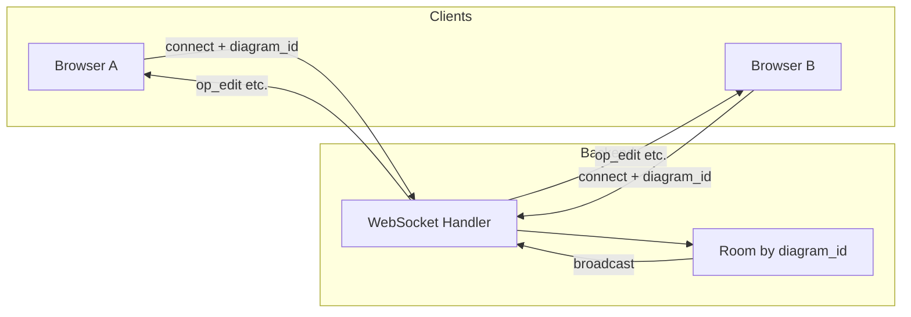
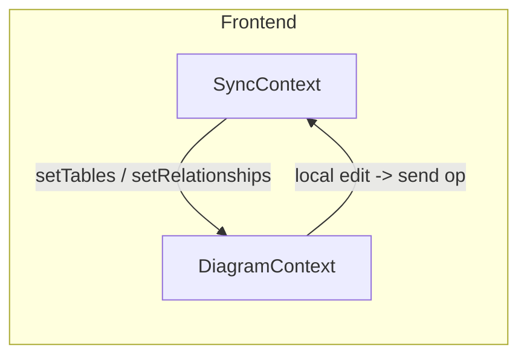

# 解决方案 01：多人协作与实时响应

## 1. 目标与范围

### 业务目标

- **同一 diagram 多端编辑**：多个用户/多个浏览器标签可同时打开同一张图表并编辑。
- **操作实时可见**：任一端的增删改（表、关系、笔记等）在数秒内同步到同文档的其他端。
- **冲突处理策略**：明确多端同时编辑时的合并或提示策略，避免数据错乱或静默覆盖。

### 范围

- **本期**：先支持「同链接/同文档」的实时同步（通过共享 diagram 的 URL 或 shareId 进入同一文档）。
- **可选后续**：在线用户列表、光标/选区展示、权限（只读/编辑）、历史与回放。

---

## 1.1 当前进度概览

> 按阶段汇总已落地能力与待办，与第 4 章实施阶段一一对应。

| 阶段 | 内容概述 | 状态 |
|------|----------|------|
| 1 | 保存级同步 + 冲突控制 | 已完成 |
| 2 | 操作级 LWW 同步 + 字段级 + 光标/在线基础 | 已完成 |
| 3 | 协作体验增强 + 历史回放 + CRDT/OT | 规划中 |

### 阶段 1（已完成）：保存级实时 + 冲突提示

- **WebSocket 端点**：`GET /diagrams/ws/{diagram_id}`，按 `diagram_id` 建立 room 并广播消息。
- **revision 冲突**：REST 更新（`POST /diagrams/update`）携带 expected `revision`，服务端校验不一致返回 **409 Conflict**，前端 Toast 提示并支持 `pullLatest` 刷新。
- **保存级同步**：保存成功后广播整份 diagram 快照（`diagram_snapshot`）到同 room 的其他客户端，其他端应用快照更新状态。

### 阶段 2（已完成）：操作级 LWW 同步 + 字段级/光标基础

- **操作级 `op_edit`**：
  - 表 / 关系 / 笔记 / 区域 / 任务的增删改通过 `op_edit` 在 room 内转发，前端 `SyncContext.applyOp` 增量更新各 Context。
  - 字段级：`field_update` / `field_remove` / `field_reorder` 已接入（仍为 LWW，同字段并发编辑会“后写覆盖前写”）。
- **光标/在线**：
  - 已定义 `op_awareness` / `op_cursor` 协议，后端仅转发；前端在 `SyncContext` 中维护 `onlineClients` 与 `cursors`。
  - 本地选中表/笔记/区域时通过 `sendCursor` 广播粗粒度光标（完整 UI 待阶段 3 增强）。

### 阶段 3（规划中）：多人在线协作体验 + 历史/CRDT

- **历史与回放**：`diagram_history` 表与 `/diagrams/history` 接口已在文档中设计，尚未实现。
- **CRDT/OT**：仅在文档中完成 notes 文本的 Yjs/yrs PoC 设计，尚未在生产路径启用。
- **协作体验**：计划增强光标/选区 UI、在线用户列表展示、与 undo/redo 的协调等。

---

## 2. 前置条件

> 当前实现进度与分阶段方案见 **§1.1** 与 **§4**。

### 当前架构简述

- 数据流为 **REST 单请求-响应**：前端通过 Vite 代理调用后端 `/diagrams`、`/tables`、`/todos`、`/references`、`/templates`，无长连接。
- **已有 WebSocket**：已提供 `GET /diagrams/ws/{diagram_id}`，用于多人协作的实时消息广播。
- 前端状态在 React Context（如 `DiagramContext`）中，保存时调用 `diagramService.update` 等 REST API；同时在保存成功后通过 WS 广播快照，实现保存级同步。

### 依赖

- 需在后端新增 **WebSocket 服务端** 与前端建立长连接。
- 需定义 **文档/房间** 维度：以 `diagram_id` 为 room key，同一 diagram 的客户端加入同一 room，消息仅在 room 内广播。

---

## 3. 技术选型

### 服务端

- 在 Actix-web 上提供 WebSocket：
  - **方案 A**：`actix-web-actors` + `actix`，使用 Actor 管理连接与 room。
  - **方案 B**：`tokio-tungstenite` 等裸 WS，在 handler 内维护 `HashMap<diagram_id, Vec<WsSender>>` 做广播。
- 按 **diagram_id** 做 room/channel 管理：连接建立时根据 path 或 query 取得 `diagram_id`，握手时可选校验 diagram 是否存在（查 DB），再加入对应 room。

### 同步模型

- **方案 A（推荐用于强一致性）**：采用 **操作转换（OT）** 或 **CRDT**（如 Rust 侧无成熟库时可考虑前端使用 `yrs` 等，后端仅转发）。
- **方案 B（快速落地）**：**LWW（Last-Writer-Wins）** + revision 乐观锁；payload 中带 `revision`，服务端或客户端丢弃旧 revision 的更新，冲突时提示用户刷新或合并。

### 前端

- 在现有 `src/context/` 外增加 **SyncContext**（或 CollaborationContext）：
  - 根据当前打开的 `diagram_id` 建立 WebSocket 连接（如 `ws://host/diagrams/ws/{diagram_id}`）。
  - 订阅 WS 消息，解析后调用现有 Context 的 `setTables`、`setRelationships`、`setNotes` 等，或应用增量操作（若采用 OT/CRDT）。
  - 本地编辑时（如保存或关键操作后），将操作封装为协议消息发送到 WS，由服务端广播给同 room 其他客户端。

---

## 4. 实施阶段与方案

以下 4.1 / 4.2 / 4.3 与 1.1 中的阶段 1 / 2 / 3 一一对应，便于区分「已完成」与「规划中」。

---

### 4.1 阶段 1：保存级实时 + 冲突控制（状态：已完成）

> 对应 1.1 中阶段 1。

- **目标**：同一 diagram 多端打开时，任一端保存后其他端在数秒内看到整图更新；多端同时保存时通过 revision 避免静默覆盖并提示冲突。
- **主要实现**：
  - 后端：`GET /diagrams/ws/{diagram_id}`，按 `diagram_id` 建 room；`POST /diagrams/update` 校验 expected `revision`，不一致返回 409。
  - 前端：`Workspace` 保存成功后调用 `SyncContext.sendSnapshot`；收到 `diagram_snapshot` 时应用整份快照；冲突时 Toast + `pullLatest`。
- **验收**：双窗口同 diagram，一端保存后另一端看到更新；故意制造 revision 落后时保存，应出现冲突提示并可拉取最新。

---

### 4.2 阶段 2：操作级 LWW 同步 + 字段级/光标基础（状态：已完成）

> 对应 1.1 中阶段 2。

- **目标**：无需等保存，表/关系/笔记/区域/任务及字段的增删改在其他端实时可见；粗粒度光标与在线状态可广播与展示基础。
- **服务端**：
  - `op_edit` / `op_awareness` / `op_cursor` 在 `RoomHub` 内按 room 仅转发，不落库。
- **前端**：
  - `SyncContext.sendOp` / `applyOp`：支持 `table_*` / `relationship_*` / `note_*` / `area_*` / `task_update` 以及 `field_update` / `field_remove` / `field_reorder`。
  - `onlineClients`、`cursors` 状态；连接时发送 `op_awareness`（join/ping/leave），选中元素时发送 `op_cursor`（focusedType/focusedId）。
- **核心原则**：实时与持久化解耦（操作级仅同步，落库仍走 REST + revision）；后端尽量无状态。
- **当前限制**：字段级仍为 LWW；光标/在线 UI 仅为协议与状态基础，完整展示与用户区分在阶段 3。

**最小协议（已用）**：`op_edit` 的 payload 含 `diagramId`、`senderClientId`、`op`、`data`；`op_cursor` / `op_awareness` 含 `clientId`、`focusedType`/`focusedId` 或 `user`、`status` 等。

---

### 4.3 阶段 3：迈向真正的多人在线编辑（状态：规划中）

> 对应 1.1 中阶段 3；以下为规划内容，不做为已实现承诺。

#### 4.3.1 协作体验增强（目标 A）

- 在编辑器头部展示在线用户列表（来自 `onlineClients`），区分不同 client/user。
- 在画布与侧栏中根据 `cursors` 高亮其他用户正在查看或编辑的对象（表、字段、笔记、区域等）。
- 优化远端操作与本地 undo/redo 的交互，避免远端操作打乱本地编辑流。

#### 4.3.2 局部 CRDT/OT（目标 B）

- 选取 **notes 文本区域** 作为首个 CRDT 试验点：使用 Yjs/yrs 将 note 内容绑定到 `Y.Text`，通过现有 WS 扩展 `notes_crdt_update` 消息在同一 diagram 客户端间转发。
- 与 LWW 共存：CRDT 仅作用于文本字段；结构性变更仍用 op_edit；保存时从 Yjs 序列化回 notes 再写库。

**Notes 文本 CRDT PoC 设计（初版）**：

- **范围**：仅 `note.content`；notes 的增删与位置等仍由 LWW + op_edit 负责。
- **协议**：例如 `{ "type": "notes_crdt_update", "payload": { "diagramId", "clientId", "update": "<base64>" } }`，后端仅转发。
- **保存与加载**：加载时从快照灌入 Yjs；保存时从 Yjs 读回写进 `DiagramVo`。
- **回退策略**：通过开关关闭 CRDT 时，不再收发 `notes_crdt_update`，notes 文本退回到单机 + 保存级 LWW。

#### 4.3.3 历史与回放基础（目标 C）

- 每次保存成功（revision 自增）时写入一条历史快照；支持按 revision 恢复完整 diagram 状态。
- 为时间轴回放、版本对比预留接口与数据形态，UI 可后续迭代。

**历史数据与接口设计（初版）**：

- **表**：`diagram_history`，字段建议：`id`、`diagram_id`、`revision`、`snapshot_json`（DiagramVo JSON）、`created_at`。
- **接口**：`GET /diagrams/history/{diagram_id}` 返回版本列表；`GET /diagrams/history/{diagram_id}/{revision}` 返回该 revision 快照；可选预留 `diff?from=&to=`。

---

## 5. 验收标准

- 两个浏览器窗口打开同一 diagram（同一 URL 或同一 shareId），在一端增/删表或关系，另一端在若干秒内可见更新。
- 需验证的场景：
  - 单表新增：A 端新增表，B 端列表与画布出现该表。
  - 关系新增：A 端新增关系，B 端画布出现连线。
  - 删除：A 端删除表/关系，B 端对应元素消失。
  - 多端同时编辑：根据所选策略（LWW 或 OT/CRDT）验证无静默覆盖或可预期的冲突提示。

---

## 6. 参考与附录

### 架构示意

### 相关代码位置

- 后端路由注册：`backend/src/main.rs`
- 前端 Context：`src/context/`、`src/components/Workspace.jsx`（保存与加载）
- 项目约定：`.cursor/rules/project-context.mdc`（revision 乐观锁等）
