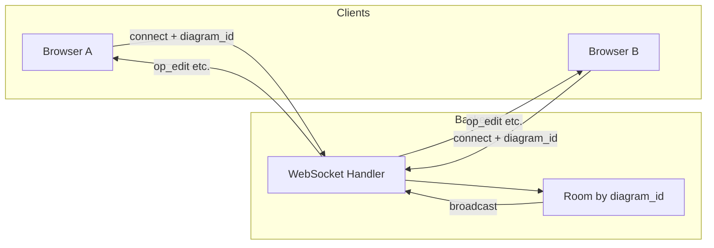
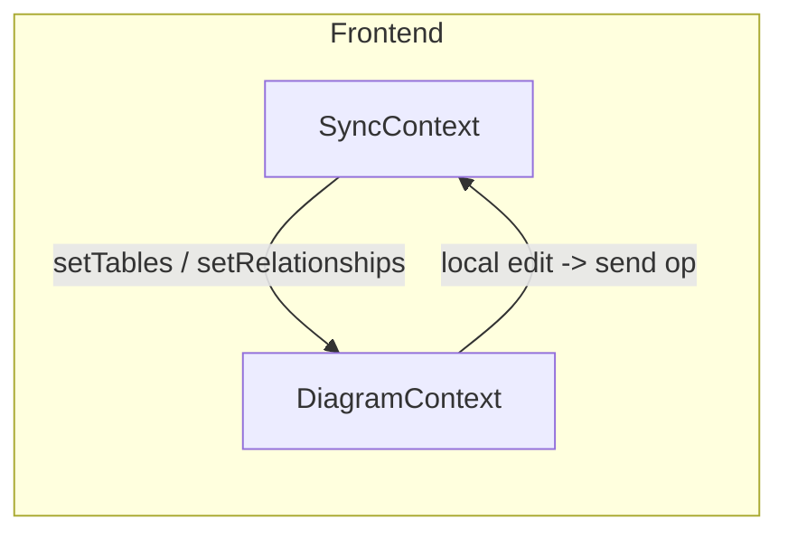

# 解决方案 01：多人协作与实时响应

## 1. 目标与范围

### 业务目标

- **同一 diagram 多端编辑**：多个用户/多个浏览器标签可同时打开同一张图表并编辑。
- **操作实时可见**：任一端的增删改（表、关系、笔记等）在数秒内同步到同文档的其他端。
- **冲突处理策略**：明确多端同时编辑时的合并或提示策略，避免数据错乱或静默覆盖。

### 范围

- **本期**：先支持「同链接/同文档」的实时同步（通过共享 diagram 的 URL 或 shareId 进入同一文档）。
- **可选后续**：在线用户列表、光标/选区展示、权限（只读/编辑）、历史与回放。

---

## 2. 前置条件

### 当前架构简述

- 数据流为 **REST 单请求-响应**：前端通过 Vite 代理调用后端 `/diagrams`、`/tables`、`/todos`、`/references`、`/templates`，无长连接。
- **无 WebSocket**：`backend/src/main.rs` 仅注册 HTTP scope，未提供 WS 端点。
- 前端状态在 React Context（如 `DiagramContext`）中，保存时调用 `diagramService.update` 等 REST API，无服务端推送。

### 依赖

- 需在后端新增 **WebSocket 服务端** 与前端建立长连接。
- 需定义 **文档/房间** 维度：以 `diagram_id` 为 room key，同一 diagram 的客户端加入同一 room，消息仅在 room 内广播。

---

## 3. 技术选型

### 服务端

- 在 Actix-web 上提供 WebSocket：
  - **方案 A**：`actix-web-actors` + `actix`，使用 Actor 管理连接与 room。
  - **方案 B**：`tokio-tungstenite` 等裸 WS，在 handler 内维护 `HashMap<diagram_id, Vec<WsSender>>` 做广播。
- 按 **diagram_id** 做 room/channel 管理：连接建立时根据 path 或 query 取得 `diagram_id`，握手时可选校验 diagram 是否存在（查 DB），再加入对应 room。

### 同步模型

- **方案 A（推荐用于强一致性）**：采用 **操作转换（OT）** 或 **CRDT**（如 Rust 侧无成熟库时可考虑前端使用 `yrs` 等，后端仅转发）。
- **方案 B（快速落地）**：**LWW（Last-Writer-Wins）** + 现有 revision 乐观锁；payload 中带 `revision`，服务端或客户端丢弃旧 revision 的更新，冲突时提示用户刷新或合并。

### 前端

- 在现有 `src/context/` 外增加 **SyncContext**（或 CollaborationContext）：
  - 根据当前打开的 `diagram_id` 建立 WebSocket 连接（如 `ws://host/diagrams/ws/{diagram_id}`）。
  - 订阅 WS 消息，解析后调用现有 Context 的 `setTables`、`setRelationships`、`setNotes` 等，或应用增量操作（若采用 OT/CRDT）。
  - 本地编辑时（如保存或关键操作后），将操作封装为协议消息发送到 WS，由服务端广播给同 room 其他客户端。

---

## 4. 分步实施（可落地步骤）

| 步骤 | 内容 |
|------|------|
| **Step 1** | 后端新增 WebSocket 端点，例如 `ws://host/diagrams/ws/{diagram_id}`；握手时校验 diagram 存在（可先不做鉴权）。 |
| **Step 2** | 服务端维护「diagram_id -> 连接集合」的 room，收到某连接的消息后，向同 room 内其他连接广播（消息格式建议 JSON：`{ "type": "...", "payload": { ... } }`）。 |
| **Step 3** | 定义最小消息协议：如 `op_edit`（表格/关系/笔记等变更）、`op_cursor`（可选）、`op_awareness`（可选）。 |
| **Step 4** | 前端根据当前打开的 diagram_id 建立 WS 连接，在 SyncContext 中接收并解析消息，调用现有 Context 的 setTables/setRelationships 等或应用增量操作。 |
| **Step 5** | 前端在本地编辑（如保存或关键操作）时，向 WS 发送 op，服务端广播给同 room 其他客户端。 |
| **Step 6** | （可选）冲突策略：若采用 LWW，在 payload 中带 revision，服务端或客户端丢弃旧 revision 的更新并提示用户。 |

---

## 5. 验收标准

- 两个浏览器窗口打开同一 diagram（同一 URL 或同一 shareId），在一端增/删表或关系，另一端在若干秒内可见更新。
- 需验证的场景：
  - 单表新增：A 端新增表，B 端列表与画布出现该表。
  - 关系新增：A 端新增关系，B 端画布出现连线。
  - 删除：A 端删除表/关系，B 端对应元素消失。
  - 多端同时编辑：根据所选策略（LWW 或 OT/CRDT）验证无静默覆盖或可预期的冲突提示。

---

## 6. 参考与附录

### 架构示意

### 相关代码位置

- 后端路由注册：`backend/src/main.rs`
- 前端 Context：`src/context/`、`src/components/Workspace.jsx`（保存与加载）
- 项目约定：`.cursor/rules/project-context.mdc`（revision 乐观锁等）
