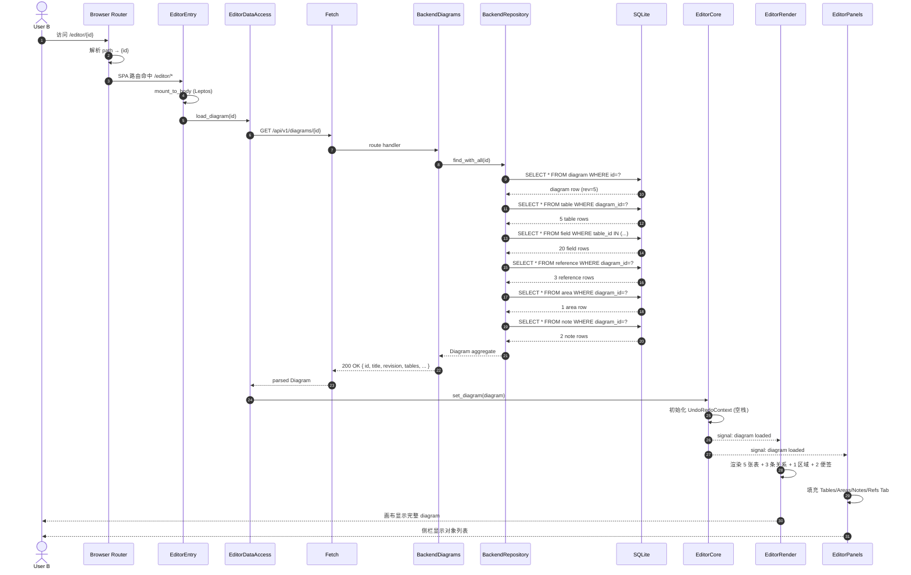
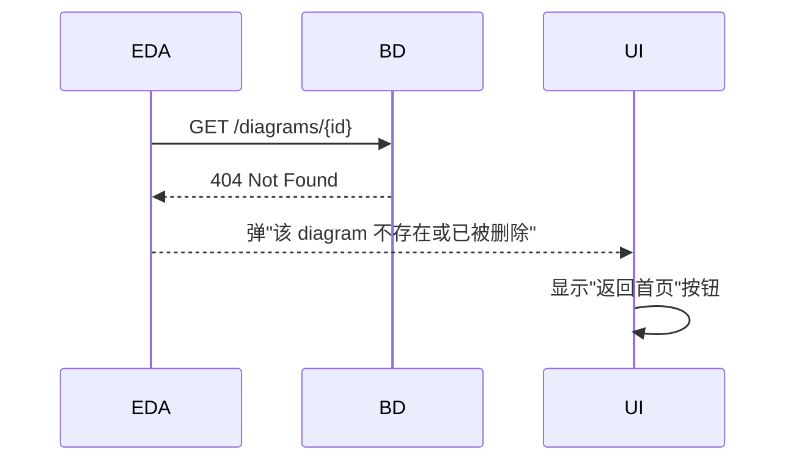

## ADDED — S02 时序图：分享链接加载

> 模块：core | 提案：add-baseline-docs
> 路径：`logos/resources/prd/3-technical-plan/2-scenario-implementation/core-S02-load-shared-diagram.md`
> 对齐参考源：`core-01-architecture-overview.md` + `core-02-diagram-persistence.md` + `core-05-top-menu-modals.md` §5.7

# S02 时序图：分享链接加载（How 层 — 第 2 步：场景）

## 1. 场景描述

**用户故事**：作为协作者 A，我把自己编辑的 diagram 分享给协作者 B；B 通过链接在浏览器中打开该 diagram，看到完整内容并可继续编辑。

**触发**：用户点击分享链接 `https://coldrawdb.example.com/editor/{id}`

**成功标志**：编辑器加载完整 diagram（含所有 tables/fields/references/areas/notes），可编辑

**覆盖范围**：CAP-PERSIST-01（读取）+ Share 模态（链接生成）+ 路由 `/editor/{id}`

## 2. 参与者

| 角色 | 模块 | 文件 |
|---|---|---|
| User B | — | — |
| Browser Router | — | `index.html` SPA 路由 |
| EditorEntry | `frontend-rs/src/lib.rs` | `mount_to_body` |
| EditorDataAccess | `frontend-rs/src/editor_data_access.rs` | `fetch_diagram` |
| BackendDiagrams | `backend/src/diagrams_v1.rs` | `read` handler |
| BackendRepository | `backend/src/repository/diagrams.rs` | `DiagramRepo::find_with_*` |
| SQLite | — | 11 张表 JOIN 查询 |
| EditorCore | `frontend-rs/src/editor_core.rs` | `set_diagram` |
| EditorRender + Panels | `frontend-rs/src/editor_render.rs` + `editor_panels.rs` | 响应式渲染 |

## 3. 时序图



## 4. 步骤详解

### 4.1 路由解析

```html
<!-- index.html -->
<body>
  <div id="root"></div>
  <script type="module">/* trunk bundle */</script>
</body>
```

```rust
// frontend-rs/src/lib.rs
#[wasm_bindgen(start)]
pub fn main() {
    leptos::mount_to_body(App);
}

#[component]
fn App() -> impl IntoView {
    let route = use_route();  // "/editor/{id}"
    view! { <Editor diagram_id=route.id /> }
}
```

### 4.2 EditorDataAccess 拉取

```rust
// frontend-rs/src/editor_data_access.rs
pub async fn fetch_diagram(id: &str) -> Result<Diagram, AppError> {
    let url = format!("/api/v1/diagrams/{}", id);
    let resp = gloo_net::http::Request::get(&url)
        .send()
        .await?
        .json::<Diagram>()
        .await?;
    Ok(resp)
}
```

### 4.3 Backend handler

```rust
// backend/src/diagrams_v1.rs
#[get("/api/v1/diagrams/{id}")]
async fn read(path: Path<String>) -> Result<HttpResponse, AppError> {
    let id = path.into_inner();
    diagrams::service::read(&pool, &id).await
        .map(|diagram| HttpResponse::Ok().json(diagram))
        .map_err(AppError::from)
}
```

### 4.4 Repository 聚合查询

```rust
// backend/src/diagrams/service.rs
pub async fn read(pool: &Pool, id: &str) -> Result<Diagram> {
    let diagram = diagram_repo::find(pool, id).await?
        .ok_or(AppError::NotFound)?;
    let tables = table_repo::find_by_diagram(pool, id).await?;
    let table_ids: Vec<i64> = tables.iter().map(|t| t.id).collect();
    let fields = field_repo::find_by_tables(pool, &table_ids).await?;
    let references = reference_repo::find_by_diagram(pool, id).await?;
    let areas = area_repo::find_by_diagram(pool, id).await?;
    let notes = note_repo::find_by_diagram(pool, id).await?;
    Ok(Diagram {
        id: diagram.id.clone(),
        title: diagram.title,
        revision: diagram.revision,
        tables: assemble(tables, fields),  // table + fields 嵌套
        references,
        areas,
        notes,
        enums: vec![],          // V1 不持久化
        custom_types: vec![],   // V1 不持久化
    })
}
```

> **性能考量**：5 张表 + 20 字段用 3 个查询（diagrams / tables / fields + 4 个查询；总计 6 个）。V1 接受 N+1 风险；V2 计划用 JOIN 优化。

### 4.5 EditorCore 初始化

```rust
// frontend-rs/src/editor_core.rs
pub fn set_diagram(&mut self, diagram: Diagram) {
    self.diagram = diagram;
    self.undo_stack.clear();
    self.redo_stack.clear();
    self.dirty = false;
    self.revision = self.diagram.revision;
    self.diagram_signal.set(self.diagram.clone());
}
```

### 4.6 渲染响应

```rust
// frontend-rs/src/editor_render.rs
#[component]
pub fn Canvas(core: RwSignal<Diagram>) -> impl IntoView {
    create_effect(move |_| {
        let diagram = core.get();
        // 渲染 tables / relationships / areas / notes
    });
}
```

## 5. 错误处理

### 5.1 404 Not Found



### 5.2 网络中断

- 重试 3 次（1s / 2s / 4s 指数退避）
- 全失败后显示加载失败 + 重试按钮

### 5.3 JSON 解析错误

- 后端返回非预期结构（schema 漂移）
- 弹"加载失败，请刷新重试"
- 错误日志上报（V1 仅 console.log）

### 5.4 链接无效（UUID 格式错）

- 前端 regex 校验
- 格式错则直接显示"无效链接"提示，不发请求

## 6. 性能与资源

| 资源 | 数量 |
|---|---|
| HTTP 请求 | 1（GET） |
| 数据库查询 | 6（diagrams + tables + fields + references + areas + notes） |
| WASM 内存 | 整个 diagram 树（≈ 100 KB / 100 表） |
| 网络流量 | 单次 GET ≈ 5 KB（5 表 20 字段） |
| 首屏时间 | < 1s（不含网络） |

## 7. 与 S01 的对比

| 维度 | S01（编辑保存） | S02（分享加载） |
|---|---|---|
| HTTP 方法 | PUT（写） | GET（读） |
| 触发 | 用户编辑 | 链接访问 |
| 频率 | 高（debounce 1s） | 低（一次性） |
| 错误 | 409 冲突（多写） | 404 不存在 |
| 后端事务 | 1 写事务 | 6 读查询 |
| 性能预算 | 200ms | 1s（首屏） |

## 8. 测试用例映射

| TC ID | 描述 | 对应 S02 步骤 |
|---|---|---|
| UT-P-02 | 创建含 5 表 20 字段 | （前置：A 先 S01 创建） |
| UT-S-01 | GET /diagrams/{id} → 200 全量数据 | 4.2 - 4.5 |
| UT-S-02 | GET /diagrams/{nonexistent} → 404 | 5.1 |
| UT-S-03 | GET /diagrams/{invalid-uuid} → 400 | 5.4 |
| ST-S-01 | 端到端：A 创建 + Share → B 通过链接加载 → 一致 | 完整链路 |
| ST-S-02 | 端到端：A 编辑保存后 B 加载，B 编辑触发 409 | （S01 + S02 联合） |

## 9. V1 边界

- ❌ 权限校验（V1 链接公开可访问；V2 计划加入鉴权）
- ❌ 链接过期（V1 链接永久有效）
- ❌ 链接访问统计（V1 不统计）
- ❌ SSR 预渲染（V1 纯 SPA + 客户端拉取）
- ❌ 数据库连接池优化（V1 单连接够用）

## 10. 对齐参考源

- `core-01-architecture-overview.md`（系统上下文 + 数据流）
- `core-02-diagram-persistence.md`（API 端点）
- `core-05-top-menu-modals.md`（Share 模态）
- `core-00-information-architecture.md`（路由 §2）
- `backend/src/diagrams_v1.rs`（5 端点 Rust 路由）
- `backend/src/diagrams/service.rs`（read 实现）
- `frontend-rs/src/lib.rs`（mount_to_body + 路由）
- `frontend-rs/src/editor_data_access.rs`（fetch_diagram）
- `docs/drawdb-capability-checklist.md` §2.5
