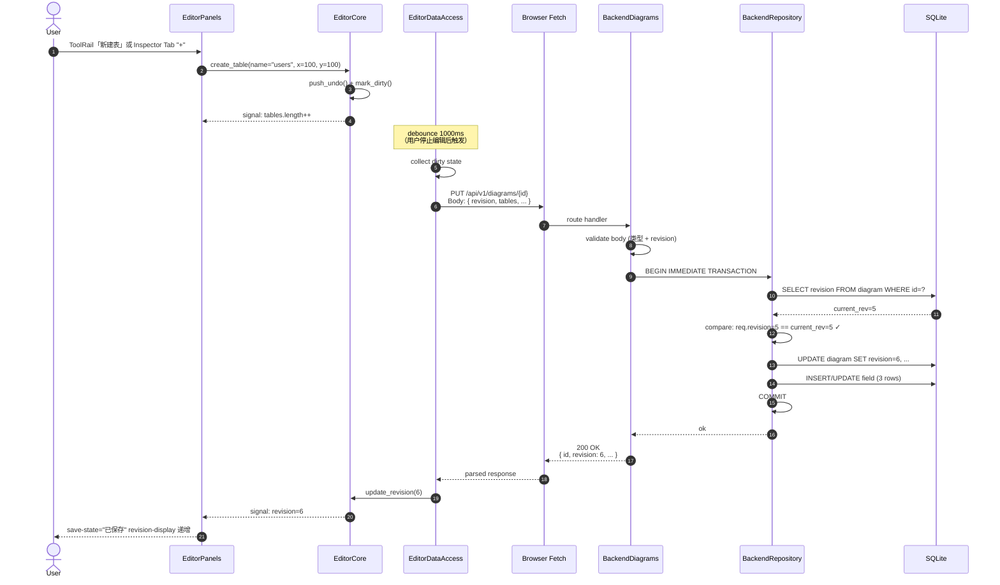
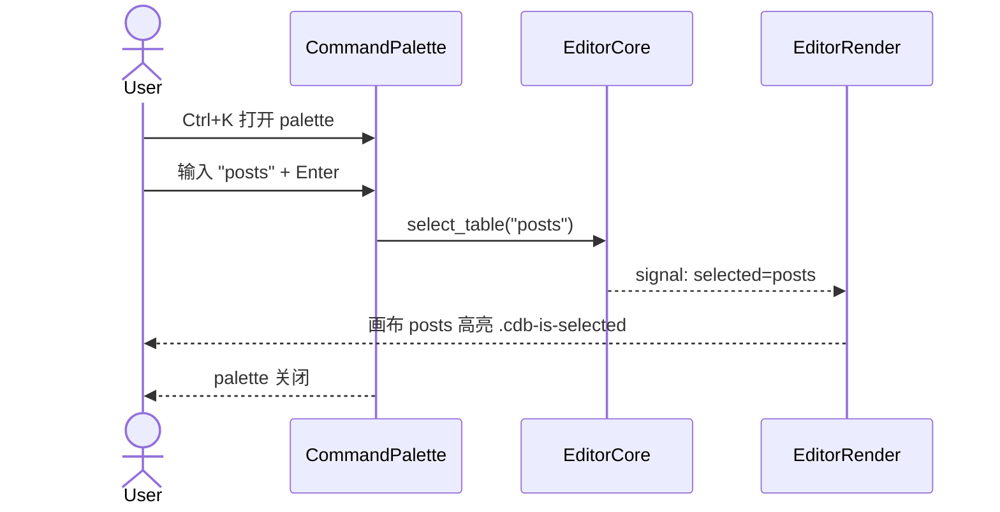
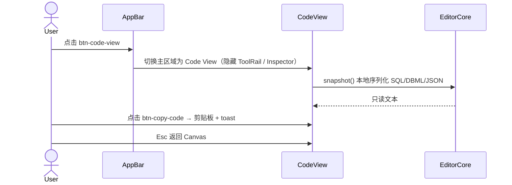
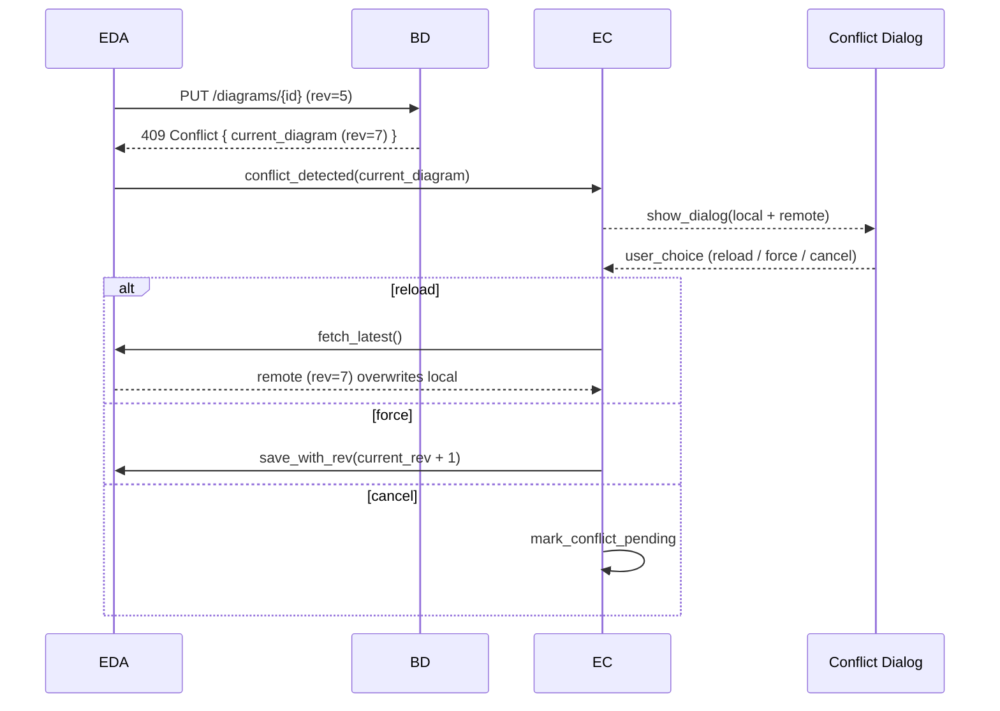

# S01 时序图：编辑 + 自动保存（How 层 — 第 2 步：场景）

> Phase 2 输入：`core-S01-edit-and-save-design.md` | 原型：`core-01-editor-prototype.html`

## 1. 场景描述

**用户故事**：作为开发者，我在编辑器中新建一张表（含 3 个字段），编辑器自动将变更同步到后端，刷新页面后内容不丢失。

**触发**：用户在 Tool Rail 点击「新建表」、Inspector「表」Tab 底部「+」、或在 Inspector / 画布上编辑字段 / 删除对象

**成功标志**：AppBar `[data-testid="save-state"]` 变为「已保存」+ `[data-testid="revision-display"]` revision 自增

**覆盖范围**：CAP-CANVAS-01/02（Table/Field）+ CAP-PERSIST-01/02（创建/更新）+ 全部 11 张表写入 + E4 Command Palette / Code View（客户端辅路径，无额外 HTTP）

## 2. 参与者

| 角色 | 模块 | 文件 / 锚点 |
|---|---|---|
| User | — | — |
| AppBar | `frontend-rs/src/editor_panels.rs` | `[data-testid="save-state"]` / `[data-testid="revision-display"]` / `[data-testid="btn-code-view"]` |
| ToolRail | `frontend-rs/src/editor_panels.rs` | `[data-testid="tool-rail"]` 新建表 / 关系 / 区域 |
| Inspector | `frontend-rs/src/editor_panels.rs` | `[data-testid="inspector-panel"]` / `[data-testid="field-editor"]` |
| EditorCore | `frontend-rs/src/editor_core.rs` | `push_undo` / `mark_dirty` / `update_revision` |
| EditorDataAccess | `frontend-rs/src/editor_data_access.rs` | `save`（debounce 1s） |
| ModalRoot | `frontend-rs/src/editor_panels.rs` | `[data-testid="modal-conflict"]`（409 分支） |
| CommandPalette | `frontend-rs/src/command_palette.rs` | `[data-testid="command-palette"]` · `Ctrl+K`（E4，无 HTTP） |
| CodeView | `frontend-rs/src/code_view.rs` | `[data-testid="code-view"]` · SQL/DBML/JSON 预览（E4，无 PUT） |
| Browser HTTP | — | `fetch` API |
| BackendDiagrams | `backend/src/diagrams_v1.rs` | `create` / `update` handler |
| BackendRepository | `backend/src/repository/...` | `DiagramRepo` / `TableRepo` / `FieldRepo` |
| SQLite | — | `data/coldrawdb.db` |

## 3. 时序图



### 3.1 辅路径 — Command Palette（E4，无 HTTP）



> 对齐 Phase 2 §3.5；不触发 debounce PUT。

### 3.2 辅路径 — Code View（E4，无 PUT）



> 对齐 Phase 2 §3.6；Monaco 集成见 `core-0a-code-editor.md`；不发起 HTTP。

## 4. 步骤详解

### 4.1 用户操作 → EditorCore

```rust
// frontend-rs/src/editor_panels.rs::on_create_table
fn on_create_table(name: String) {
    let table = Table { id: uuid::Uuid::new_v4().to_string(), name, ..default() };
    self.core.create_table(table);  // 调用 editor_core
}
```

### 4.2 EditorCore 处理

```rust
// frontend-rs/src/editor_core.rs
fn create_table(&mut self, table: Table) {
    self.undo_stack.push(UndoOp::CreateTable(table.clone()));
    self.diagram.tables.push(table);
    self.dirty = true;
    self.save_signal.notify();  // 唤醒 debounce 计时器
}
```

### 4.3 EditorDataAccess debounce

```rust
// frontend-rs/src/editor_data_access.rs
async fn save_loop(&self) {
    let mut debounce = tokio::time::interval(Duration::from_millis(1000));
    debounce.set_missed_tick_behavior(MissedTickBehavior::Skip);
    loop {
        debounce.tick().await;
        if self.core.is_dirty() {
            self.save().await;  // HTTP PUT
        }
    }
}
```

### 4.4 Backend handler

```rust
// backend/src/diagrams_v1.rs
#[put("/api/v1/diagrams/{id}")]
async fn update(
    path: Path<String>,
    body: Json<DiagramUpdateRequest>,
) -> Result<HttpResponse, AppError> {
    let id = path.into_inner();
    diagrams::service::update(&pool, &id, body.into_inner()).await
        .map(|diagram| HttpResponse::Ok().json(diagram))
        .map_err(AppError::from)
}
```

### 4.5 Repository 事务

```rust
// backend/src/diagrams/service.rs
pub async fn update(pool: &Pool, id: &str, req: DiagramUpdateRequest) -> Result<Diagram> {
    let mut tx = pool.begin().await?;
    let current = diagram_repo::find(&mut *tx, id).await?
        .ok_or(AppError::NotFound)?;
    if current.revision != req.revision {
        return Err(AppError::Conflict { current });
    }
    diagram_repo::update(&mut *tx, id, &req).await?;
    field_repo::replace_all(&mut *tx, id, &req.fields).await?;
    // ... 其他表
    tx.commit().await?;
    diagram_repo::find(pool, id).await
}
```

## 5. 错误处理

### 5.1 409 Conflict（最复杂分支）



### 5.2 404 Not Found

- diagram 不存在（被他人删除）
- 弹"该 diagram 已被删除"提示
- 提供"返回列表"按钮

### 5.3 网络中断

- AppBar `[data-testid="save-state"]` 变红，文案「保存失败（离线）」（对齐 Phase 2 §3.4）
- 指数退避自动重试：**3s / 6s / 12s**（封顶 **30s**）
- 网络恢复后 revision 推进，状态回「已保存」
- 超过重试上限后保留手动「重试」入口

### 5.4 后端 validation 错误

- 400 Bad Request + 详细错误消息
- 弹 toast 提示
- 不更新本地状态

## 6. 性能与资源

| 资源 | 数量 |
|---|---|
| HTTP 请求 | 1（PUT 全量） |
| 数据库事务 | 1（IMMIDIATE） |
| 数据库写语句 | N（diagram + N tables + M fields + ...） |
| WASM 内存增量 | 撤销栈 +1 步（≈ 1 KB） |
| 网络流量 | 单次 PUT ≈ 表格数 × 1 KB + 字段数 × 0.5 KB |

## 7. 测试用例映射

| TC ID | 场景 | 对应 S01 步骤 |
|---|---|---|
| UT-P-01 | 创建空 diagram | 4.1 - 4.5（首次 PUT → 201） |
| UT-P-02 | 创建含 5 表 20 字段 | 4.5（事务写 11 张表相关行） |
| UT-P-03 | PUT 带正确 revision → 200 | 4.4 - 4.5 |
| UT-P-04 | PUT 带过期 revision → 409 | 5.1 |
| UT-P-05 | DELETE → 级联删除 | （本场景不覆盖；S02 涉及） |
| ST-P-01 | 端到端：编辑 → 自动保存 → 重新加载 → 一致 | 完整链路 |
| ST-P-02 | Command Palette Ctrl+K 聚焦表 | §3.1 |
| ST-P-03 | Code View 复制 SQL 到剪贴板 | §3.2 |

## 8. V1 边界

- ❌ 局部 PUT（V1 全量更新；V2 计划改为 PATCH 局部）
- ❌ 实时协作同步（V1 仅单人；V2 OT 引擎）
- ❌ 后端 schema diff（V1 直接 replace）
- ❌ WASM 端 ORM（V1 仅后端 ORM）

## 9. 对齐参考源

- `core-S01-edit-and-save-design.md` — Phase 2 交互 + 验收 G/W/T
- `core-01-editor-prototype.html` — AppBar / ToolRail / Inspector / 409 模态锚点
- `core-01-architecture-overview.md`（数据流 §5）
- `core-02-diagram-persistence.md`（API + 事务 + 乐观锁）
- `core-01a-table-and-field.md`（Table / Field 对象结构）
- `core-0a-code-editor.md`（E4 Monaco / Code View）
- `backend/src/diagrams_v1.rs`（5 端点 Rust 路由）
- `backend/src/diagrams/service.rs`（事务逻辑）
- `frontend-rs/src/editor_core.rs`（状态机）
- `frontend-rs/src/editor_data_access.rs`（HTTP + debounce）
- `docs/drawdb-capability-checklist.md` §2.5

