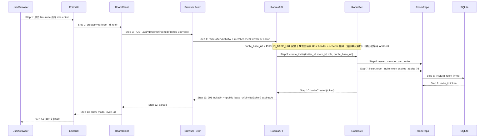

# Delta: core-S04-room-lifecycle.md

> 提案：fix-canvas-zoom-invite-comment-resize（问题 2：协作邀请链接无效）

## MODIFIED — ## 4. 时序图 — S04.2 邀请成员

## 4. 时序图 — S04.2 邀请成员

## MODIFIED — ### 7.2 邀请（§4）

### 7.2 邀请（§4）

1. 调用方须为 room **owner 或 editor**（可配置仅 owner）。
2. 生成 `token`（32 byte url-safe），INSERT `room_invite` TTL 7 天。
3. 响应含 `inviteUrl`：`{public_base_url}/invite/{token}`（前端路由，API 路径不同）。`public_base_url` 推导规则：取 `PUBLIC_BASE_URL` 配置（环境变量）；未配置时由请求 **Host header + scheme** 推导（`Forwarded` / `X-Forwarded-Proto` 优先，保留非默认端口）；**禁止硬编码 `localhost` / `127.0.0.1` / 无端口占位 host**。
4. 前端 `DiagramClient` / `AuthClient` / `RoomClient` / `CollabClient` 的 base_url 一律由 `window.location.origin` 同源派生（单入口部署下前后端同源，无需额外配置）；仅本地 dev 双进程（trunk serve :8080 + cargo run :3000）允许经环境变量/构建配置覆盖为 `http://127.0.0.1:3000`。
