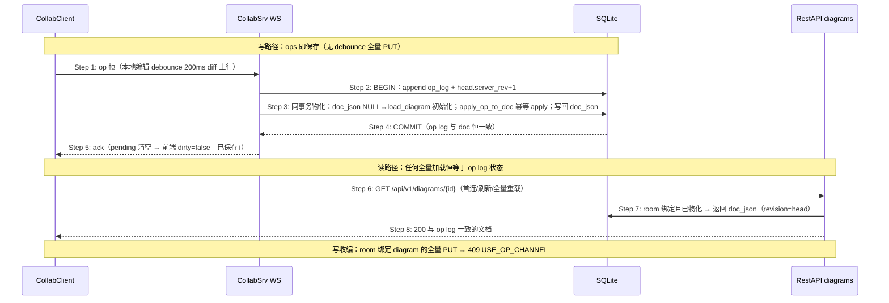

# Delta: core-S05-ot-collab.md（fix-collab-autosave-race · 方案 B 服务端物化单写者）

## MODIFIED — 7. 时序图 — S05.5 op 落库即物化（单写者）

````markdown
## 7. 时序图 — S05.5 op 落库即物化（单写者，fix-collab-autosave-race 改写）

> 原「周期 checkpoint（REST）」时序废弃：房间内不再有客户端全量快照写。
> 唯一事实源 = 服务端 doc_json；op 落库与物化同事务，读写无交错窗口。


````

## MODIFIED — 8. 步骤说明（追加小节）

````markdown
### 8.5 服务端物化单写者（fix-collab-autosave-race 改写）

1. **唯一事实源**：`room_collab_head.doc_json`（前端 Diagram JSON 形状）。op 落库即物化，
   同一事务提交——op log 与 doc 恒一致，从架构上消除「双写者交错」。
2. **物化规则**：15 种 op 幂等 apply。`table.create` 携带含字段全量；`table.update` 合并除
   `fields` 外所有键；`field.*` 依 `parentId` 定位父表字段数组；reference/area/note 按 id upsert/delete。
3. **初始化**：`doc_json` 为 NULL 时首个 op 落库前从关系存储 `load_diagram` 初始化
   （保真度与现行 GET 一致；关系存储缺 width/min_height 列为既有边界）。
4. **读切换**：GET diagram 对 room 绑定且已物化的 diagram 直接返回 doc（revision=head server_rev）。
5. **写收编**：PUT diagram 对 room 绑定 diagram 一律 409 USE_OP_CHANNEL；非房间 legacy 保存不变。
6. **前端语义**：room 模式 ops 即保存（无 1s debounce 全量 PUT）；`dirty` = 有未 ack/未 flush 的 op，
   Ack 清空后转「已保存」。
7. **入房补齐（同一权威序）**：入房「先 REST 加载（revision=doc_rev）后连 WS（head=server_rev）」
   存在提交窗口，窗口内 op 早于连接不会被广播补发。首次 `connected` 若 `server_rev > doc_rev`，
   客户端立即 `sync(lastRev=doc_rev)` 补齐；RemoteOp 按 server_rev 有序收编（rev<=cur 丢弃、
   rev==cur+1 应用、rev>cur+1 缓冲并 sync），sync 在途期间广播一律缓冲、sync 完成后有序回放。
````

## MODIFIED — 0. 文档头生产状态行

```markdown
> 生产状态：后端 WS/OT 已实现；生产前端已接入真实 WS（`wire-frontend-collab-ws`）；协作持久化为服务端物化单写者（`fix-collab-autosave-race`：op 落库即物化 doc_json，GET 物化读，PUT 写收编 409 USE_OP_CHANNEL，前端 ops 即保存）
```

## ADDED — §8.5 第 8 项：字段换序 op（verify 修复轮补充）

§8.5 物化规则由 15 种扩为 16 种，新增 `fields.reorder`：

- 触发：前端 diff 的 `EntitySnapshot` 补充 `field_order`（table_id → 有序 field id 列表）；
  同一表 id 序列变化即产出 `fields.reorder`（`targetId`=表 id，`changes.fieldIds`=全量目标序），
  排在同窗口 field create/update/delete 之后。
- 物化：按 `fieldIds` 重排字段数组；列表外字段保持原相对序追加；未知 id 忽略；幂等。
- 远端应用：`apply_op_to_store` 同规则重排 store 表字段。
- 根因：id 键控快照对「纯换序」产生空 diff（ST-SP-LIST-02 暴露），op 通道无法表达字段顺序。

## ADDED — §8.5 第 9 项：首连前编辑不丢（verify 修复轮）

- **baseline 前置**：diff baseline 在入房 REST 加载完成即建立（on_enter_room /
  on_invite_after_accept 调 `refresh_baseline`），不再等首个 `connected` 帧——
  否则 WS 未建连期间的本地编辑无 baseline 可 diff，被静默吞掉（C 批 ST-S01-SS-01 /
  ST-S05-UI-05 暴露）。
- **Connected 收编语义**：首连/重连不再整体重置 OT 状态——离线队列保留，
  sync 后 `flush_queue` 补发；已发送未 ack 的 pending op 载荷无存（协议只记
  rev/type），跨连接无法重发，按既有语义丢弃（对端经 sync/物化读收敛）。
- **重连 sync 起点修正**：`last_rev` 取断连前已知 rev（先读再更新 server_rev），
  旧实现先重置状态再读，sync 恒为空、断线期间的远端 op 补不回来。


## ADDED — §8.5 第 10 项：在途帧回队重发（verify 修复轮第二轮）

- `inflight_frames` 登记已发送未 ack 帧；WS 断开/被替换时回队重发（含 bookkeeping
  pending→queued 前移）；物化幂等，重投安全。ST-PC-06 间歇丢 op（actual=2 缺 table_1）
  的根因修复。
- flush_queue 失败不再丢帧：失败帧及后续整体回队。
- Connected 不再 pending_ops.clear()（配合重发，ack 按 client_rev 正常对账）。


## ADDED — §8.5 第 11 项：远端帧到达前结算本地编辑（verify 修复轮第三轮）

- **根因**（ST-CR-INSP-01 间歇失败，canvas-perf 2/15 复现）：`apply_remote` / sync 回放 /
  全量重同步会推进或重采 diff baseline；本地编辑若尚在 200ms debounce 窗口内
  （未 diff 上行），重采把它吞进 baseline → op 永远不发，后续依赖它的 op
  （如 field.update）上行时服务端文档里没有目标实体（mock 侧 putCalls=1 且
  doc.tables 为空、`__cdb_collab_state` 事件环无 table.create enqueue 为铁证）。
- **修复**：remote_op / sync / SYNC_GAP_TOO_LARGE 全量重同步处理前，先取消待触发
  debounce 并同步结算一次 diff+上行（`flush_pending_local_ops`），再应用远端帧。
  空 diff 时 emit 直接返回，无本地编辑时无害。
- **回归**：ST-FE-S05-11（建表后 <200ms 注入远端 note.create 广播，断言服务端物化
  文档同时含本地表与远端 note）。
