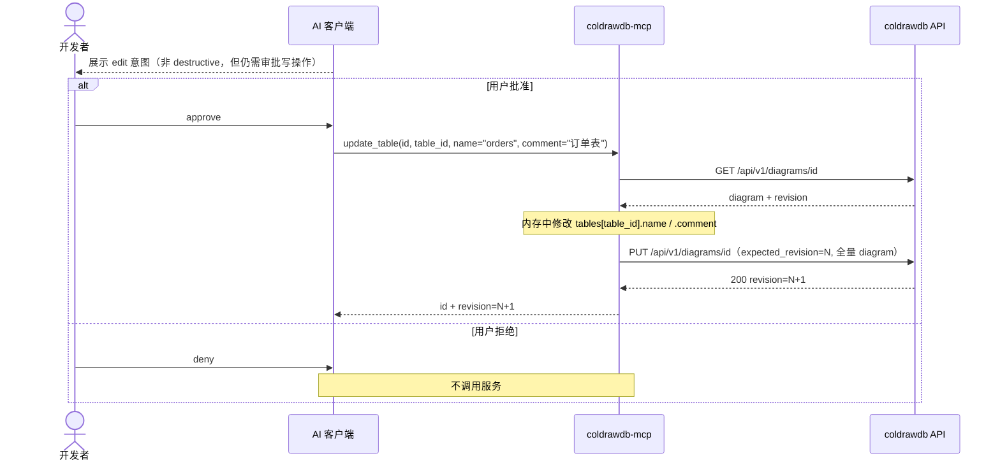
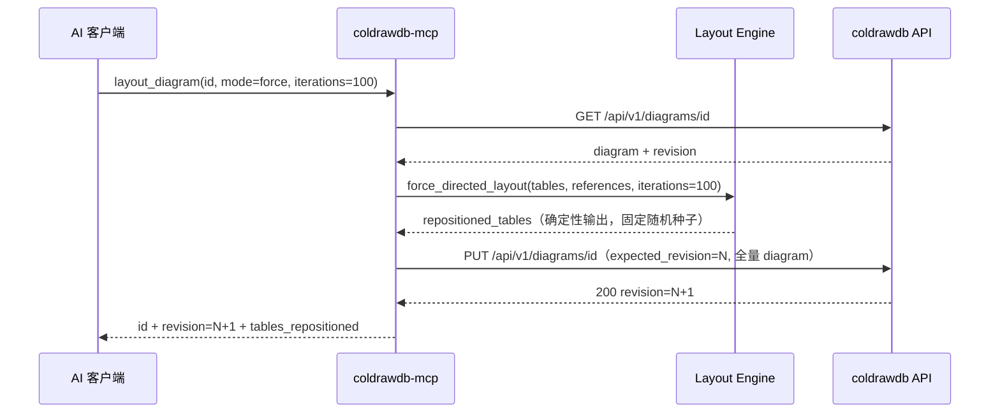

# Delta: core-S06-ai-client-mcp.md — mcp-canvas-tools（新增画布编辑时序与工具推导）

## MODIFIED — 6. API 与工具推导

## 6. API 与工具推导

| 时序步骤 | 推导工具 | 上游 |
|---|---|---|
| 工具发现 | tools/list | 本地静态 schema |
| 图表发现 | list_diagrams | `GET /diagrams/queryAll` |
| 读取 | get_diagram | `GET /api/v1/diagrams/{id}` |
| 创建 | create_diagram | `POST /api/v1/diagrams` |
| revision 保存 | update_diagram | `PUT /api/v1/diagrams/{id}` |
| 双确认删除 | delete_diagram | `DELETE /api/v1/diagrams/{id}` |
| 导入 | import_schema | `POST /api/v1/diagrams/import` |
| 导出 | export_schema | GET + 本地 serializer |
| 修改表属性 | update_table | GET + PUT（partial_update） |
| 修改字段属性 | update_field | GET + PUT（partial_update） |
| 关系连线管理 | update_reference | GET + PUT（partial_update） |
| 自动布局 | layout_diagram | GET + PUT（force_directed_layout） |

## ADDED — 6.1 辅时序：画布编辑（update_table / update_field / update_reference）

update_field 与 update_reference 遵循同一模式：
- 客户端仅传需要变更的字段（细粒度参数）
- adapter 全量读取 → 内存局部修改 → 全量写回
- 409 冲突时返回 `REVISION_CONFLICT` + `current_revision`，禁止自动覆盖

## ADDED — 6.2 辅时序：自动布局（layout_diagram）

布局引擎约束：
- 纯函数，无副作用，确定性输出（固定随机种子，相同输入必然相同输出）
- 输入：tables（含 x/y）+ references（关联边）
- 输出：tables 的更新后 x/y（不修改 name/comment 等其他属性）
- Fruchterman-Reingold 力导向变体：斥力（全表对）+ 引力（reference 边），迭代收敛

## MODIFIED — 8. 测试映射

## 8. 测试映射

| 步骤 | 用例 |
|---|---|
| initialize/tools/list | UT-MCP-01～03、ST-MCP-01 |
| list/get/export | UT-MCP-04～06、ST-MCP-02 |
| create/update/import/delete | UT-MCP-07～10、ST-MCP-03 |
| 409 | UT-MCP-12、ST-MCP-04 |
| 错误与脱敏 | UT-MCP-13～15、ST-MCP-05 |
| 四客户端 | UT-MCP-11、ST-MCP-06～09 |
| update_table 参数校验 | UT-MCP-16 |
| update_field 参数校验 | UT-MCP-17 |
| update_reference 参数校验 | UT-MCP-18 |
| layout_diagram 力导向算法正确性 | UT-MCP-19 |
| 四工具契约稳定性（tools/list 恰好 11 个） | UT-MCP-20 |
| update_table / update_field 端到端 | ST-MCP-10 |
| update_reference 连线创建/更新/删除端到端 | ST-MCP-11 |
| layout_diagram 端到端 + 确定性输出验证 | ST-MCP-12 |
