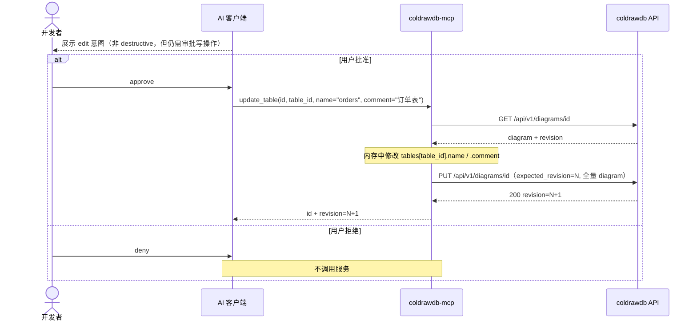
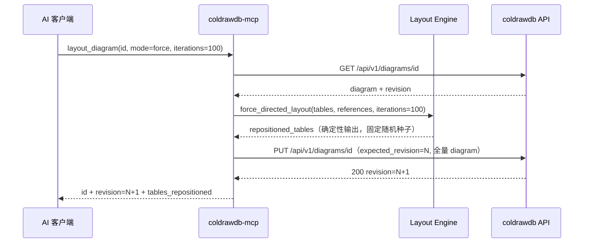
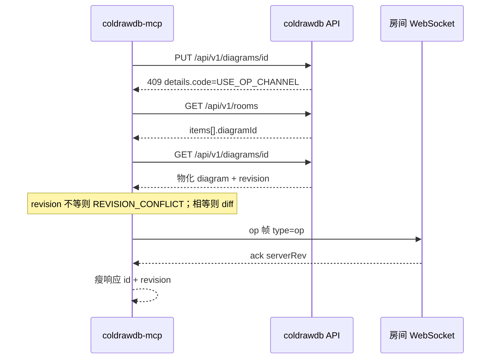

## MODIFIED — 6. API 与工具推导

| 时序步骤 | 推导工具 | 上游 |
|---|---|---|
| 工具发现 | tools/list | 本地静态 schema |
| 图表发现 | list_diagrams | `GET /diagrams/queryAll` |
| 读取 | get_diagram | `GET /api/v1/diagrams/{id}` |
| 创建 | create_diagram | `POST /api/v1/diagrams` |
| revision 保存 | update_diagram | 非房间：`PUT /api/v1/diagrams/{id}`；房间：PUT 409 `USE_OP_CHANNEL` 后走 WS op |
| 双确认删除 | delete_diagram | `DELETE /api/v1/diagrams/{id}` |
| 导入 | import_schema | `POST /api/v1/diagrams/import` |
| 导出 | export_schema | GET + 本地 serializer |
| 修改表属性 | update_table | GET + 非房间 PUT / 房间 op |
| 修改字段属性 | update_field | GET + 非房间 PUT / 房间 op |
| 关系连线管理 | update_reference | GET + 非房间 PUT / 房间 op |
| 自动布局 | layout_diagram | GET + 非房间 PUT / 房间 op |

### 6.1 辅时序：画布编辑（update_table / update_field / update_reference）

update_field 与 update_reference 遵循同一模式：
- 客户端仅传需要变更的字段（细粒度参数）
- adapter 全量读取 → 内存局部修改 → 全量写回
- 非房间 409 冲突时返回 `REVISION_CONFLICT` + `current_revision`，禁止自动覆盖
- 房间图的 PUT 409 `USE_OP_CHANNEL` 转入 §6.3，不把该 409 当作最终错误

### 6.2 辅时序：自动布局（layout_diagram）

布局引擎约束：
- 纯函数，无副作用，确定性输出（固定随机种子，相同输入必然相同输出）
- 输入：tables（含 x/y）+ references（关联边）
- 输出：tables 的更新后 x/y（不修改 name/comment 等其他属性）
- Fruchterman-Reingold 力导向变体：斥力（全表对）+ 引力（reference 边），迭代收敛
- 房间图在 PUT 被 `USE_OP_CHANNEL` 拒绝后，坐标差通过 table.update op 提交，响应仍含 `tables_repositioned`

### 6.3 辅时序：房间图经协作 op 写入

- op 语义与前端 `diff_snapshots` 一致：table/field/reference/area/note/dict 的 create/update/delete，以及 `fields.reorder`。`table.create` 携带含 fields 的完整表；`table.update` 不携带 fields。
- 客户端帧为 `{type:"op", clientRev, op}`。先忽略 `connected`，每条 op 等待 `ack.serverRev`。`error.code=READ_ONLY` 原样返回。
- token 只出现在 WebSocket query。连接失败信息必须打码，不得进入 stderr 或 MCP 错误。

## MODIFIED — 7. 异常与恢复

- stdin EOF：完成当前响应后正常退出；不得把 EOF 当成上游错误。
- 上游超时：返回 `UPSTREAM_TIMEOUT`；不自动重试写操作。
- 非房间 409：返回 `current_revision`；禁止 adapter 自动强制覆盖。
- 房间 409 `USE_OP_CHANNEL`：转入 op 通道；仅当物化 revision 与 `expected_revision` 不一致时返回 `REVISION_CONFLICT`。
- JSON payload 非 object：在调用上游前返回 `VALIDATION_ERROR`。
- stdout 污染：协议测试立即失败。成功调用不写 stderr；失败日志只能是一行含 `code`/`message` 的 JSON。
- 遗留 list 端点失败：返回 `UPSTREAM_ERROR`，不得退化为 SQLite 查询。

## MODIFIED — 8. 测试映射

| 步骤 | 用例 |
|---|---|
| initialize/tools/list | UT-MCP-01～03、ST-MCP-01 |
| list/get/export | UT-MCP-04～06、ST-MCP-02 |
| create/update/import/delete | UT-MCP-07～10、ST-MCP-03 |
| 409 | UT-MCP-12、ST-MCP-04 |
| 错误与脱敏 | UT-MCP-13～15、ST-MCP-05 |
| 四客户端 | UT-MCP-11、ST-MCP-06～09 |
| update_table 参数校验 | UT-MCP-16 |
| update_field 参数校验 | UT-MCP-17 |
| update_reference 参数校验 | UT-MCP-18 |
| layout_diagram 力导向算法正确性 | UT-MCP-19 |
| 四工具契约稳定性（tools/list 恰好 11 个） | UT-MCP-20 |
| update_table / update_field 端到端 | ST-MCP-10 |
| update_reference 连线创建/更新/删除端到端 | ST-MCP-11 |
| layout_diagram 端到端 + 确定性输出验证 | ST-MCP-12 |
| 房间 op 写入与 stderr | UT-MCP-25～27 |

## MODIFIED — 9. 设计决策

- stdio 是四客户端交集，且与当前“本地可信”安全边界匹配。
- adapter 调 HTTP 而非复用 repository，避免绕过业务响应与 revision 语义。房间图不绕过写收编：PUT 被拒绝后走与前端相同的 op 通道。
- 现有 v1 API 没有 list method，MVP 临时使用遗留 `/diagrams/queryAll`；后续应设计正式 `GET /api/v1/diagrams` 后再迁移。
- 现有 diagram API 尚未挂 S03 JWT；房间列表与房间 WebSocket 需要 `COLDRAWDB_ACCESS_TOKEN`。无 token 时房间写失败为 `UNAUTHENTICATED`，不得把 token 写入日志。
