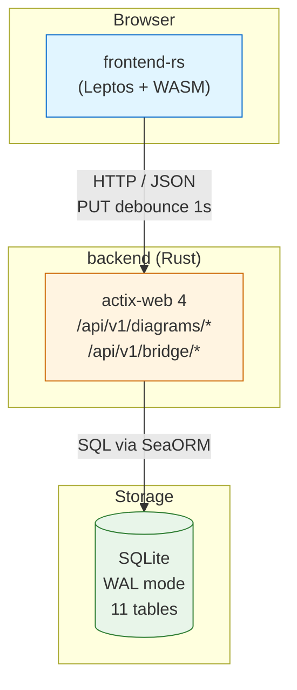

# V1 技术架构（How 层 — 第 1 步：架构）

## 0. 现行覆盖范围与原型基线

> 覆盖：V1（S01/S02 全栈）+ V2（auth / rooms / collab REST+WS 已落地于 backend）+ V3（S06 MCP adapter，本提案仅作回归边界）
> 唯一现行 HTML 主原型：`core-01-editor-prototype.html`（只读事实输入；演示器不建立真实 REST/WS）
> 历史参考原型：`core-03/04/05-*-prototype.html`（不作验收入口）
> 本提案预期：**不新增 API 端点、不新增 DB 表/迁移**；若行为已有契约，仅补前端参与者与异常映射

## 1. 系统上下文

```
┌──────────────────────────────────────────────────────┐
│                       Browser                        │
│  ┌──────────────────────────────────────────────┐   │
│  │       frontend-rs (Leptos + WASM)            │   │
│  │  index.html + trunk bundle                   │   │
│  └──────────────────────────────────────────────┘   │
│                       │ HTTP / JSON                  │
└───────────────────────┼──────────────────────────────┘
                        │
┌───────────────────────┼──────────────────────────────┐
│                       ▼                              │
│  ┌──────────────────────────────────────────────┐   │
│  │   backend (Rust + actix-web 4)               │   │
│  │   /api/v1/diagrams/*  (5 端点)               │   │
│  │   /api/v1/bridge/*    (5 端点)               │   │
│  └──────────────────────────────────────────────┘   │
│                       │ SQL                          │
│                       ▼                              │
│  ┌──────────────────────────────────────────────┐   │
│  │   SQLite (WAL 模式)                          │   │
│  │   11 张表                                    │   │
│  └──────────────────────────────────────────────┘   │
└──────────────────────────────────────────────────────┘
```

V1 系统由**两个 Rust 二进制**组成：WASM 前端 + actix-web 后端；共享 SQLite 文件。V2 计划新增 `collab-server`（独立 OT 引擎，详见 `add-v2-collab-spec`）。

### 1.1 Mermaid 系统架构图（machine-readable 主版本）



### 1.2 现行页面状态与系统边界

生产前端与规格必须以统一工作空间页面状态为准（对齐 `core-00-information-architecture.md`）：

| 状态 ID | 视图 | 技术触发 | 下一跳 |
|---|---|---|---|
| `auth` | 登录 / 注册 | 未登录访问受保护路由 | `rooms`（登录成功） |
| `rooms` | 房间与最近项目 | S03 会话有效 | `room-editor` / `invite` |
| `invite` | 邀请预览 / 失效 | `/invite/{token}` | `room-editor` 或停留失效 |
| `room-editor` | 协作 ER 编辑器 | 房间成员 | 可回 `rooms` |
| `share-readonly` | 匿名只读分享 | `?share=<id>` | **不被鉴权拦截** |

```text
Browser (frontend-rs)
  auth ──登录成功──→ rooms ──创建/打开/接受邀请──→ room-editor
                         ▲                              │
                         └──────── room-badge / 退出 ────┘
  ?share= ──────────→ share-readonly（S02 旁路）

主原型 HTML：仅本地状态机演示上述流转；禁止当作生产完成证据
```

废止默认路径：历史 Landing → 空白 `/editor` 直达。

## 2. 前端 4 模块 + 单向依赖

```
┌─────────────────────────────────────────┐
│           frontend-rs crate             │
│  (Leptos 0.x + WASM + trunk)            │
├─────────────────────────────────────────┤
│  lib.rs                                 │
│  └── mount_to_body + 模块组合           │
├─────────────────────────────────────────┤
│  editor_data_access（无依赖）           │
│  └── HTTP 客户端（diagrams/bridge）     │
│        + debounce 1s 自动保存          │
├─────────────────────────────────────────┤
│  editor_core（依赖 data_access）         │
│  └── 状态机（diagram / undo / redo）     │
├─────────────────────────────────────────┤
│  editor_panels（依赖 core）              │
│  └── 侧栏（Tables / Areas / Notes ...）  │
├─────────────────────────────────────────┤
│  editor_render（依赖 core）              │
│  └── Canvas 渲染（Table/Field/连线）    │
└─────────────────────────────────────────┘
```

### 2.1 模块职责

| 模块 | 职责 | 关键 API |
|---|---|---|
| `editor_data_access` | 唯一 HTTP 出口；封装 diagrams/bridge API；debounce 自动保存 | `DiagramsApi` / `BridgeApi` |
| `editor_core` | 持有 diagram 主状态；状态变更入口；撤销/重做栈 | `Diagram` / `UndoRedoContext` |
| `editor_panels` | 侧栏 6 Tab + Issues + DBMLEditor 视图 | 7 个 panel 子模块 |
| `editor_render` | 画布渲染（Table/Field/Relationship/Area/Note）；贝塞尔连线 | `Canvas` / `calc_path` |

### 2.2 依赖方向（强制）

```
editor_data_access  ←（无依赖）
        ↑
editor_core
        ↑
   ┌────┴────┐
   │         │
editor_panels  editor_render
```

- 任何反向依赖（panels → data_access，render → data_access）**禁止**
- 模块间通信通过 `editor_core` 暴露的 signals（Leptos `Signal<T>` / `RwSignal<T>`）
- HTTP 请求必须经过 `editor_data_access`，其他模块不可直接 `fetch`

### 2.5 V2 前端布局层（redesign-phase-a/b/c 落地，2026-06-14）

V2 重构后的前端分为 **4 个 UI 层**（z-index 体系见 `core-00-information-architecture.md` §1）：

| 层 | 容器 | z-index | 职责 |
|---|---|---|---|
| L1 | `AppBar`（顶栏） | `--cdb-z-app-bar` (10) | 标题 + 主菜单 + 全局操作（Share / Undo / Redo） |
| L2 | `ToolRail`（左侧工具轨） | `--cdb-z-tool-rail` (20) | 选中 / 表 / 关系 / 区域 / 便签 / 缩放 6 个工具按钮 |
| L3 | `Inspector`（右侧检查器） | `--cdb-z-inspector` (30) | 当前选中对象的属性编辑面板（替代 V1 模态中的字段编辑） |
| L4 | `ModalRoot`（模态根） | `--cdb-z-modal` (40) | New / Open / Share / Rename / Settings / Confirm 6 个模态 |
| L5 | `Palette` / `Tooltip` / `Popover` | `--cdb-z-overlay` (50) | 颜色选择器 / 工具提示 / 弹出层 |
| L6 | `Drawer`（IO 抽屉） | `--cdb-z-drawer` (35) | 导入 / 导出抽屉（与 Inspector 同级侧栏语义，不占用模态层） |

> V1 vs V2 关键差异：V1 所有编辑操作集中在中央模态（L4），V2 拆分为侧栏（L3）+ 抽屉（L6）+ 模态（L4），降低上下文切换成本。

### 2.6 设计系统层（redesign-phase-d/e 落地，2026-06-15）

| 组件 | 来源 | 引用规格 |
|---|---|---|
| Design Tokens | 13 类约 100 个 `--cdb-*` CSS 变量 | `core-07-design-tokens.md` |
| Icon Library | 自建 SVG 模板 + `@douyinfe/semi-icons` 命名规范 | `core-08-icon-library.md` |
| Core Components | 8 类（Button / Modal / Dropdown / Tooltip / Popover / Tag / Collapse / SideSheet） | `core-09-core-components.md` |
| Code Editor | Monaco + DBML setup + 复制按钮（E4 替代 V1 `<textarea readonly>`） | `core-0a-code-editor.md` |
| Dark Mode | `<html data-mode="light\|dark">` 全局切换（E5） | `core-0b-dark-mode.md` |
| Motion | CSS `@keyframes` + transition + 工具类（E6 不引入 framer-motion） | `core-0c-motion.md` |

> **依赖方向（强制）**：所有组件 / icon / 动效 都依赖 token 层（`core-07`），不得越过 token 直接引用硬编码值。

### 2.7 前端模块职责：生产 vs 主原型

| 层 | 职责 | 禁止 |
|---|---|---|
| `frontend-rs`（`editor_data_access` + auth/room/collab 客户端） | **唯一**真实 REST / WS 出口；Bearer、refresh、room 成员校验、OT 队列 | 绕过 data_access 直连 fetch/WS |
| `editor_core` / panels / render | 状态机、布局壳（AppBar / ToolRail / Inspector / StatusBar）、画布 | 自造持久化语义 |
| `core-01-editor-prototype.html` | 演示页面流、状态文案、锚点与交互连贯性 | 作为生产 REST/WS 完成证据；演示登录/WS 不得写入强制生产契约 |

**状态表述（强制）**：

1. 后端 auth/rooms/collab 已实现并可编排验收
2. 生产前端 API/页面流已**部分**接入
3. 相对主原型的结构 / 视觉 / 交互逐项对齐，由下一变更 `implement-unified-prototype-spec-parity` 实现与验收
4. 不得因主原型可演示而将 S03～S05 标为全栈完成

## 3. 后端 11 子模块

```
backend/src/
├── main.rs            # actix-web 入口（绑定 /api/v1/*）
├── init.rs            # 配置加载 + DB 初始化 + migration
├── diagrams_v1.rs     # /api/v1/diagrams/* 5 端点
├── phase3_bridge.rs   # /api/v1/bridge/* 5 端点
├── areas/             # 区域实体 + repository
├── diagrams/          # diagram 实体 + repository
├── fields/            # 字段实体 + repository
├── indices/           # 索引实体 + repository
├── notes/             # 便签实体 + repository
├── references/        # 关系实体 + repository
├── tables/            # 表实体 + repository
├── todos/             # task 实体 + repository
├── common/            # 共享类型（error / id / timestamp）
├── entity/            # ORM 实体
├── error/             # 错误类型 + IntoResponse
└── repository/        # 数据访问抽象层
```

### 3.1 7 个领域子模块（与 drawdb 7 大画布对象对齐）

| 子模块 | 对应画布对象 | 11 张表中对应表 |
|---|---|---|
| `areas` | Area | `area` |
| `diagrams` | Diagram | `diagram` |
| `fields` | Field | `field` |
| `indices` | Index | `indice` + `indice_link`（V1 实体化但 frontend 不写） |
| `notes` | Note | `note` |
| `references` | Relationship | `reference` |
| `tables` | Table | `table` + `table_link` |

### 3.2 4 个支撑子模块

| 子模块 | 职责 |
|---|---|
| `todos` | 导入任务（task 表） |
| `common` | 共享类型（`DbId` / `Timestamp` / `Revision`） |
| `entity` | SeaORM 实体定义（与 SQL 表 1:1） |
| `error` | 错误类型 + `IntoResponse` 实现 |
| `repository` | 通用数据访问抽象（trait + SQL 实现） |

## 4. 11 张表

| 表名 | 用途 | 主键 | 关键索引 |
|---|---|---|---|
| `task` | 导入任务日志 | BIGINT auto | type / status |
| `diagram` | 主表 | BIGINT auto | id（UUID） + revision |
| `diagram_link` | diagram 关联 | BIGINT auto | source_id / target_id |
| `table` | 表元数据 | BIGINT auto | diagram_id + name |
| `field` | 字段 | BIGINT auto | table_id + name |
| `table_link` | 表关联 | BIGINT auto | source / target |
| `indice` | 索引 | BIGINT auto | table_id |
| `indice_link` | 索引字段关联 | BIGINT auto | indice_id + field_id |
| `reference` | 关系 | BIGINT auto | start_table_id / end_table_id |
| `area` | 区域 | BIGINT auto | diagram_id |
| `note` | 便签 | BIGINT auto | diagram_id |

详细 DDL 见 `deltas/database/coldrawdb-v1.sql`。

## 5. 数据流

### 5.1 加载流程（GET）

```
Browser → frontend-rs/editor_data_access
              ↓ HTTP GET /api/v1/diagrams/{id}
         backend/diagrams_v1::read
              ↓ SELECT * FROM diagram JOIN ...
         SQLite
              ↑ JSON response
         editor_core::set_diagram
              ↑ signal
         editor_panels + editor_render (reactive update)
```

### 5.2 编辑保存流程（debounce 1s PUT）

```
User edits → ToolRail / Inspector / Canvas
              ↓ signal
         editor_core::push_undo + mark_dirty
              ↓ AppBar save-state →「保存中…」
              ↓ 1000ms debounce
         editor_data_access.save
              ↓ HTTP PUT /api/v1/diagrams/{id}
         backend/diagrams_v1::update
              ↓ BEGIN IMMEDIATE TRANSACTION
         SQLite (write)
              ↓ COMMIT
              ↑ 200 OK + new revision
         editor_core::update_revision
              ↓ AppBar revision-display 递增 +「已保存」
```

### 5.3 冲突流程（PUT → 409）

```
editor_data_access.save → 409 Conflict
              ↓
         editor_core::conflict_detected
              ↓
         ModalRoot 弹冲突模态 [data-testid="modal-conflict"]
         - Reload [data-testid="conflict-reload"]: GET → 覆盖本地
         - Force [data-testid="conflict-force"]: PUT rev+1 → 覆盖远端
         - Cancel: 关闭模态，保留本地
```

### 5.4 Command Palette（E4，客户端，无 HTTP）

```
User Ctrl+K → command_palette::CommandPalette
              ↓ 过滤表/关系
         editor_core::select_object
              ↓ signal
         editor_render 聚焦 + Inspector 同步
```

> 对齐 `core-S01-edit-and-save-design.md` §3.5；不触发 debounce PUT。

### 5.5 Code View（E4，客户端，无 PUT）

```
User 点击 btn-code-view → code_view::CodeView
              ↓ editor_core::snapshot()
         本地序列化 SQL / DBML / JSON（Monaco 只读）
              ↓ 可选 bridge 导出逻辑（内存）
         剪贴板复制 + toast（无 HTTP）
```

> 对齐 `core-0a-code-editor.md`；主区域切换时隐藏 ToolRail / Inspector。

### 5.6 分享加载（GET + ?share=）

```
Browser ?share=<id> → lib.rs 解析 query
              ↓
         editor_data_access.fetch_diagram(id)
              ↓ HTTP GET /api/v1/diagrams/{id}
         backend → SQLite → editor_core::set_diagram
              ↓
         editor_render + Inspector 渲染
```

> Share 模态生成 URL：`/editor?share={id}`（见 `core-S02-load-shared-diagram-design.md`）。

### 5.7 页面流数据源（REST / WS）

| 页面状态 | 权威状态来源 | UI 反馈锚点（示例） |
|---|---|---|
| auth | `POST /auth/login|register`、`GET /auth/me`、`POST /auth/refresh|logout` | `login-form` / `session-indicator` |
| rooms | `GET/POST /rooms` | `rooms-list-page` / `room-list` |
| invite | `GET/POST .../invites/{token}` | `invite-accept-page` / `btn-accept-invite` |
| room-editor | rooms 成员 + S01 PUT 或 S05 WS | `room-editor-page` / `room-badge` / `save-state` / `ws-status` |
| share-readonly | `GET /diagrams/{id}`（匿名） | 只读画布；写工具禁用 |

协作房间内并发合并走 S05；**禁止**对已 OT 合并的并发弹出 S01 `modal-conflict`（409）。

## 6. 关键技术选型（选型 / 理由 / 备选方案）

| 维度 | 选型 | 选型理由 | 备选方案 |
|---|---|---|---|
| 前端语言 | Rust + Leptos 0.x | 与后端同语言栈；类型安全；WASM 性能优于 JS | TypeScript + React（drawdb 现状，迁移成本高） |
| 前端打包 | trunk | Leptos 官方推荐；零配置 WASM 打包 | wasm-pack + 自写 Rollup（配置成本高） |
| 渲染 | HTML5 Canvas（自绘） | 性能优于 SVG：100+ 表 60fps；贝塞尔连线自渲染无 vDOM diff | SVG（drawdb V1 选型，>50 表掉帧）/ WebGL（过重） |
| 后端语言 | Rust + actix-web 4 | 高性能（接近 C++）；类型安全；与前端共享模型 crate | Node + Fastify（生态好但性能弱）/ Go + Gin（性能中等） |
| 数据库 | SQLite（WAL 模式） | 单进程 + 文件级备份；零运维；适合自托管 | PostgreSQL（功能强但需额外部署）/ MySQL（同上） |
| ORM | SeaORM | 11 张表实体化；事务支持；与 actix-web 生态契合 | Diesel（编译时间长）/ SQLx（裸 SQL，开发慢） |
| 序列化 | serde + JSON | 与 OpenAPI 一致；schema 演进兼容 | bincode（二进制，不便于调试）/ MessagePack |
| 配置 | TOML | Rust 生态事实标准；注释友好 | YAML（缩进敏感）/ JSON（无注释） |
| 日志 | tracing + tracing-subscriber | 结构化日志；span 追踪；与 OpenTelemetry 兼容 | log + env_logger（功能弱）/ slog（API 复杂） |
| 测试 | cargo test（unit + integration） | 覆盖 11 个子模块；内置 mock 支持 | pytest 等外部框架（需另起进程） |
| CORS | actix-cors（strict 模式） | 仅允许同源；自托管场景无跨域需求 | 完全禁用（部分部署场景受限） |

## 7. 部署拓扑

### 7.1 本地 dev

```
trunk serve        # localhost:8080（WASM 前端）
cargo run -p backend   # localhost:3000（actix-web）
SQLite             # ./data/coldrawdb.db
```

### 7.2 Docker

```dockerfile
# frontend-rs 阶段
FROM rust:1.75 as wasm-build
WORKDIR /app
RUN cargo install trunk
RUN trunk build --release

# backend 阶段
FROM rust:1.75-slim as api-build
WORKDIR /app
RUN cargo build --release -p backend

# 运行阶段
FROM debian:bookworm-slim
COPY --from=api-build /app/target/release/backend /usr/local/bin/
COPY --from=wasm-build /app/dist /var/www/
EXPOSE 3000
CMD ["backend"]
```

### 7.3 staging

- 单机 Docker Compose
- 反向代理：nginx（前端静态 + 后端 API 反代）
- 数据卷：SQLite 文件
- 详细见 `deltas/.../3-deployment/core-01-deployment-plan.md`

## 8. 性能预算

| 指标 | 预算 | 测量 |
|---|---|---|
| 首屏加载 | < 3s | Phase 4 W4 perf 记录 |
| 编辑响应 | < 50ms | Leptos signal propagation |
| 自动保存 PUT | < 200ms | 100 KB payload |
| Canvas 渲染 | 60 fps / 100 表 / 200 关系 | Phase 4 W4 perf |
| WASM 体积 | < 5 MB | trunk build 产物 |
| 后端冷启动 | < 500ms | `cargo run` to ready |

## V2 系统上下文端点

在既有 diagrams/bridge 之外，backend 已挂载（本提案不新增）：

| 域 | 路径族 | 场景 |
|---|---|---|
| diagrams | `/api/v1/diagrams/*` | S01 / S02 / S05 checkpoint |
| bridge | `/api/v1/bridge/*` | 导入导出 |
| auth | `/api/v1/auth/*` | S03 |
| rooms | `/api/v1/rooms/*` | S04 |
| collab REST | collab head/ops（见 `collab.yaml`） | S05 |
| WS | `/ws/rooms/{roomId}` | S05 |

> 原文「V2 计划新增独立 `collab-server`」以**现行事实**覆盖：协作 WS/OT 已由 backend 实现；后续是否拆独立进程不在本提案范围。

## S06 回归边界（本提案不改）

- MCP stdio adapter（`coldrawdb-mcp`）不计入统一原型 UI 对齐范围
- 本提案合并后，S06 仅作回归：不得因页面流文案变更破坏 MCP → HTTP 白名单路径与 redaction 边界
- Streamable HTTP 仍禁止在权限前置未完成前部署（见原文 MCP adapter 节）

## 9. V1 边界

下列条目仅描述 **V1 历史边界**，不得再写为现行系统事实：

- ~~❌ OT 实时协作（V2 计划）~~ → V2 后端已实现；生产前端逐项对齐待下一变更
- ~~❌ WebSocket（V1 全 HTTP）~~ → `/ws/rooms/{roomId}` 已存在

仍有效：V1 单人非 room 编辑仍走 S01 PUT + 409；微服务拆分 / PostgreSQL 等边界不变。

## 10. 对齐参考源

- `core-01-editor-prototype.html` — 唯一现行主原型（页面状态事实输入）
- `core-00-information-architecture.md` — auth / rooms / invite / room-editor
- `core-S03-user-auth.md` / `core-S04-room-lifecycle.md` / `core-S05-ot-collab.md` — V2 时序
- `auth.yaml` / `rooms.yaml` / `collab.yaml` — 既有契约（本提案预期无新增端点）

## 11. 非功能性约束（NFR 架构映射）

> 与 `core-01-requirements.md` §4 NFR 一一对应；此处仅记录架构侧的应对策略

| NFR 维度 | 约束 | 架构应对 |
|---|---|---|
| **性能** | 编辑响应 P95 < 200ms；自动保存 debounce 1s；100 表 60fps | Canvas 自渲染 + Leptos 细粒度 signal 更新；debounce 1s 写入；`BEGIN IMMEDIATE TRANSACTION` 避免写锁争用 |
| **安全** | V1 无用户系统；数据仅按 diagram id 区分 | 无鉴权中间件；URL 中 share id 即权限；部署文档强调内网/反代保护；TLS 由前置 nginx 终止 |
| **可扩展** | 单实例 1 CPU / 1 GB RAM 承载 100 并发 | actix-web 异步运行时（tokio）；SQLite WAL 允许读写并发；WASM 端零服务端计算 |
| **可观测** | 结构化日志 + 关键指标 | `tracing` 输出 JSON 日志（stdout）；指标暴露 `/metrics`（V2 候选，V1 仅 stderr） |
| **开发体验** | 本地启动 < 30s；CI green | `cargo run -p backend` + `trunk serve`；GitHub Actions 4 阶段（lint / test / build / docker）；`scripts/dev.sh` 一键拉起 |

### 11.1 数据备份策略（V1 简化版）

- SQLite 文件级备份：每天 cron `cp data/coldrawdb.db data/backup/$(date +%Y%m%d).db`
- 备份保留 30 天滚动
- 灾难恢复：单文件复制即可（无分布式状态）

## 12. 外部依赖与测试策略

> 依据 `architecture-designer` SKILL §Step 5「外部依赖与测试策略」

### 12.1 外部依赖清单（V1）

**V1 无外部服务依赖**——所有功能均在本进程内完成，无邮件 / SMS / OAuth / 支付 / 验证码等第三方服务。

| 类别 | 提供商 | 用途 | 测试策略 |
|---|---|---|---|
| 无 | — | — | — |

### 12.2 内置服务依赖（同进程）

| 服务 | 用途 | 测试策略 |
|---|---|---|
| SQLite 文件 | 11 张表持久化 | `cargo test` 使用临时文件 `data/test-{uuid}.db` |
| 静态资源（dist） | WASM bundle + HTML | `trunk build` 产物作为 nginx 静态目录；CI 校验 dist 存在 |

### 12.3 后续候选（不在当前部署范围）

- 邮件服务（SendGrid / SMTP）— 用于 S03 注册验证
- 独立扩缩容的 WebSocket 网关 — 当前 S05 WS 已由 backend 实现，后续可拆分为独立服务
- 对象存储（S3 兼容）— 用于 V2 模板/导入产物的二进制存储

V2 引入时需在本节按 SKILL 表格补充 `used_in` / `test_strategy` / `test_config` 三列。

## MCP adapter 边界

```text
Claude / Codex / Cursor / OpenCode
              │ MCP stdio（JSON-RPC）
              ▼
       coldrawdb-mcp（新 Rust 服务）
       ├─ protocol/tool schema
       ├─ config + redaction
       ├─ fixed-path HTTP client
       └─ pure export serializer
              │ HTTP + optional Bearer
              ▼
       既有 coldrawdb backend
              │ SeaORM / SQL
              ▼
             SQLite
```

### 模块职责

| 模块 | 职责 | 禁止 |
|---|---|---|
| MCP protocol | initialize、tools/list、tools/call、annotations | 业务持久化 |
| config | BASE_URL/Token/timeout 校验、secret redaction | 把 Token 写入日志 |
| HTTP adapter | 只调用白名单 diagram 路径、错误映射 | 任意 URL/method/header |
| export serializer | Diagram → JSON/DBML/SQL 纯函数 | 网络、文件、数据库副作用 |
| backend | revision、事务、持久化 | 由 MCP 绕过 |

### 依赖方向

`protocol → application tools → HTTP port`；具体 HTTP client 实现依赖 port。export serializer 是纯领域服务。MCP crate 不依赖 `backend` crate、SeaORM 或 sqlite，以编译依赖和安全测试固定这一边界。

### 当前认证事实

auth/rooms/collab 已实现，但 `/api/v1/diagrams*` 尚未挂 JWT middleware。`COLDRAWDB_ACCESS_TOKEN` 仅做 header 透传，为后续兼容保留；MVP 的实际保护来自本地 stdio 与 backend 网络边界。Streamable HTTP 在权限前置未完成前禁止部署。

### 技术选型

- Rust MCP SDK：实现阶段选择与项目 toolchain 兼容、支持 stdio 和 tool annotations 的版本；若采用 `rmcp 3.1.x`，最低 Rust 版本需在构建 delta 中显式提升并验证。
- HTTP：异步 client，默认 30s timeout，不对写请求自动重试。
- 序列化：serde/serde_json；工具契约以 `mcp-tools.yaml` 为源。
- 测试：mock HTTP + 真实 stdio client + 隔离 backend orchestration。
