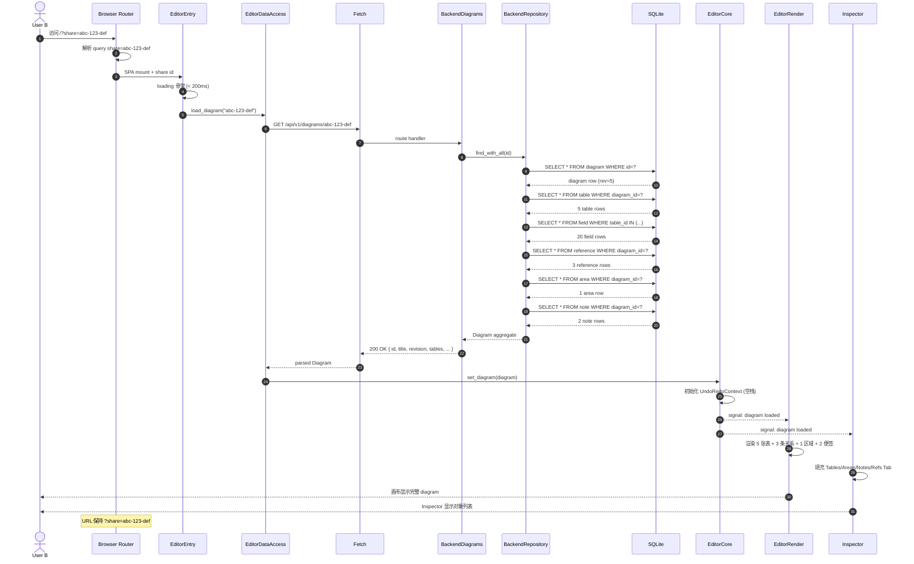
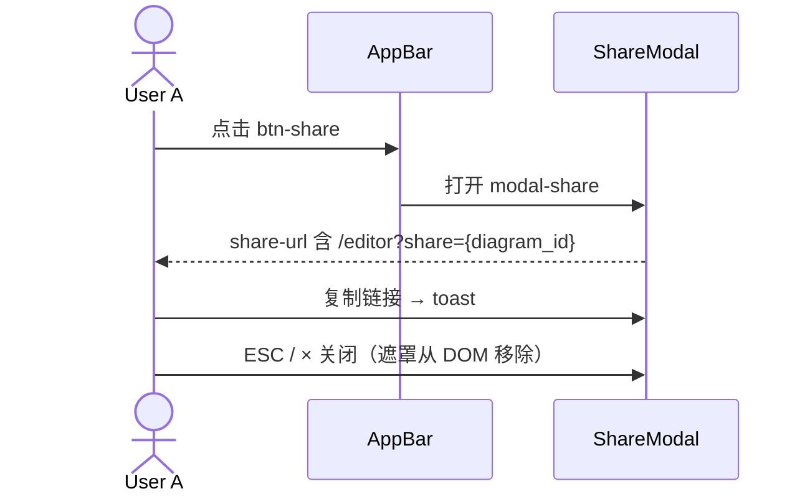
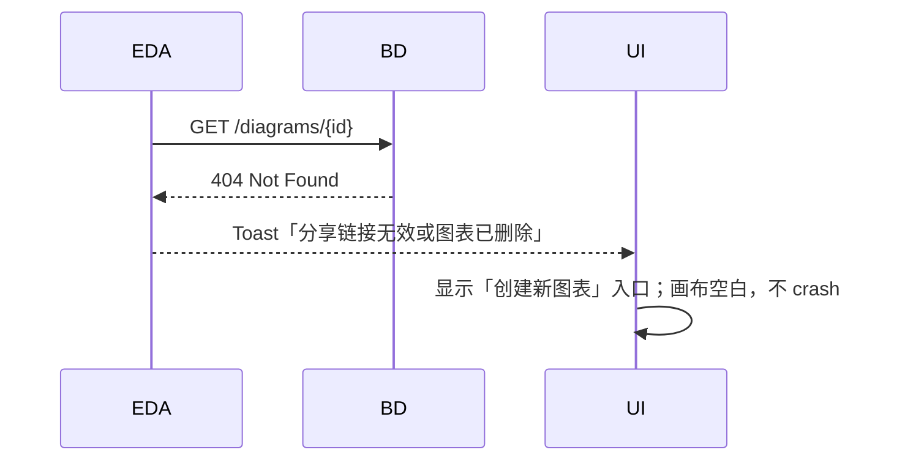

# S02 时序图：分享链接加载（How 层 — 第 2 步：场景）

> Phase 2 输入：`core-S02-load-shared-diagram-design.md` | 原型：`core-01-editor-prototype.html` §Share 模态

## 0. 现行文档与原型基线

> Phase 2 输入：`core-S02-load-shared-diagram-design.md` | 原型：`core-01-editor-prototype.html`（Share 模态 + `?share=`）
> 页面状态：`share-readonly`（鉴权旁路）；与默认 `auth → rooms → room-editor` 主路径并行
> API/DB：本提案不新增端点；仅补页面状态与只读边界映射

## 1. 场景描述

**成功标志**：编辑器加载完整 diagram；URL 保持 `share` 参数；画布 **只读**（写工具禁用）。

**废止**：原文「可继续编辑」作为分享链接默认成功语义 → 改为 **匿名只读**（与 Phase 2 / 主原型一致）。若用户需写权限，须走 S03 登录 + S04 房间成员路径，而非分享旁路。

## 2. 参与者

| 角色 | 模块 | 文件 / 锚点 |
|---|---|---|
| User A / User B | — | — |
| AppBar | `frontend-rs/src/editor_panels.rs` | `[data-testid="btn-share"]` |
| ShareModal | `frontend-rs/src/editor_panels.rs` | `[data-testid="modal-share"]` / `[data-testid="modal-input-share-url"]` |
| Browser Router | — | 解析 `?share=` query 或 `/editor?share=` |
| EditorEntry | `frontend-rs/src/lib.rs` | `mount_to_body` + share id 解析 |
| EditorDataAccess | `frontend-rs/src/editor_data_access.rs` | `fetch_diagram` |
| BackendDiagrams | `backend/src/diagrams_v1.rs` | `read` handler |
| BackendRepository | `backend/src/repository/diagrams.rs` | `DiagramRepo::find_with_*` |
| SQLite | — | 11 张表 JOIN 查询 |
| EditorCore | `frontend-rs/src/editor_core.rs` | `set_diagram` |
| EditorRender + Inspector | `frontend-rs/src/editor_render.rs` + `editor_panels.rs` | 响应式渲染 |

## 3. 时序图



### 3.1 辅路径 — 生成分享链接（编辑器内）



> 对齐 Phase 2 §3.1；`build_share_url(id)` → `/editor?share={id}`。

### 3.2 无 share 参数 — Landing 默认路径

替换「Landing 或空白编辑器 / New → POST diagrams」为现行默认：

1. 用户访问 `/`（无 query）→ **不**弹分享错误
2. **未登录** → 进入 `auth`（登录/注册）
3. **已登录** → 进入 `rooms`
4. 不再将「Landing → New → 空白 `/editor`」写为现行默认主路径

## 4. 步骤详解

### 4.1 URL 与 share 参数解析

```rust
// frontend-rs/src/lib.rs（目标行为，对齐 Phase 2）
fn parse_share_id_from_location() -> Option<String> {
    web_sys::window()
        .and_then(|w| w.location().search().ok())
        .and_then(|q| {
            // ?share=abc-123-def
            url_search_params(&q).get("share")
        })
}
```

> **V1 实现注记**：当前代码仍从 `pathname` 末段解析 diagram id（`/editor/{id}`）；Step 5 应对齐 `?share=` 与 `build_share_url`（见 `editor_panels.rs::build_share_url`）。

### 4.2 EditorDataAccess 拉取

```rust
// frontend-rs/src/editor_data_access.rs
pub async fn fetch_diagram(id: &str) -> Result<Diagram, AppError> {
    let url = format!("/api/v1/diagrams/{}", id);
    let resp = gloo_net::http::Request::get(&url)
        .send()
        .await?
        .json::<Diagram>()
        .await?;
    Ok(resp)
}
```

### 4.3 Backend handler

```rust
// backend/src/diagrams_v1.rs
#[get("/api/v1/diagrams/{id}")]
async fn read(path: Path<String>) -> Result<HttpResponse, AppError> {
    let id = path.into_inner();
    diagrams::service::read(&pool, &id).await
        .map(|diagram| HttpResponse::Ok().json(diagram))
        .map_err(AppError::from)
}
```

### 4.4 Repository 聚合查询

```rust
// backend/src/diagrams/service.rs
pub async fn read(pool: &Pool, id: &str) -> Result<Diagram> {
    let diagram = diagram_repo::find(pool, id).await?
        .ok_or(AppError::NotFound)?;
    let tables = table_repo::find_by_diagram(pool, id).await?;
    let table_ids: Vec<i64> = tables.iter().map(|t| t.id).collect();
    let fields = field_repo::find_by_tables(pool, &table_ids).await?;
    let references = reference_repo::find_by_diagram(pool, id).await?;
    let areas = area_repo::find_by_diagram(pool, id).await?;
    let notes = note_repo::find_by_diagram(pool, id).await?;
    Ok(Diagram {
        id: diagram.id.clone(),
        title: diagram.title,
        revision: diagram.revision,
        tables: assemble(tables, fields),  // table + fields 嵌套
        references,
        areas,
        notes,
        enums: vec![],          // V1 不持久化
        custom_types: vec![],   // V1 不持久化
    })
}
```

> **性能考量**：5 张表 + 20 字段用 3 个查询（diagrams / tables / fields + 4 个查询；总计 6 个）。V1 接受 N+1 风险；V2 计划用 JOIN 优化。

### 4.5 EditorCore 初始化

```rust
// frontend-rs/src/editor_core.rs
pub fn set_diagram(&mut self, diagram: Diagram) {
    self.diagram = diagram;
    self.undo_stack.clear();
    self.redo_stack.clear();
    self.dirty = false;
    self.revision = self.diagram.revision;
    self.diagram_signal.set(self.diagram.clone());
}
```

### 4.6 渲染响应

```rust
// frontend-rs/src/editor_render.rs
#[component]
pub fn Canvas(core: RwSignal<Diagram>) -> impl IntoView {
    create_effect(move |_| {
        let diagram = core.get();
        // 渲染 tables / relationships / areas / notes
    });
}
```

## 5. 错误处理

### 5.1 404 Not Found



### 5.2 网络中断

- 重试 3 次（3s / 6s / 12s 指数退避，封顶 30s，与 S01 对齐）
- 全失败后显示加载失败 + 重试按钮

### 5.3 JSON 解析错误

- 后端返回非预期结构（schema 漂移）
- 弹"加载失败，请刷新重试"
- 错误日志上报（V1 仅 console.log）

### 5.4 链接无效（UUID 格式错）

- 前端 regex 校验
- 格式错则直接显示"无效链接"提示，不发请求

## 6. 性能与资源

| 资源 | 数量 |
|---|---|
| HTTP 请求 | 1（GET） |
| 数据库查询 | 6（diagrams + tables + fields + references + areas + notes） |
| WASM 内存 | 整个 diagram 树（≈ 100 KB / 100 表） |
| 网络流量 | 单次 GET ≈ 5 KB（5 表 20 字段） |
| 首屏时间 | < 200ms loading 骨架 + < 1s 数据就绪 | Phase 2 §3.2 |

## 7. 与 S01 的对比

| 维度 | S01（编辑保存） | S02（分享加载） |
|---|---|---|
| HTTP 方法 | PUT（写） | GET（读） |
| 触发 | 用户编辑 | 链接访问 |
| 频率 | 高（debounce 1s） | 低（一次性） |
| 错误 | 409 冲突（多写） | 404 不存在 |
| 后端事务 | 1 写事务 | 6 读查询 |
| 性能预算 | 200ms | 1s（首屏） |

## 8. 测试用例映射

| TC ID | 描述 | 对应 S02 步骤 |
|---|---|---|
| UT-P-02 | 创建含 5 表 20 字段 | （前置：A 先 S01 创建） |
| UT-S-01 | GET /diagrams/{id} → 200 全量数据 | 4.2 - 4.5 |
| UT-S-02 | GET /diagrams/{nonexistent} → 404 | 5.1 |
| UT-S-03 | GET /diagrams/{invalid-uuid} → 400 | 5.4 |
| ST-S-01 | 端到端：A 创建 + Share → B 通过链接加载 → 一致 | 完整链路 |
| ST-S-02 | 端到端：A 编辑保存后 B 加载，B 编辑触发 409 | （S01 + S02 联合） |

## 页面状态与参与者

| 角色 | 模块 | 说明 |
|---|---|---|
| Router / Entry | `frontend-rs` `lib.rs` | 解析 `?share=`；**跳过**鉴权拦截 |
| EditorDataAccess | `editor_data_access` | `GET /api/v1/diagrams/{id}`（匿名） |
| EditorCore | `editor_core` | `set_diagram` + `readonly=true` |
| ShareModal | AppBar | `[data-testid="modal-share"]` / `share-url`（生成旁路链接） |

主原型演示加载失败/成功；生产以真实 GET 为准。

## 异常映射（前端）

| 条件 | 前端 | 下一步 |
|---|---|---|
| 200 | 只读渲染；禁用 PUT / 关系创建 / 邀请写 | 保持 `?share=` |
| 404 | Toast「分享链接无效或图表已删除」 | 登录后进 rooms / 可达的创建入口（不得假设旧 Landing New） |
| 网络失败 | 加载失败 + 重试 | 同 S01 退避策略 |
| 非法 UUID | 前端拦截，不发请求 | 「无效链接」 |

## 9. V1 边界

- ✅ `?share=` **不被** S03 鉴权拦截（旁路）
- ❌ 分享链接不授予 room 写权限（写权限仍走 S04 成员）
- ❌ 链接过期 / 访问统计 — 仍 Out of Scope（除非独立变更）

## 10. 对齐参考源

- `core-00-information-architecture.md` — `share-readonly` 状态
- `core-S03-user-auth.md` — 旁路与私有路由区分
