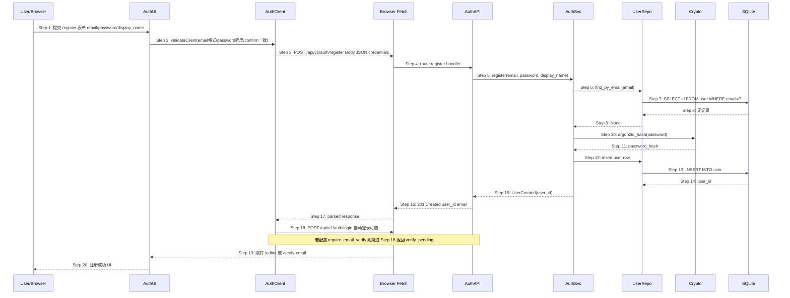
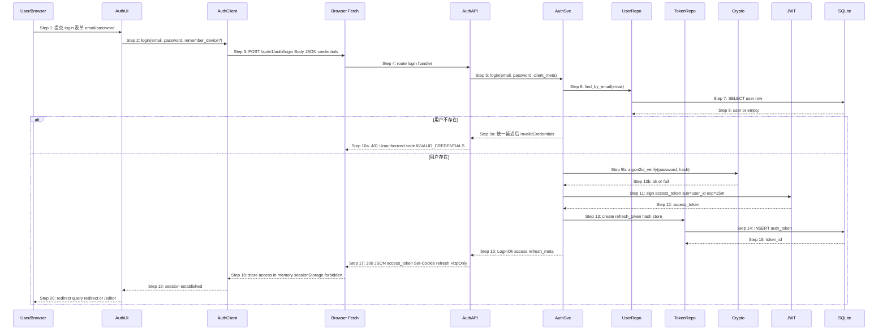
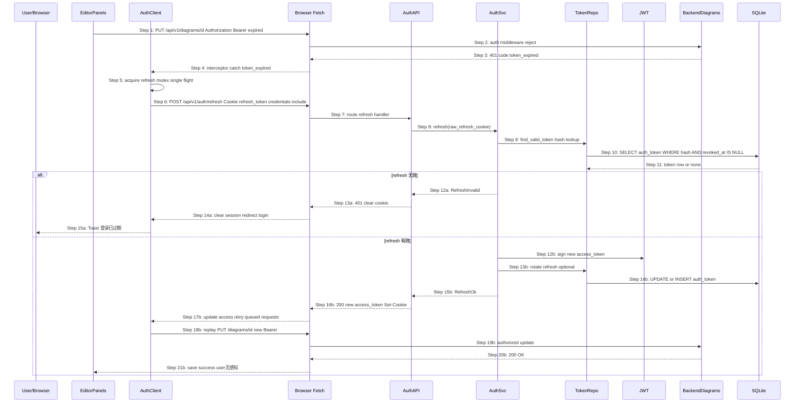
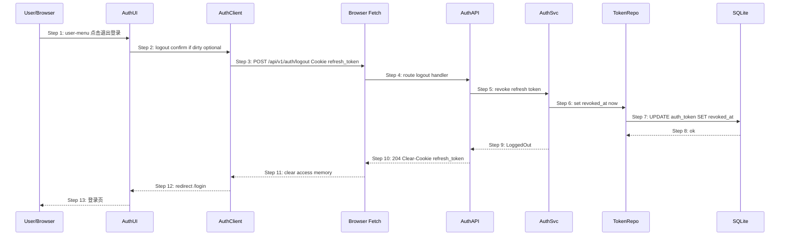

# S03 时序图：用户注册 / 登录 / Token 续期（How 层 — 第 2 步：场景）

> 版本：V2 | 优先级：P2 | 前置：无（V2 链首）| 后续：S04 协作房间
> Phase 2 输入：`core-S03-user-auth-design.md`
> Phase 1 输入：`core-00-scenario-overview.md` §S03

## 1. 场景描述

**用户故事**：作为团队使用者，我能注册账户、登录并在会话过期前静默续期，以便访问私有 diagram 并为 S04/S05 协作提供身份。

**触发**：

- S03.1：新用户提交注册表单
- S03.2：用户提交登录凭据
- S03.3：`access_token` 将过期或 API 返回 `token_expired`
- S03.4：用户主动退出登录

**成功标志**：

- 注册/登录后获得有效 `access_token` + HttpOnly `refresh_token` cookie
- 后续 diagram API 携带 `Authorization: Bearer`
- refresh 成功时用户无感知，编辑不中断

**覆盖范围**：`user` + `auth_token` 表；JWT 签发/校验；Argon2id 密码哈希

## 2. 参与者

| 角色 | 模块 | 说明（V2 规划） |
|---|---|---|
| User | — | 浏览器用户 |
| AuthUI | `frontend-rs` auth 页面 | `/login` `/register` Leptos 路由 |
| AuthClient | `frontend-rs` auth 客户端 | HTTP + token 内存存储 + refresh mutex |
| HTTP | Browser Fetch | `credentials: include` 携带 refresh cookie |
| AuthAPI | `backend/src/auth_v1.rs` | `/api/v1/auth/*` 路由 |
| AuthSvc | `backend/src/auth/service.rs` | 注册/登录/refresh/logout 业务 |
| UserRepo | `backend/src/auth/user_repo.rs` | `user` 表 CRUD |
| TokenRepo | `backend/src/auth/token_repo.rs` | `auth_token` refresh 持久化 |
| JWT | `jsonwebtoken` + 配置 | access_token 签名/校验 |
| Crypto | `argon2` crate | 密码哈希/验证 |
| DB | SQLite | `user` / `auth_token` |

## 3. 时序图 — S03.1 注册



## 4. 时序图 — S03.2 登录



## 5. 时序图 — S03.3 Token 续期（Refresh）



## 6. 时序图 — S03.4 退出登录



## 7. 步骤说明

### 7.1 注册（对应 §3 Step 1–20）

1. **User** 在 `/register` 填写 email、password、confirm_password、display_name（可选），点击提交。
2. **AuthUI** 做客户端校验（格式、强度、确认一致）；失败则 inline 错误，不发起请求。
3. **AuthClient** 发送 `POST /api/v1/auth/register`，body `{ email, password, display_name? }`。
4. **AuthAPI** 路由到 `register` handler，校验 JSON schema。
5. **AuthSvc** 调用 `find_by_email`；若已存在 → 见 EX-6.1。
6. **UserRepo** 查询 SQLite `user` 表。
7. **Crypto** 使用 Argon2id（memory=19MB, iterations=2）生成 `password_hash`；明文密码不落盘。
8. **UserRepo** 插入 `user` 行，生成 UUID `id`。
9. **AuthAPI** 返回 `201 { user_id, email }`。
10. **AuthClient**（可选）链式调用 login 自动签发 token；若启用邮箱验证则返回 `verify_pending` 并跳转 `/verify-email` → 见 EX-18.1。

> 注册与 login 分离可简化错误语义；自动登录减少一步交互，由 `logos.config` 或环境变量 `COLDRAWDB_AUTH_AUTO_LOGIN_AFTER_REGISTER` 控制。

### 7.2 登录（对应 §4 Step 1–20）

1. **User** 访问 `/login?redirect=/editor/d-abc`，提交凭据。
2. **AuthClient** `POST /api/v1/auth/login`。
3. **AuthSvc** 查 user；**无论是否存在**均执行 Argon2 verify 路径（dummy hash 防时序）→ 见 EX-9.1。
4. 验证通过后 **JWT** 签发 `access_token`（claims: `sub`, `exp`, `iat`；TTL 默认 15m）。
5. **TokenRepo** 生成随机 refresh_token（32 byte），仅存 SHA-256 hash 到 `auth_token`；原始值仅通过 Set-Cookie 下发。
6. **AuthAPI** 响应 `200 { access_token, expires_in }` + `Set-Cookie: refresh_token=...; HttpOnly; Secure; SameSite=Lax; Path=/api/v1/auth`。
7. **AuthClient** 将 access 存内存；**禁止** localStorage。
8. **AuthUI** 按 `redirect` 跳转目标页。

### 7.3 Token 续期（对应 §5 Step 1–21）

1. **EditorPanels** 经 S01 debounce 触发 `PUT /diagrams/{id}`，Bearer 已过期。
2. **auth middleware** 返回 `401 { code: "token_expired" }`（非 generic 401，便于客户端区分）。
3. **AuthClient** refresh mutex 保证并发仅一次 refresh。
4. `POST /api/v1/auth/refresh` 依赖 Cookie，无需 body。
5. **AuthSvc** 校验 hash + `expires_at` + `revoked_at IS NULL`。
6. 成功则签发新 access + 可选 refresh rotation（旧 token revoke，新 cookie 下发）。
7. **AuthClient** 重放失败请求队列；用户无 Toast。

### 7.4 退出（对应 §6 Step 1–13）

1. 若有 dirty diagram → Confirm 模态（S01 debounce 完成或放弃）。
2. revoke 当前 refresh；其他设备 refresh 亦失效（若采用 token family 则仅 revoke 当前）。
3. 清除客户端 access，跳转 `/login`。

## 8. 异常用例

### EX-6.1: 邮箱已注册（← Phase 2 S03 注册异常）

- **触发条件**：§3 Step 6–9 查得 email 已存在
- **期望响应**：`409 { code: "EMAIL_EXISTS", message: "该邮箱已注册" }`
- **副作用**：不插入 user；不发送邮件

### EX-5.1: 注册字段校验失败

- **触发条件**：password 长度 < 8 或缺少字母/数字
- **期望响应**：`422 { code: "VALIDATION_ERROR", fields: { password: "..." } }`
- **副作用**：无

### EX-9.1 / EX-10.1: 登录凭据无效（← Phase 2 防枚举）

- **触发条件**：用户不存在或 Argon2 verify 失败
- **期望响应**：统一 `401 { code: "INVALID_CREDENTIALS", message: "邮箱或密码错误" }`；响应延迟 ≥ 200ms
- **副作用**：不签发 token；不泄露用户是否存在

### EX-4.1: 登录速率限制

- **触发条件**：同一 IP/email 5 分钟内失败 ≥ 5 次
- **期望响应**：`429 { code: "TOO_MANY_ATTEMPTS", retry_after: 300 }`
- **副作用**：UI 禁用提交按钮并倒计时

### EX-12.1: refresh_token 无效或已撤销

- **触发条件**：§5 Step 10–11 无有效 token（logout 后、过期、篡改）
- **期望响应**：`401 { code: "REFRESH_INVALID" }` + `Clear-Cookie`
- **副作用**：客户端清 session；redirect `/login?redirect=...`

### EX-18.1: 注册后需邮箱验证

- **触发条件**：`COLDRAWDB_AUTH_REQUIRE_EMAIL_VERIFY=true`
- **期望响应**：`201 { status: "verify_pending" }`；发送 SMTP 验证链接
- **副作用**：未签发 refresh；`/editor` 私有 API 仍 401 直至验证

### EX-13.1: SQLite 写入失败（技术异常）

- **触发条件**：INSERT user 或 auth_token 失败
- **期望响应**：`500 { code: "INTERNAL_ERROR" }`
- **副作用**：记录 tracing error；注册场景无 partial user（事务包裹）

## 9. API 端点摘要（由时序图推导）

| 方法 | 路径 | 场景 | 认证 |
|---|---|---|---|
| POST | `/api/v1/auth/register` | S03.1 | 无 |
| POST | `/api/v1/auth/login` | S03.2 | 无 |
| POST | `/api/v1/auth/refresh` | S03.3 | Cookie refresh |
| POST | `/api/v1/auth/logout` | S03.4 | Cookie 或 Bearer |
| GET | `/api/v1/auth/me` | 会话探测 | Bearer |

## 10. 数据表（V2 增量）

```sql
-- user
CREATE TABLE user (
  id TEXT PRIMARY KEY,
  email TEXT NOT NULL UNIQUE,
  password_hash TEXT NOT NULL,
  display_name TEXT,
  email_verified_at TEXT,
  created_at TEXT NOT NULL
);

-- auth_token (refresh)
CREATE TABLE auth_token (
  id TEXT PRIMARY KEY,
  user_id TEXT NOT NULL REFERENCES user(id),
  token_hash TEXT NOT NULL,
  expires_at TEXT NOT NULL,
  revoked_at TEXT,
  created_at TEXT NOT NULL
);
CREATE INDEX idx_auth_token_hash ON auth_token(token_hash);
```

## 11. 性能与资源

| 路径 | HTTP | DB | 备注 |
|---|---|---|---|
| register | 1 (+1 login 可选) | 1 SELECT + 1 INSERT | Argon2id ~100–300ms CPU |
| login | 1 | 1 SELECT + 1 INSERT token | 恒定时间 verify |
| refresh | 1 | 1 SELECT + 1 UPDATE | mutex 避免 refresh 风暴 |
| logout | 1 | 1 UPDATE | — |

## 12. 测试用例映射（规划）

| TC ID | 场景 | 对应步骤 |
|---|---|---|
| UT-A-01 | register 成功 201 | §3 Step 13–16 |
| UT-A-02 | register 重复 email 409 | EX-6.1 |
| UT-A-03 | login 成功 Set-Cookie | §4 Step 17 |
| UT-A-04 | login 错误密码 401 统一文案 | EX-9.1 |
| UT-A-05 | refresh 成功重放 PUT | §5 Step 16b–21b |
| UT-A-06 | refresh 无效 redirect login | EX-12.1 |
| UT-A-07 | logout revoke refresh | §6 Step 7–10 |
| ST-A-01 | 注册→登录→PUT diagram 带 Bearer | S03 + S01 串联 |

## 13. V2 边界

- ✅ 本场景实现后，私有 `/editor` 需 Bearer；`?share=` 仍匿名（S02）
- ❌ OAuth / SSO（Out of Scope）
- ❌ 多因素认证 MFA（V2.1 候选）
- ❌ 与 S04 room 权限交叉（S04 在 JWT 之上校验 room_member）

## 14. 与 S04 / S05 的衔接

- **S04**：WS 与 REST 均校验同一 JWT `sub`；room 成员表引用 `user.id`
- **S05**：collab-server 验证 JWT 后接受 room 内 op；refresh 逻辑仍走 AuthAPI

## 15. 对齐参考源

- `core-S03-user-auth-design.md` — Phase 2 交互 + 验收
- `core-03-auth-prototype.html` — UI 锚点
- `core-01-architecture-overview.md` §12 外部依赖（SMTP）
- `core-00-scenario-overview.md` — 场景依赖 S03 → S04 → S05
- `jsonwebtoken` / `argon2` — Rust crate 选型（V2 实现时写入 architecture delta）
