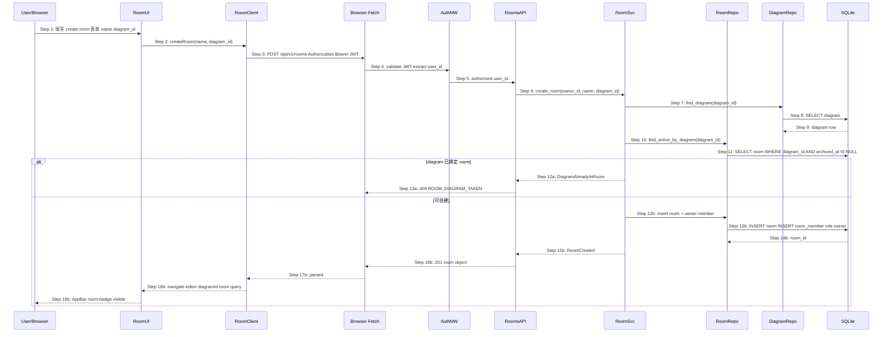
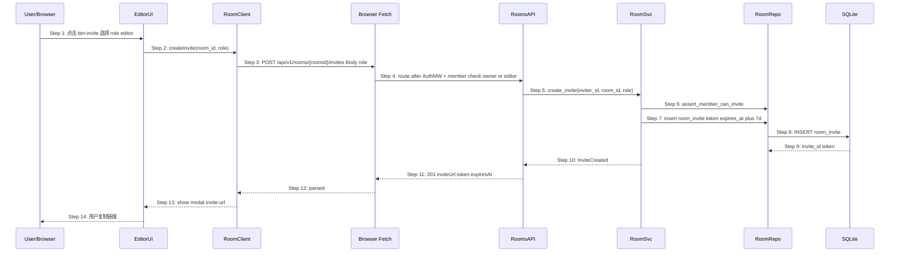
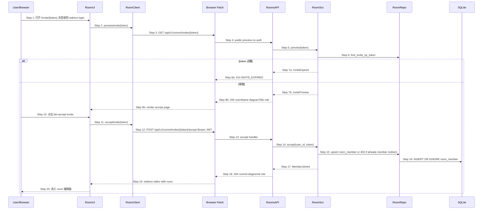
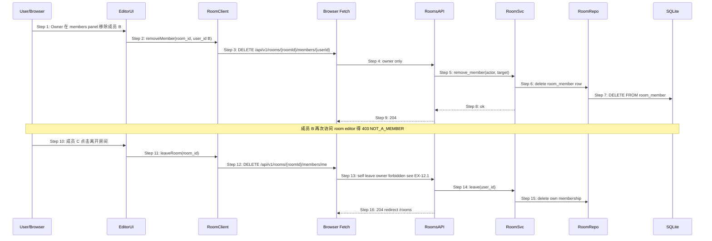

# S04 时序图：创建 / 加入协作房间（How 层 — 第 2 步：场景）

> 版本：V2 | 优先级：P2 | 前置：**S03 鉴权** | 后续：**S05 OT 协作**
> Phase 2 输入：`core-S04-room-lifecycle-design.md`
> Phase 1 输入：`core-00-scenario-overview.md` §S04

## 1. 场景描述

**用户故事**：作为团队负责人，我能为 diagram 创建协作房间、邀请成员并以角色（owner/editor/viewer）加入，以便多人进入同一编辑器上下文（S05 OT 的前置）。

**触发**：

- S04.1：Owner 创建 room 并绑定 diagram
- S04.2：Owner/Editor 生成邀请链接
- S04.3：被邀请人接受 invite
- S04.4：成员管理（改 role / 移除 / 离开）

**成功标志**：

- room 创建后跳转 `/editor/{diagramId}?room={roomId}`
- 被邀请人 accept 后成为 `room_member`
- viewer 进入编辑器时为只读 UI

**覆盖范围**：`room` / `room_member` / `room_invite` 表；JWT 校验 + room 成员校验

## 2. 参与者

| 角色 | 模块 | 说明（V2 规划） |
|---|---|---|
| User | — | 浏览器用户（须 S03 登录，share 链路除外） |
| RoomUI | `frontend-rs` room 页面 | `/rooms` `/invite/{token}` |
| EditorUI | `frontend-rs` editor_panels | room 上下文 AppBar |
| RoomClient | `frontend-rs` room HTTP 客户端 | 带 Bearer JWT |
| HTTP | Browser Fetch | REST |
| AuthMW | `backend` auth middleware | JWT 校验 `sub` → user_id |
| RoomsAPI | `backend/src/rooms_v1.rs` | `/api/v1/rooms/*` |
| RoomSvc | `backend/src/rooms/service.rs` | room 业务 |
| RoomRepo | `backend/src/rooms/repository.rs` | room / member / invite |
| DiagramRepo | `backend/src/diagrams/` | diagram 存在性校验 |
| DB | SQLite | V2 表 + V1 diagram |

## 3. 时序图 — S04.1 创建协作房间

## 4. 时序图 — S04.2 邀请成员

## 5. 时序图 — S04.3 接受邀请

## 6. 时序图 — S04.4 成员管理与离开

## 7. 步骤说明

### 7.1 创建 room（§3）

1. **User** 在 `[data-testid="modal-create-room"]` 提交 `name` + `diagram_id`。
2. **RoomClient** 携带 S03 JWT 调用 `POST /api/v1/rooms`。
3. **AuthMW** 解析 `sub` 为 `owner_id`。
4. **RoomSvc** 校验 diagram 存在且未绑定 active room → 见 EX-11.1。
5. **RoomRepo** 事务内 INSERT `room` + INSERT `room_member(role=owner)`。
6. 响应 `201` 后前端跳转 `/editor/{diagramId}?room={roomId}`。

### 7.2 邀请（§4）

1. 调用方须为 room **owner 或 editor**（可配置仅 owner）。
2. 生成 `token`（32 byte url-safe），INSERT `room_invite` TTL 7 天。
3. 响应含 `inviteUrl`：`https://host/invite/{token}`（前端路由，API 路径不同）。

### 7.3 接受（§5）

1. **GET preview** 可匿名；**POST accept** 须 JWT。
2. 已是成员 → `200` 直接返回 room 信息（幂等）或 `403` + 前端 redirect（见 EX-14.1）。

### 7.4 权限与 S01 PUT

- room 内 **editor/owner** 可对 diagram PUT（S01）；**viewer** → `403 READ_ONLY`。
- S05 引入 OT 后 PUT 频率下降，权限模型不变。

## 8. 异常用例

### EX-11.1: diagram 已绑定 room（← Phase 2 S04.1）

- **触发条件**：§3 Step 11 已存在 active room
- **期望响应**：`409 { code: "ROOM_DIAGRAM_TAKEN", existingRoomId }`
- **副作用**：不创建新 room

### EX-4.1: 未登录访问 /rooms

- **触发条件**：无 Bearer JWT
- **期望响应**：`401` + 前端 redirect `/login?redirect=/rooms`

### EX-8.1: 邀请过期

- **触发条件**：§5 preview/accept 时 `expires_at < now`
- **期望响应**：`410 { code: "INVITE_EXPIRED" }`

### EX-13.1: 非成员访问 room 编辑器 API

- **触发条件**：JWT 有效但非 room_member
- **期望响应**：`403 { code: "NOT_A_MEMBER" }`

### EX-12.1: Owner 不能 leave 只能删 room

- **触发条件**：§6 Step 13 owner 调用 `DELETE .../members/me`
- **期望响应**：`409 { code: "OWNER_CANNOT_LEAVE" }`

### EX-7.1: viewer 尝试 PUT diagram

- **触发条件**：viewer 触发 S01 save
- **期望响应**：`403 { code: "READ_ONLY" }`

## 9. API 端点摘要（由时序图推导）

| 方法 | 路径 | 子场景 | 认证 |
|---|---|---|---|
| POST | `/api/v1/rooms` | S04.1 | Bearer |
| GET | `/api/v1/rooms` | 列表 | Bearer |
| GET | `/api/v1/rooms/{id}` | 详情 | Bearer + member |
| DELETE | `/api/v1/rooms/{id}` | 删 room | Bearer + owner |
| POST | `/api/v1/rooms/{id}/invites` | S04.2 | Bearer + invite权限 |
| GET | `/api/v1/rooms/invites/{token}` | S04.3 preview | 无 |
| POST | `/api/v1/rooms/invites/{token}/accept` | S04.3 | Bearer |
| GET | `/api/v1/rooms/{id}/members` | 成员列表 | Bearer + member |
| PATCH | `/api/v1/rooms/{id}/members/{userId}` | 改 role | Bearer + owner |
| DELETE | `/api/v1/rooms/{id}/members/{userId}` | 移除 | Bearer + owner |
| DELETE | `/api/v1/rooms/{id}/members/me` | 离开 | Bearer + non-owner |

## 10. 数据表与 API 规格（V2 增量）

- DDL：`logos/resources/database/coldrawdb-v2-rooms.sql`
- OpenAPI：`logos/resources/api/rooms.yaml`（11 端点，与 §9 摘要一一对应）

## 11. 测试用例映射（规划）

| TC ID | 场景 | 对应 |
|---|---|---|
| UT-R-01 | create room 201 | §3 Step 16b |
| UT-R-02 | diagram 已占用 409 | EX-11.1 |
| UT-R-03 | create invite 201 | §4 Step 11 |
| UT-R-04 | accept invite 200 | §5 Step 18 |
| UT-R-05 | invite expired 410 | EX-8.1 |
| UT-R-06 | viewer PUT 403 | EX-7.1 |
| ST-R-01 | 创建→邀请→B accept→同 room 编辑 | S04 E2E |

## 12. V2 边界

- ✅ 依赖 S03 JWT；不重复实现登录
- ❌ WebSocket / OT（S05）
- ❌ 实时 presence（S05）
- ✅ S02 `?share=` 与 room 独立

## 13. 与 S05 的衔接

- S04 完成后，用户可在 `/editor?room=` 上下文内建立 **WS 连接**（S05 Step 1）
- collab-server 校验同一 JWT + `room_member` 后接受 op

## 14. 对齐参考源

- `core-S04-room-lifecycle-design.md` — Phase 2
- `core-04-collab-prototype.html` — UI 锚点
- `core-S03-user-auth.md` — JWT 前置
- `auth.yaml` — Bearer 安全方案
