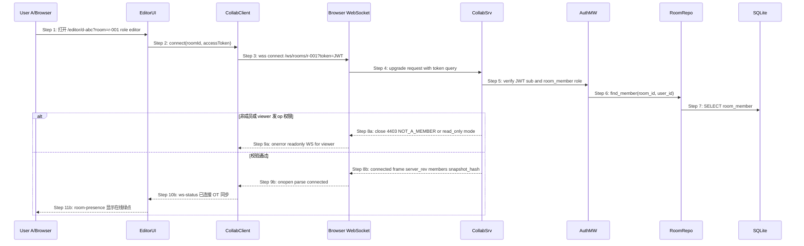
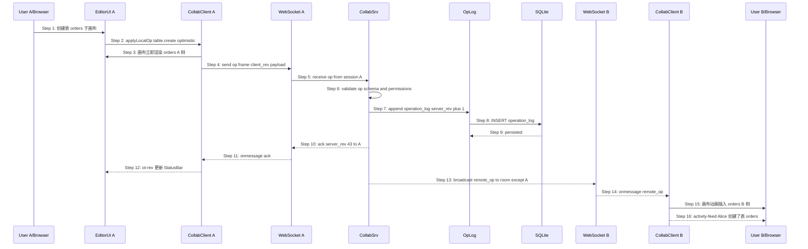
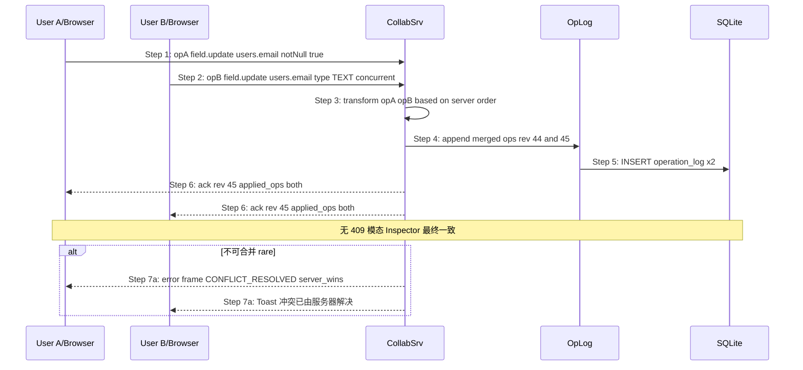
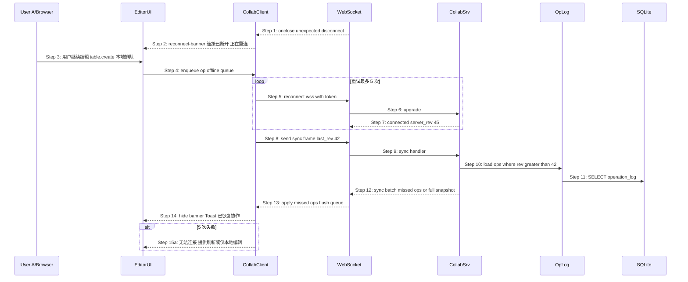
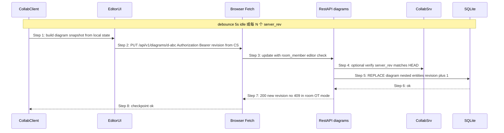

# S05 时序图：OT 实时协作（How 层 — 第 2 步：场景）

> 版本：V2 | 优先级：P2 | 前置：**S03 鉴权** + **S04 协作房间** | 后续：无（V2 链末）
> Phase 2 输入：`core-S05-ot-collab-design.md`
> Phase 1 输入：`core-00-scenario-overview.md` §S05

## 1. 场景描述

**用户故事**：作为 room 内 editor，我能在多人同时编辑 ER 图时通过 OT 即时同步变更、看到在线成员与远端光标，并在断线后自动恢复，而无需 S01 的 409 冲突模态。

**触发**：

- S05.1：editor 进入 `/editor/{diagramId}?room={roomId}` 建立 WS
- S05.2：本地编辑（创建表/改字段）→ 发送 `op` 帧
- S05.3：两客户端并发 op → collab-server `transform`
- S05.4：WS 断开 → 重连 → `sync` 补发 missed ops
- S05.5（辅助）：周期 checkpoint → REST PUT 持久化 diagram 快照

**成功标志**：

- `[data-testid="ws-status"]` 显示「已连接 · OT 同步」
- 远端客户端 500ms 内收到 `remote_op` 并渲染
- 并发 op 合并后 Inspector 一致，**无 409 模态**
- 重连后 `server_rev` 与画布状态一致

**覆盖范围**：`collab-server` WS 网关；`operation` / `operation_log` 表（V2 DDL 待 `collab.yaml`）；JWT + `room_member` 校验

## 2. 参与者

| 角色 | 模块 | 说明（V2 规划） |
|---|---|---|
| User A/B | — | 浏览器用户（room 成员，role ≠ viewer 可发 op） |
| EditorUI | `frontend-rs` editor + collab 层 | Canvas / Inspector / StatusBar |
| CollabClient | `frontend-rs` collab_client | WS 连接、op 队列、optimistic apply |
| WS | Browser WebSocket | `wss://host/ws/rooms/{roomId}` |
| CollabSrv | `collab-server` | JWT/成员校验、OT transform、广播 |
| AuthMW | collab-server auth | 校验 Bearer JWT + room_member |
| RoomRepo | 共享 SQLite 读 | room / member 存在性 |
| OpLog | collab-server persistence | append `operation_log` |
| RestAPI | `backend` diagrams_v1 | 周期 checkpoint PUT |
| DB | SQLite | diagram + operation_log |

## 3. 时序图 — S05.1 建立 WebSocket 会话

## 4. 时序图 — S05.2 本地 op 广播

## 5. 时序图 — S05.3 并发 op OT 合并

## 6. 时序图 — S05.4 断线重连与 sync

## 7. 时序图 — S05.5 周期 checkpoint（REST）

## 8. 步骤说明

### 8.1 WS 连接（§3）

1. **EditorUI** 在 room 上下文挂载后调用 **CollabClient.connect**。
2. **CollabSrv** 校验 JWT `sub` + `room_member`；viewer 仅只读 WS（收 op 不发）。
3. **connected** 帧携带 `server_rev`、在线 `members[]`、可选 `snapshot_hash`。
4. 连接失败 `4403` → 前端 redirect 或只读降级。

### 8.2 本地 op（§4）

1. 用户操作 → **CollabClient** 生成结构化 op（与 diagram JSON 子集对齐）。
2. **optimistic** 本地 apply，再 WS 发送。
3. **CollabSrv** 持久化 `operation_log`，递增 `server_rev`。
4. 发送方收 `ack`；其他成员收 `remote_op`。

### 8.3 OT 合并（§5）

1. 服务端按到达顺序或 vector clock 排序。
2. `transform(opA, opB)` 产出可交换的合并 op。
3. room 模式 **禁止** 向用户暴露 S01 `revision_conflict` 模态。

### 8.4 重连（§6）

1. 断线期间 op 入 **offline queue**，不丢弃。
2. 重连后 `sync { last_rev }` 补发；队列 flush。
3. 5 次失败 → 降级 Banner（Phase 2 §S05.4）。

### 8.5 Checkpoint（§7）

1. OT 为权威实时态；SQLite diagram 为周期快照。
2. PUT 仍走 V1 diagrams 路径，但 revision 由 collab-server 协调（room 内无 409 UI）。

## 9. 异常用例

### EX-5.1: 非成员连接 WS（← S04 EX-13.1）

- **触发条件**：§3 Step 7 无 room_member 记录
- **期望响应**：WS close `4403` 或 HTTP 403 `{ code: "NOT_A_MEMBER" }`
- **副作用**：不写入 operation_log

### EX-5.2: viewer 发送 op

- **触发条件**：viewer 客户端尝试 `op` 帧
- **期望响应**：`error { code: "READ_ONLY" }` 帧，连接保持只读
- **副作用**：不递增 server_rev

### EX-5.3: JWT 过期 mid-session

- **触发条件**：WS 期间 access_token 过期
- **期望响应**：`error { code: "token_expired" }` → 前端 refresh 后重连
- **副作用**：offline queue 保留至重连成功

### EX-5.4: 重连 sync 缺口过大

- **触发条件**：§6 Step 11 missed ops 超过阈值
- **期望响应**：`sync` 帧携带 full diagram snapshot
- **副作用**：本地状态全量替换，Activity 记录「已同步服务器版本」

### EX-5.5: collab-server 不可用

- **触发条件**：WS 5 次连接失败
- **期望响应**：UI 降级 Banner；可选仅本地 PUT（有 409 风险，Phase 2 已说明）
- **副作用**：operation_log 暂停写入

## 10. WS 协议摘要（由时序图推导）

| 方向 | 帧 type | 说明 | 子场景 |
|---|---|---|---|
| S→C | `connected` | `{ serverRev, members[], snapshotHash? }` | S05.1 |
| C→S | `op` | `{ clientRev?, op: { type, ... } }` | S05.2 |
| S→C | `ack` | `{ serverRev, appliedOp? }` | S05.2 |
| S→C | `remote_op` | `{ serverRev, op, authorId }` | S05.2 |
| 双向 | `presence` | `{ cursor, selection?, userId }` | S05.2 |
| C→S | `sync` | `{ lastRev }` | S05.4 |
| S→C | `sync` | `{ ops[] \| snapshot }` | S05.4 |
| S→C | `error` | `{ code, message }` | EX-* |

**连接 URL**：`wss://{host}/ws/rooms/{roomId}?token={access_token}`

**REST 辅助**（非 WS）：room 内 PUT `/api/v1/diagrams/{id}` checkpoint（§7）；OpenAPI 扩展见 `collab.yaml`（待 Step 2 产出）。

## 11. 数据表与 API 规格（V2 增量）

| 表 | 用途 | DDL |
|---|---|---|
| `operation` | op 载荷（type + JSON + hash） | `coldrawdb-v2-collab.sql` §17 |
| `operation_log` | room 内 server_rev 有序链 | §18 |
| `room_collab_head` | head server_rev + snapshot_hash | §19 |

- OpenAPI：`logos/resources/api/collab.yaml`（WS `/ws/rooms/{roomId}` + REST head/ops + 帧 schema）
- Checkpoint：`diagrams.yaml` PUT + `X-Room-Id` / `X-Collab-Server-Rev` 头（见 collab.yaml `x-collab-checkpoint`）

## 12. 测试用例映射（规划）

| TC ID | 场景 | 对应 |
|---|---|---|
| UT-C-01 | WS connect 200 connected 帧 | §3 Step 8b |
| UT-C-02 | op → ack + remote_op | §4 Step 10–13 |
| UT-C-03 | transform 并发两 op | §5 Step 3–6 |
| UT-C-04 | sync 补发 missed ops | §6 Step 8–13 |
| UT-C-05 | viewer op → READ_ONLY | EX-5.2 |
| ST-C-01 | A/B 同 room A 建表 B 500ms 内可见 | Phase 2 验收 / `core-S05-ot-collab.json` Step 13 |

## 13. V2 边界

- ✅ 依赖 S03 JWT + S04 room_member
- ✅ OT 替代 room 内 S01 409 UX
- ❌ 非 room 单人编辑仍走 S01 PUT + 409
- ❌ 邮件/第三方推送

## 14. 对齐参考源

- `core-S05-ot-collab-design.md` — Phase 2
- `core-05-ot-collab-prototype.html` — UI 锚点
- `core-S04-room-lifecycle.md` — room 前置
- `core-S01-edit-and-save-diagram.md` — 409 / revision 对比
