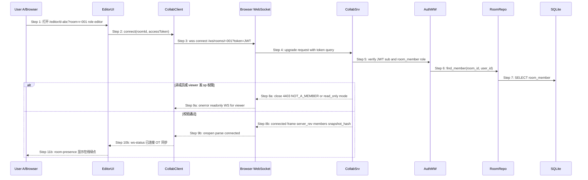
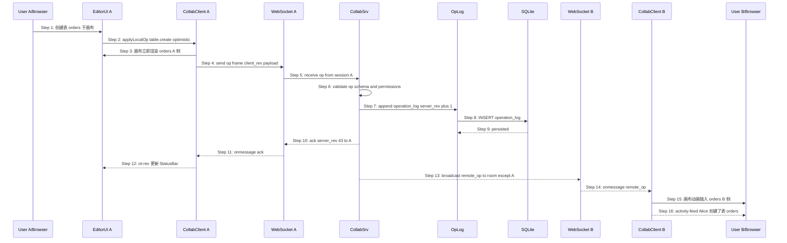
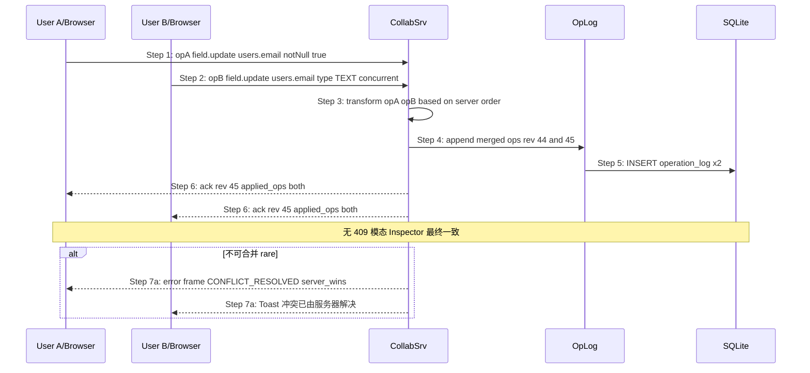
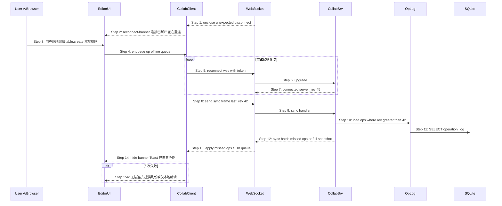
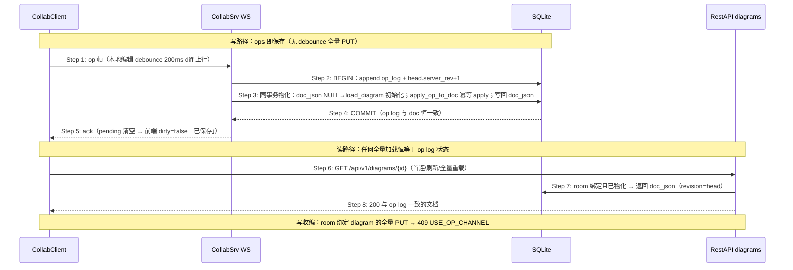

# S05 时序图：OT 实时协作（How 层 — 第 2 步：场景）

> 版本：V2 | 优先级：P2 | 前置：**S03 鉴权** + **S04 协作房间** | 后续：无（V2 链末）
> Phase 2 输入：`core-S05-ot-collab-design.md`
> Phase 1 输入：`core-00-scenario-overview.md` §S05

## 0. 现行文档与原型基线

> 版本：V2 | 前置：S03 + S04 | 现行原型：`core-01-editor-prototype.html`
> 历史参考：`core-05-ot-collab-prototype.html`（非验收入口）
> 生产状态：后端 WS/OT 已实现；生产前端已接入真实 WS（`wire-frontend-collab-ws`：连接 / op 双向 / presence / 重连 sync / viewer 只读）；协作持久化为服务端物化单写者（`fix-collab-autosave-race`：op 落库即物化 doc_json，GET 物化读，PUT 写收编 409 USE_OP_CHANNEL，前端 ops 即保存 + 入房 sync 补齐）
> 入口页面状态：在 **`room-editor`** 内建立 WS（废止仅写 `/editor/{diagramId}?room=` 为唯一表述）
> API/DB：不新增；既有 `collab.yaml` + WS `/ws/rooms/{roomId}`

## 1. 场景描述

- S05.1：进入 **`room-editor`** 后建立 WS
- 成功：`ws-status`「已连接 · OT 同步」；远端 500ms 内可见；**无 S01 409 模态**
- Viewer：可接收 presence / remote_op，**不可**发送 op

## 2. 参与者

| 角色 | 模块 | 说明 |
|---|---|---|
| EditorUI | `frontend-rs` room-editor | Canvas / Inspector / StatusBar / Banner |
| CollabClient | `frontend-rs` | **真实** WS、op 队列、optimistic apply、sync flush |
| CollabSrv | **backend**（现行） | JWT + room_member、OT、广播；非「未落地的独立进程」前提 |
| 主原型 | HTML 本地事件模拟 | 演示 connected/op/ack/remote_op/sync；**不**建立真实 WebSocket |

## 3. 时序图 — S05.1 建立 WebSocket 会话

## 4. 时序图 — S05.2 本地 op 广播

## 5. 时序图 — S05.3 并发 op OT 合并

## 6. 时序图 — S05.4 断线重连与 sync

## 7. 时序图 — S05.5 op 落库即物化（单写者，fix-collab-autosave-race 改写）

> 原「周期 checkpoint（REST）」时序废弃：房间内不再有客户端全量快照写。
> 唯一事实源 = 服务端 doc_json；op 落库与物化同事务，读写无交错窗口。

## 8. 步骤说明

### 8.1 WS 连接（§3）

1. **EditorUI** 在 room 上下文挂载后调用 **CollabClient.connect**。
2. **CollabSrv** 校验 JWT `sub` + `room_member`；viewer 仅只读 WS（收 op 不发）。
3. **connected** 帧携带 `server_rev`、在线 `members[]`、可选 `snapshot_hash`。
4. 连接失败 `4403` → 前端 redirect 或只读降级。

### 8.2 本地 op（§4）

1. 用户操作 → **CollabClient** 生成结构化 op（与 diagram JSON 子集对齐）。
2. **optimistic** 本地 apply，再 WS 发送。
3. **CollabSrv** 持久化 `operation_log`，递增 `server_rev`。
4. 发送方收 `ack`；其他成员收 `remote_op`。

### 8.3 OT 合并（§5）

1. 服务端按到达顺序或 vector clock 排序。
2. `transform(opA, opB)` 产出可交换的合并 op。
3. room 模式 **禁止** 向用户暴露 S01 `revision_conflict` 模态。

### 8.4 重连（§6）

1. 断线期间 op 入 **offline queue**，不丢弃。
2. 重连后 `sync { last_rev }` 补发；队列 flush。
3. 5 次失败 → 降级 Banner（Phase 2 §S05.4）。

### 8.5 服务端物化单写者（§7，fix-collab-autosave-race 改写）

1. **唯一事实源**：`room_collab_head.doc_json`（前端 Diagram JSON 形状）。op 落库即物化，
   同一事务提交——op log 与 doc 恒一致，从架构上消除「双写者交错」。
2. **物化规则**：16 种 op 幂等 apply（15 种实体 CRUD + `fields.reorder` 字段换序）。
   `table.create` 携带含字段全量；`table.update` 合并除 `fields` 外所有键；`field.*` 依 `parentId`
   定位父表字段数组；reference/area/note 按 id upsert/delete；`fields.reorder` 的 `targetId`=表 id、
   `changes.fieldIds`=字段 id 全量目标序，列表外字段保持原相对序追加末尾。
3. **初始化**：`doc_json` 为 NULL 时首个 op 落库前从关系存储 `load_diagram` 初始化
   （保真度与现行 GET 一致；关系存储缺 width/min_height 列为既有边界）。
4. **读切换**：GET diagram 对 room 绑定且已物化的 diagram 直接返回 doc（revision=head server_rev）。
5. **写收编**：PUT diagram 对 room 绑定 diagram 一律 409 USE_OP_CHANNEL；非房间 legacy 保存不变。
6. **前端语义**：room 模式 ops 即保存（无 1s debounce 全量 PUT）；`dirty` = 有未 ack/未 flush 的 op，
   Ack 清空后转「已保存」。
7. **入房补齐（同一权威序）**：入房「先 REST 加载（revision=doc_rev）后连 WS（head=server_rev）」
   存在提交窗口，窗口内 op 早于连接不会被广播补发。首次 `connected` 若 `server_rev > doc_rev`，
   客户端立即 `sync(lastRev=doc_rev)` 补齐；RemoteOp 按 server_rev 有序收编（rev<=cur 丢弃、
   rev==cur+1 应用、rev>cur+1 缓冲并 sync），sync 在途期间广播一律缓冲、sync 完成后有序回放。
8. **字段换序 op**（verify 修复轮补充，ST-SP-LIST-02 暴露）：id 键控快照对「同 id 集合、仅顺序
   变化」产生空 diff，op 通道无法表达字段顺序。`EntitySnapshot` 补充 `field_order`
   （table_id → 有序 field id 列表），同一表（非整表 create/delete）序列变化即产出
   `fields.reorder`，排在同窗口 field create/update/delete 之后；远端 `apply_op_to_store`
   按同一规则重排。
9. **首连前编辑不丢**（verify 修复轮，ST-S01-SS-01 / ST-S05-UI-05 暴露）：diff baseline 在入房
   REST 加载完成即建立（不等首个 connected 帧），WS 未建连期间的本地编辑 diff 入离线队列；
   Connected 不再整体重置 OT 状态——离线队列保留、sync 后 flush 补发；重连 sync 的 last_rev
   取断连前已知 rev（旧实现先重置再读，sync 恒为空）。
10. **在途帧回队重发**（verify 修复轮，ST-PC-06 间歇丢 op 暴露）：已发送未 ack 的帧登记
    `inflight_frames`；WS 断开或被新连接替换时（旧 socket Drop 后 onclose 不触发）回队到
    `queued_frames` 前部，bookkeeping 同步把 pending 挪回 queued_while_offline，重连
    sync+flush 重发——物化幂等（create=upsert / update=merge / delete 幂等），重投安全。
    flush_queue 任一帧发送失败时，该帧及后续帧整体回队不得丢弃（旧实现 take 后 break 丢帧）。
11. **远端帧到达前结算本地编辑**（verify 修复轮，ST-CR-INSP-01 间歇失败暴露，回归
    ST-FE-S05-11）：`apply_remote` / sync 回放 / 全量重同步会推进或重采 diff baseline，
    若本地编辑尚在 200ms debounce 窗口内（未 diff 上行），重采会把它吞进 baseline——
    op 永远不发，后续依赖它的 op 上行时服务端文档里没有目标实体。因此 remote_op /
    sync / SYNC_GAP_TOO_LARGE 全量重同步处理前，先取消待触发 debounce 并同步执行一次
    diff+上行（`flush_pending_local_ops`），再应用远端帧。

## 9. 异常用例

### EX-5.1: 非成员连接 WS（← S04 EX-13.1）

- **触发条件**：§3 Step 7 无 room_member 记录
- **期望响应**：WS close `4403` 或 HTTP 403 `{ code: "NOT_A_MEMBER" }`
- **副作用**：不写入 operation_log

### EX-5.2: viewer 发送 op

- **触发条件**：viewer 客户端尝试 `op` 帧
- **期望响应**：`error { code: "READ_ONLY" }` 帧，连接保持只读
- **副作用**：不递增 server_rev

### EX-5.3: JWT 过期 mid-session

- **触发条件**：WS 期间 access_token 过期
- **期望响应**：`error { code: "token_expired" }` → 前端 refresh 后重连
- **副作用**：offline queue 保留至重连成功

### EX-5.4: 重连 sync 缺口过大

- **触发条件**：§6 Step 11 missed ops 超过阈值
- **期望响应**：`sync` 帧携带 full diagram snapshot
- **副作用**：本地状态全量替换，Activity 记录「已同步服务器版本」

### EX-5.5: collab-server 不可用

- **触发条件**：WS 5 次连接失败
- **期望响应**：UI 降级 Banner；可选仅本地 PUT（有 409 风险，Phase 2 已说明）
- **副作用**：operation_log 暂停写入

## 10. WS 协议摘要（由时序图推导）

| 方向 | 帧 type | 说明 | 子场景 |
|---|---|---|---|
| S→C | `connected` | `{ serverRev, members[], snapshotHash? }` | S05.1 |
| C→S | `op` | `{ clientRev?, op: { type, ... } }` | S05.2 |
| S→C | `ack` | `{ serverRev, appliedOp? }` | S05.2 |
| S→C | `remote_op` | `{ serverRev, op, authorId }` | S05.2 |
| 双向 | `presence` | `{ cursor, selection?, userId }` | S05.2 |
| C→S | `sync` | `{ lastRev }` | S05.4 |
| S→C | `sync` | `{ ops[] \| snapshot }` | S05.4 |
| S→C | `error` | `{ code, message }` | EX-* |

**连接 URL**：`wss://{host}/ws/rooms/{roomId}?token={access_token}`

**REST 辅助**（非 WS）：room 内 GET `/api/v1/diagrams/{id}` 返回物化文档（§7）；全量 PUT 已收编（409 USE_OP_CHANNEL）；OpenAPI 扩展见 `collab.yaml` `x-collab-materialization`。

## 11. 数据表与 API 规格（V2 增量）

| 表 | 用途 | DDL |
|---|---|---|
| `operation` | op 载荷（type + JSON + hash） | `coldrawdb-v2-collab.sql` §17 |
| `operation_log` | room 内 server_rev 有序链 | §18 |
| `room_collab_head` | head server_rev + 物化文档 doc_json（单写者） | §19 |

- OpenAPI：`logos/resources/api/collab.yaml`（WS `/ws/rooms/{roomId}` + REST head/ops + 帧 schema）
- 物化读/写收编：`diagrams.yaml` GET 返回物化文档；PUT 对 room 绑定 diagram → 409 USE_OP_CHANNEL（见 collab.yaml `x-collab-materialization`；原 checkpoint 头协议废弃）

## 12. 测试用例映射（规划）

| TC ID | 场景 | 对应 |
|---|---|---|
| UT-C-01 | WS connect 200 connected 帧 | §3 Step 8b |
| UT-C-02 | op → ack + remote_op | §4 Step 10–13 |
| UT-C-03 | transform 并发两 op | §5 Step 3–6 |
| UT-C-04 | sync 补发 missed ops | §6 Step 8–13 |
| UT-C-05 | viewer op → READ_ONLY | EX-5.2 |
| ST-C-01 | A/B 同 room A 建表 B 500ms 内可见 | Phase 2 验收 / `core-S05-ot-collab.json` Step 13 |

## 连接态不变量（对齐主原型）

| 连接态 | UI | 写操作（Owner/Editor） |
|---|---|---|
| `connected` | `ws-status` 正常；`ot-rev` 递增 | optimistic + 等 ack |
| `reconnecting` / `syncing` | Banner；显示**待同步数量** | 可本地应用但须入**可见队列** |
| `failed` | 危险 Banner | 默认暂停协作写；可选「仅本地编辑」并持续警告（有 S01 409 风险，须明示） |
| `viewer` | 角色 Tag | 不得入队或伪造 ack；仍收 presence/remote_op |

锚点：`ws-status`、`ot-rev`、`remote-cursor`、`activity-feed`、`reconnect-banner`、`room-presence`。

## 异常映射（前端补齐）

| 条件 | 前端 |
|---|---|
| WS close 4403 / NOT_A_MEMBER | Toast + 回 rooms 或只读降级 |
| READ_ONLY（viewer op） | 忽略发送；保持只读连接 |
| token_expired mid-session | S03 refresh 后重连；offline queue 保留 |
| sync 缺口过大 | 全量 snapshot；Activity「已同步服务器版本」 |
| 5 次重连失败 | `failed` Banner；「刷新」或「仅本地编辑」 |

## 断线排队与重连可见性

1. 断线期间本地编辑必须进入 **可见待同步队列**（数量可在 Banner/Status 读取）
2. 重连 `sync { last_rev }` 后 flush；成功 Toast「已恢复协作」并隐藏 Banner
3. 队列不得静默丢弃

## OT 合并与 S01 409 边界

协作合并成功或 `CONFLICT_RESOLVED` → Toast / Activity；**禁止**弹出 S01 `modal-conflict`。

非 room、或用户主动「仅本地编辑」降级后的 PUT，才允许走 S01 409 路径。

## 13. V2 边界

- ✅ 依赖 S03 JWT + S04 room_member
- ✅ OT 替代 room 内 S01 409 UX
- ❌ 非 room 单人编辑仍走 S01 PUT + 409
- ✅ 主原型模拟 ≠ 生产前端逐项完成

## 14. 对齐参考源

- 现行主原型：`core-01-editor-prototype.html`
- `core-S01-edit-and-save-diagram.md` — 409 仅非 OT
- `core-00-information-architecture.md` — `room-editor`
- `collab.yaml` — 既有帧契约（本提案不新增）
