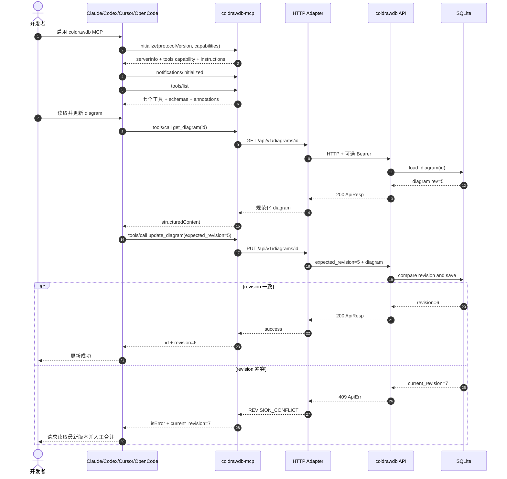
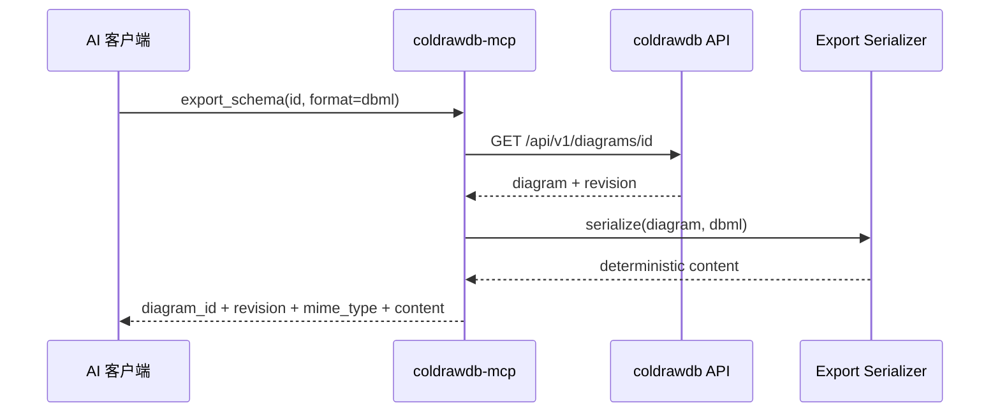
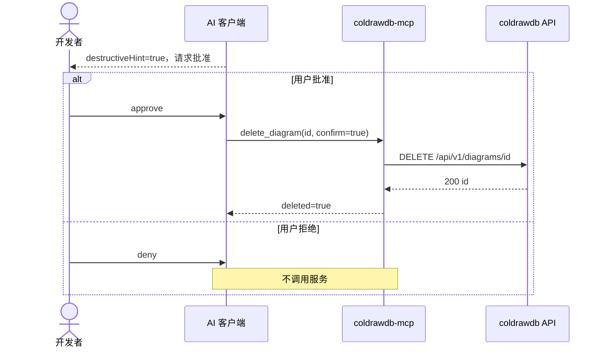

# S06 时序图：AI 客户端通过 MCP 管理数据库图表

> Why：`core-S06-mcp-service-requirements.md` | What：`core-S06-mcp-service-design.md` | How 契约：`mcp-tools.yaml`

## 1. 场景描述

开发者在 Claude、Codex、Cursor 或 OpenCode 中启用 coldrawdb MCP，读取现有 diagram，基于最新 revision 提交全量更新；服务通过现有 HTTP API 保存，成功时返回新 revision，冲突时停止并要求重新读取与人工合并。

成功标志：客户端完成 initialize/tools/list；`get_diagram` 返回 rev=N；`update_diagram(expected_revision=N)` 返回 rev=N+1，且 OpenLogos reporter 记录对应 ST。

## 2. 参与者

| 参与者 | 职责 | 实现边界 |
|---|---|---|
| 开发者 | 配置服务、批准写工具、决定冲突处理 | 人类确认点 |
| AI 客户端 | 启动 stdio 子进程、展示工具、执行审批策略 | Claude/Codex/Cursor/OpenCode |
| coldrawdb-mcp | MCP 握手、schema、参数校验、错误规范化 | 独立 Rust adapter/service |
| HTTP Adapter | 固定路径调用、Bearer 透传、超时、脱敏 | 不接受任意 URL/method/header |
| coldrawdb API | diagram CRUD/import 和 revision 校验 | 既有 backend |
| SQLite | 持久化 | MCP 不直接访问 |

## 3. 主时序：初始化、读取与更新

## 4. 辅时序：导出

序列化是 adapter 内纯函数；不得把导出文本发送给未配置的第三方服务。

## 5. 辅时序：删除双确认

## 6. API 与工具推导

| 时序步骤 | 推导工具 | 上游 |
|---|---|---|
| 工具发现 | tools/list | 本地静态 schema |
| 图表发现 | list_diagrams | `GET /diagrams/queryAll` |
| 读取 | get_diagram | `GET /api/v1/diagrams/{id}` |
| 创建 | create_diagram | `POST /api/v1/diagrams` |
| revision 保存 | update_diagram | `PUT /api/v1/diagrams/{id}` |
| 双确认删除 | delete_diagram | `DELETE /api/v1/diagrams/{id}` |
| 导入 | import_schema | `POST /api/v1/diagrams/import` |
| 导出 | export_schema | GET + 本地 serializer |

## 7. 异常与恢复

- stdin EOF：完成当前响应后正常退出；不得把 EOF 当成上游错误。
- 上游超时：返回 `UPSTREAM_TIMEOUT`；不自动重试写操作。
- 409：返回 `current_revision`；禁止 adapter 自动强制覆盖。
- JSON payload 非 object：在调用上游前返回 `VALIDATION_ERROR`。
- stdout 污染：协议测试立即失败；日志只能走 stderr。
- 遗留 list 端点失败：返回 `UPSTREAM_ERROR`，不得退化为 SQLite 查询。

## 8. 测试映射

| 步骤 | 用例 |
|---|---|
| initialize/tools/list | UT-MCP-01～03、ST-MCP-01 |
| list/get/export | UT-MCP-04～06、ST-MCP-02 |
| create/update/import/delete | UT-MCP-07～10、ST-MCP-03 |
| 409 | UT-MCP-12、ST-MCP-04 |
| 错误与脱敏 | UT-MCP-13～15、ST-MCP-05 |
| 四客户端 | UT-MCP-11、ST-MCP-06～09 |

## 9. 设计决策

- stdio 是四客户端交集，且与当前“本地可信”安全边界匹配。
- adapter 调 HTTP 而非复用 repository，避免绕过业务响应与 revision 语义。
- 现有 v1 API 没有 list method，MVP 临时使用遗留 `/diagrams/queryAll`；后续应设计正式 `GET /api/v1/diagrams` 后再迁移。
- 现有 diagram API 尚未挂 S03 JWT；MVP 不宣称具备用户级授权，远程 MCP 因此前置条件未满足而排除。

