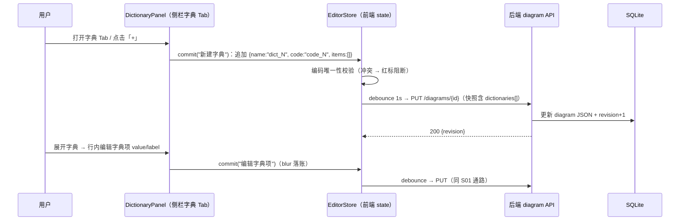
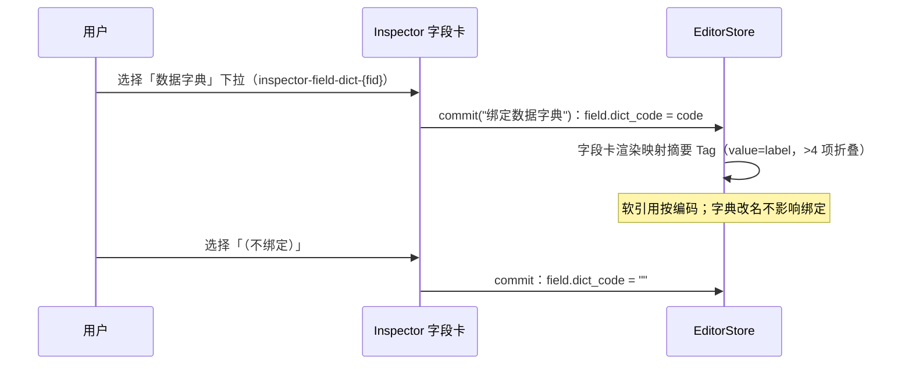
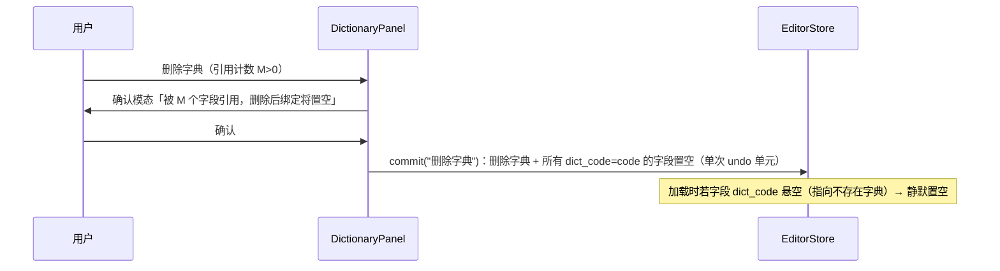
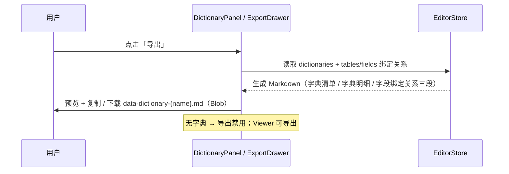

# S07 管理数据字典并绑定字段 — 场景时序图

> 场景定义见 `core-01e-data-dictionary.md`；本文推导实现时序与测试映射。
> **关键口径**：数据字典纯前端 state，持久化复用 S01 diagram JSON 快照通路；**无新增 API / DB 表**；S05 下字典编辑作为模型 op 自然同步（协议零变更）。

## 1. 场景描述

设计者在侧栏字典 Tab 集中管理代码映射字典（名称/编码 + value→label 字典项），在 Inspector 将字段绑定到字典；字典随图表自动保存持久化，可导出 Markdown 数据字典文档。

## 2. 参与者

- **用户**：图表设计者（Owner/Editor）
- **前端**：Leptos 编辑器（DictionaryPanel / Inspector / EditorStore）
- **后端**：actix-web diagram API（仅复用 S01 `PUT /api/v1/diagrams/{id}` 快照，无新端点）
- **collab-server**（S05 房间态）：既有 op 广播通路，无协议变更

## 3. 时序图 — S07.1 字典 CRUD 与持久化



## 4. 时序图 — S07.2 字段绑定字典



## 5. 时序图 — S07.3 删除被引用字典（级联置空）



## 6. 时序图 — S07.4 Markdown 导出



## 7. 异常用例

### EX-7.1: 字典编码冲突
- 触发：编辑编码与图内另一字典重复
- 行为：行内红标 + 阻断落账（不进 undo、不触发保存）

### EX-7.2: 字典项 value 重复
- 触发：同字典内两项 value 相同
- 行为：行内红标（不阻断其他编辑），导出仍可用

### EX-7.3: 旧图加载（无 dictionaries 字段）
- 触发：打开本变更前保存的 diagram JSON
- 行为：`dictionaries` 缺省为 `[]`，字典 Tab 空态，不报错

### EX-7.4: 悬空绑定
- 触发：JSON 中字段 `dict_code` 指向不存在的字典（手改 JSON / 导入）
- 行为：加载时静默置空 + 控制台 warn；不打断加载

### EX-7.5: 协作并发编辑字典
- 触发：S05 房间中两端同时编辑同一字典项
- 行为：作为模型 op 走既有 OT 合并与重连 sync 通路（S05 §5/§6），无新增冲突语义；最后一次写入生效（与表/字段编辑同级）

## 8. 数据与 API 规格（增量）

- **API**：无新增端点。复用 S01 `PUT /api/v1/diagrams/{id}`（快照含 `dictionaries`）与 `GET ?share=`；后端 `DiagramFull`/`FieldDto` DTO 扩展对应字段。
- **DB**：migration `0007_data_dictionary`（启动自动执行，同 0006 先例）：
  - `ALTER TABLE diagram ADD COLUMN dictionaries TEXT` — 字典数组 JSON blob（NULL = 无字典）
  - `ALTER TABLE field ADD COLUMN dict_code VARCHAR NOT NULL DEFAULT ''` — 字段绑定（软引用编码）
  - 房间图（S05）经 `room_collab_head.doc_json` 自然透出，不额外处理
- **diagram JSON schema 增量**：

```json
{
  "dictionaries": [
    { "id": "dict-1", "name": "是否", "code": "yes_no", "comment": "",
      "items": [ { "id": "di-1", "value": "0", "label": "否", "sort": 0 } ] }
  ]
}
```
- Field 增量：`"dict_code": ""`（可缺省，缺省 = 未绑定）

## 9. 测试用例映射

| 用例 ID | 覆盖时序 |
|---|---|
| UT-S07-01/02/03 | §3 字典 CRUD 与校验 |
| UT-S07-04/05 | §4 绑定与编码改写 |
| UT-S07-06 | §5 级联置空（单次 undo） |
| UT-S07-07/08 | §6 导出与空态禁用 |
| ST-S07-01 | §3+§4 端到端持久化 |
| ST-S07-02 | EX-7.3 旧图兼容 |
| ST-S07-03 | Viewer 只读边界 |

## 10. 与既有场景的关系

- **S01**：复用 debounce → PUT 快照与 revision/409 全链路；字典编辑只是快照内容新增字段
- **S02**：分享只读链路天然携带 dictionaries；Viewer 可浏览/导出、禁编辑
- **S05**：字典 op 复用 OT 通路，协议零变更（EX-7.5）
- **S06**：MCP 读写 diagram JSON 时 dictionaries 自然透出，本变更不扩展 MCP 工具
